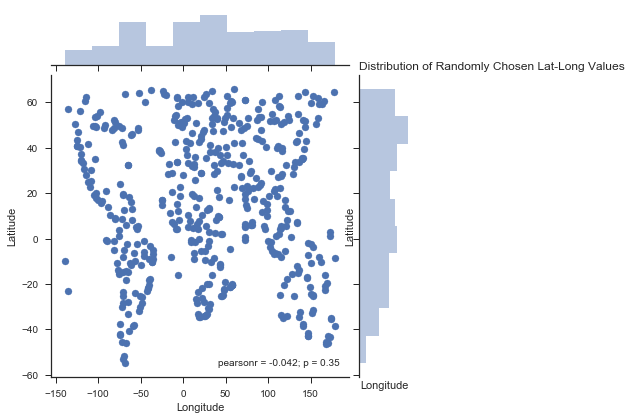

# Weather Analysis by Latitude

## Overview

This notebook visualizes the current weather in 500 unique cities across the world in random locations. [Citipy](https://pypi.python.org/pypi/citipy) a simple city-finding python package will be used to find randomly located cities, and the [OpenWeatherMap API](https://openweathermap.org/api), will return current weather statistics for those cities.

A series of scatter plots will be used to showcase the following relationships:

* Temperature (F) vs. Latitude.
* Humidity (%) vs. Latitude.
* Cloudiness (%) vs. Latitude.
* Wind Speed (mph) vs. Latitude.

Specifically, this script will:

* Randomly select **at least** 500 unique (non-repeat) cities based on latitude and longitude.
* Perform a weather check on each of the cities using a series of successive API calls. 
* Include a print log of each city as it's being processed with the city number, city name, and requested URL.
* Save both a CSV of all data retrieved and png images for each scatter plot.


```python
# Import dependencies.
from citipy import citipy
import numpy as np
import pandas as pd
import random
import datetime as date
import requests as req
import json
import seaborn as sns
import matplotlib.pyplot as plt

# Import Open Weather Map API keys.
from openWeatherMapApiKeys import apiKey

```

## Sampling Cities

Finding a city by searching random latitude and longitude values with Citipy can be problematic. Randomly selected remote locations, such as points in the middle of the Pacific Ocean or in Antarctica, may yield a city thousands of miles away in any direction. This is a problem for extremely northern or southern latitudes, or longitudes in the Pacific Ocean: random points in these areas inflate the number of cities selected in extreme northern or southern areas, or around the Pacific Rim.

To solve this, the range of latitudes is restricted to between 55th parallel south (running through Patagonia, Argentina) and 65th parallel north (running through southern Greenland and northern Canada). Longitudes are restricted to between 140th meridian west (which removes most of Alaska from the sample) and 160 meridian east (which leaves points west of Australia out). This yields a more uniform distribution of points that resolve to a city in Citipy, particularly by latitude.


```python
# Declare variables describing the scope of lat/lng search for cities.
latDim = {'min': -55, 'max': 65}
lngDim = {'min': -140, 'max': 180}

# Create arrays containing increments of lat and long.
latVals = np.arange(latDim['min'], latDim['max'], 0.1)
lngVals = np.arange(lngDim['min'], lngDim['max'], 0.1)
```


```python
# Create an empty data frame that will contain details of our randomly selected cities.
colNames = ('cityName', 'countryCode', 'randLat', 'randLng', 'uniqueName', 'Latitude', 'Longitude','Temperature',
            'Humidity','Cloudiness','WindSpeed', 'TimeStamp')
cities = pd.DataFrame(columns = colNames)
```


```python
# Query Citipy for random lat long values until we collect our sample, and append weather
# data via API call.

# Set the sample size (this will return exactly as many records as the sample size).
sampleSize = 500

baseUrl = 'http://api.openweathermap.org/data/2.5/weather?q='
units = 'imperial'

# Set the current date and time the data was retrieved, for labeling.
analysistime = date.datetime.now()
analysistimename = analysistime.strftime("%b %d, %Y %I:%M %p")

while len(cities) <= sampleSize:
    # Choose a random point within our lat-lng domain.
    randLat = random.choice(latVals)
    randLng = random.choice(lngVals)
    # Call citipy's nearest_city() method to get a city object.
    city = citipy.nearest_city(randLat, randLng)
    cityName = city.city_name.replace(' ', '%20')
    countryCode = city.country_code
    # Check if the combination of city name and country code from citipy is already present in our data frame
    # This is the best that can be done with the nearest_city() method.
    if cityName + countryCode in cities.uniqueName.tolist():
        pass
    else:
        url = baseUrl + cityName + ',' + countryCode + '&units=' + units + '&APPID=' + apiKey
        weather_response = req.get(url)
        weather_json = weather_response.json()
        print('Status code: %s DF Length is now: %s' % (str(weather_json["cod"]), str(len(cities))))
        if weather_json["cod"] == 200:
            print('City %s: %s loaded with status %s: %s' % (weather_json['id'], weather_json['name'], weather_json["cod"], url))
            Latitude = weather_json["coord"]["lat"]
            Longitude = weather_json["coord"]["lon"]
            Temperature = weather_json["main"]["temp"]
            Humidity = weather_json["main"]["humidity"]
            Cloudiness = weather_json["clouds"]["all"]
            WindSpeed = weather_json["wind"]["speed"]
            TimeStamp = weather_json['dt']
            cities.loc[len(cities)+1] = [weather_json['name'], countryCode, randLat, randLng, cityName+countryCode, Latitude, Longitude, Temperature, Humidity, Cloudiness, WindSpeed, TimeStamp]
#             cities = concat(cities, DataFrame([{'cityName': cityName, 'countryCode' : countryCode, 'randLat' : randLat,'randLng' : randLng, 'uniqueName' : cityName, 'Latitude' : Latitude, 'Longitude' : Longitude,'Temperature' : Temperature, 'Humidity' : Humidity,'Cloudiness' : Cloudiness,'WindSpeed' : WindSpeed}])
        else:
            pass

```

    Status code: 200 DF Length is now: 0
    City 2223162: Ombesa loaded with status 200: http://api.openweathermap.org/data/2.5/weather?q=ombessa,cm&units=imperial&APPID=244a987a274dfd51f4820c3f46a53b02
    Status code: 200 DF Length is now: 1
    City 1800163: Nanchang loaded with status 200: http://api.openweathermap.org/data/2.5/weather?q=nanchang,cn&units=imperial&APPID=244a987a274dfd51f4820c3f46a53b02
    Status code: 200 DF Length is now: 2
    City 4030556: Rikitea loaded with status 200: http://api.openweathermap.org/data/2.5/weather?q=rikitea,pf&units=imperial&APPID=244a987a274dfd51f4820c3f46a53b02
    Status code: 200 DF Length is now: 3
    City 98182: Baghdad loaded with status 200: http://api.openweathermap.org/data/2.5/weather?q=baghdad,iq&units=imperial&APPID=244a987a274dfd51f4820c3f46a53b02
    Status code: 200 DF Length is now: 4
    City 1737185: Kapit loaded with status 200: http://api.openweathermap.org/data/2.5/weather?q=kapit,my&units=imperial&APPID=244a987a274dfd51f4820c3f46a53b02
    Status code: 200 DF Length is now: 5
    City 3372707: Ribeira Grande loaded with status 200: http://api.openweathermap.org/data/2.5/weather?q=ribeira%20grande,pt&units=imperial&APPID=244a987a274dfd51f4820c3f46a53b02
    Status code: 200 DF Length is now: 6
    City 2025256: Chumikan loaded with status 200: http://api.openweathermap.org/data/2.5/weather?q=chumikan,ru&units=imperial&APPID=244a987a274dfd51f4820c3f46a53b02
    Status code: 200 DF Length is now: 7
    City 3984997: San Quintin loaded with status 200: http://api.openweathermap.org/data/2.5/weather?q=san%20quintin,mx&units=imperial&APPID=244a987a274dfd51f4820c3f46a53b02
    Status code: 200 DF Length is now: 8
    City 1282256: Hithadhoo loaded with status 200: http://api.openweathermap.org/data/2.5/weather?q=hithadhoo,mv&units=imperial&APPID=244a987a274dfd51f4820c3f46a53b02
    Status code: 200 DF Length is now: 9
    City 601551: Akdepe loaded with status 200: http://api.openweathermap.org/data/2.5/weather?q=akdepe,tm&units=imperial&APPID=244a987a274dfd51f4820c3f46a53b02
    Status code: 200 DF Length is now: 10
    City 1150965: Ranong loaded with status 200: http://api.openweathermap.org/data/2.5/weather?q=ranong,th&units=imperial&APPID=244a987a274dfd51f4820c3f46a53b02
    Status code: 200 DF Length is now: 11
    City 3911409: Llallagua loaded with status 200: http://api.openweathermap.org/data/2.5/weather?q=llallagua,bo&units=imperial&APPID=244a987a274dfd51f4820c3f46a53b02
    Status code: 200 DF Length is now: 12
    City 2132606: Samarai loaded with status 200: http://api.openweathermap.org/data/2.5/weather?q=samarai,pg&units=imperial&APPID=244a987a274dfd51f4820c3f46a53b02
    Status code: 200 DF Length is now: 13
    City 3374346: Ponta do Sol loaded with status 200: http://api.openweathermap.org/data/2.5/weather?q=ponta%20do%20sol,cv&units=imperial&APPID=244a987a274dfd51f4820c3f46a53b02
    Status code: 200 DF Length is now: 14
    City 1650232: Banjar loaded with status 200: http://api.openweathermap.org/data/2.5/weather?q=banjar,id&units=imperial&APPID=244a987a274dfd51f4820c3f46a53b02
    Status code: 200 DF Length is now: 15
    City 1283082: Malangwa loaded with status 200: http://api.openweathermap.org/data/2.5/weather?q=malangwa,np&units=imperial&APPID=244a987a274dfd51f4820c3f46a53b02
    Status code: 200 DF Length is now: 16
    City 2236967: Soio loaded with status 200: http://api.openweathermap.org/data/2.5/weather?q=soyo,ao&units=imperial&APPID=244a987a274dfd51f4820c3f46a53b02
    Status code: 200 DF Length is now: 17
    City 3492627: Sosua loaded with status 200: http://api.openweathermap.org/data/2.5/weather?q=sosua,do&units=imperial&APPID=244a987a274dfd51f4820c3f46a53b02
    Status code: 200 DF Length is now: 18
    City 1235846: Matara loaded with status 200: http://api.openweathermap.org/data/2.5/weather?q=matara,lk&units=imperial&APPID=244a987a274dfd51f4820c3f46a53b02
    Status code: 200 DF Length is now: 19
    City 2079582: Alyangula loaded with status 200: http://api.openweathermap.org/data/2.5/weather?q=alyangula,au&units=imperial&APPID=244a987a274dfd51f4820c3f46a53b02
    Status code: 200 DF Length is now: 20
    City 101628: Tabuk loaded with status 200: http://api.openweathermap.org/data/2.5/weather?q=tabuk,sa&units=imperial&APPID=244a987a274dfd51f4820c3f46a53b02
    Status code: 200 DF Length is now: 21
    City 3366880: Hermanus loaded with status 200: http://api.openweathermap.org/data/2.5/weather?q=hermanus,za&units=imperial&APPID=244a987a274dfd51f4820c3f46a53b02
    Status code: 200 DF Length is now: 22
    City 1309611: Myeik loaded with status 200: http://api.openweathermap.org/data/2.5/weather?q=mergui,mm&units=imperial&APPID=244a987a274dfd51f4820c3f46a53b02
    Status code: 200 DF Length is now: 23
    City 2012532: Zhigalovo loaded with status 200: http://api.openweathermap.org/data/2.5/weather?q=zhigalovo,ru&units=imperial&APPID=244a987a274dfd51f4820c3f46a53b02
    Status code: 200 DF Length is now: 24
    City 463355: Zheleznodorozhnyy loaded with status 200: http://api.openweathermap.org/data/2.5/weather?q=zheleznodorozhnyy,ru&units=imperial&APPID=244a987a274dfd51f4820c3f46a53b02
    Status code: 200 DF Length is now: 25
    City 964432: Port Alfred loaded with status 200: http://api.openweathermap.org/data/2.5/weather?q=port%20alfred,za&units=imperial&APPID=244a987a274dfd51f4820c3f46a53b02
    Status code: 200 DF Length is now: 26
    City 3402648: Carutapera loaded with status 200: http://api.openweathermap.org/data/2.5/weather?q=carutapera,br&units=imperial&APPID=244a987a274dfd51f4820c3f46a53b02
    Status code: 200 DF Length is now: 27
    City 2312895: Mbandaka loaded with status 200: http://api.openweathermap.org/data/2.5/weather?q=mbandaka,cd&units=imperial&APPID=244a987a274dfd51f4820c3f46a53b02
    Status code: 200 DF Length is now: 28
    City 2192362: Christchurch loaded with status 200: http://api.openweathermap.org/data/2.5/weather?q=christchurch,nz&units=imperial&APPID=244a987a274dfd51f4820c3f46a53b02
    Status code: 200 DF Length is now: 29
    City 2112802: Hasaki loaded with status 200: http://api.openweathermap.org/data/2.5/weather?q=hasaki,jp&units=imperial&APPID=244a987a274dfd51f4820c3f46a53b02
    Status code: 200 DF Length is now: 30
    City 3370903: Jamestown loaded with status 200: http://api.openweathermap.org/data/2.5/weather?q=jamestown,sh&units=imperial&APPID=244a987a274dfd51f4820c3f46a53b02
    Status code: 200 DF Length is now: 31
    City 2210560: Surman loaded with status 200: http://api.openweathermap.org/data/2.5/weather?q=surman,ly&units=imperial&APPID=244a987a274dfd51f4820c3f46a53b02
    Status code: 200 DF Length is now: 32
    City 3471451: Arraial do Cabo loaded with status 200: http://api.openweathermap.org/data/2.5/weather?q=arraial%20do%20cabo,br&units=imperial&APPID=244a987a274dfd51f4820c3f46a53b02
    Status code: 200 DF Length is now: 33
    City 2428394: Mao loaded with status 200: http://api.openweathermap.org/data/2.5/weather?q=mao,td&units=imperial&APPID=244a987a274dfd51f4820c3f46a53b02
    Status code: 200 DF Length is now: 34
    City 5563839: Fortuna loaded with status 200: http://api.openweathermap.org/data/2.5/weather?q=fortuna,us&units=imperial&APPID=244a987a274dfd51f4820c3f46a53b02
    Status code: 200 DF Length is now: 35
    City 1273765: Dabhol loaded with status 200: http://api.openweathermap.org/data/2.5/weather?q=dabhol,in&units=imperial&APPID=244a987a274dfd51f4820c3f46a53b02
    Status code: 200 DF Length is now: 36
    City 2411397: Georgetown loaded with status 200: http://api.openweathermap.org/data/2.5/weather?q=georgetown,sh&units=imperial&APPID=244a987a274dfd51f4820c3f46a53b02
    Status code: 200 DF Length is now: 37
    City 3573374: The Valley loaded with status 200: http://api.openweathermap.org/data/2.5/weather?q=the%20valley,ai&units=imperial&APPID=244a987a274dfd51f4820c3f46a53b02
    Status code: 200 DF Length is now: 38
    City 3361934: Saldanha loaded with status 200: http://api.openweathermap.org/data/2.5/weather?q=saldanha,za&units=imperial&APPID=244a987a274dfd51f4820c3f46a53b02
    Status code: 200 DF Length is now: 39
    City 3175096: Lasa loaded with status 200: http://api.openweathermap.org/data/2.5/weather?q=lasa,cn&units=imperial&APPID=244a987a274dfd51f4820c3f46a53b02
    Status code: 200 DF Length is now: 40
    City 1179061: Gambat loaded with status 200: http://api.openweathermap.org/data/2.5/weather?q=gambat,pk&units=imperial&APPID=244a987a274dfd51f4820c3f46a53b02
    Status code: 200 DF Length is now: 41
    City 335035: Harer loaded with status 200: http://api.openweathermap.org/data/2.5/weather?q=harer,et&units=imperial&APPID=244a987a274dfd51f4820c3f46a53b02
    Status code: 200 DF Length is now: 42
    City 1633419: Padang loaded with status 200: http://api.openweathermap.org/data/2.5/weather?q=padang,id&units=imperial&APPID=244a987a274dfd51f4820c3f46a53b02
    Status code: 200 DF Length is now: 43
    City 2206939: Bluff loaded with status 200: http://api.openweathermap.org/data/2.5/weather?q=bluff,nz&units=imperial&APPID=244a987a274dfd51f4820c3f46a53b02
    Status code: 200 DF Length is now: 44
    City 51966: Gobolka Shabeellaha Hoose loaded with status 200: http://api.openweathermap.org/data/2.5/weather?q=barawe,so&units=imperial&APPID=244a987a274dfd51f4820c3f46a53b02
    Status code: 200 DF Length is now: 45
    City 7701342: Bangshal loaded with status 200: http://api.openweathermap.org/data/2.5/weather?q=azimur,ma&units=imperial&APPID=244a987a274dfd51f4820c3f46a53b02
    Status code: 200 DF Length is now: 46
    City 2399831: Lekoni loaded with status 200: http://api.openweathermap.org/data/2.5/weather?q=lekoni,ga&units=imperial&APPID=244a987a274dfd51f4820c3f46a53b02
    Status code: 200 DF Length is now: 47
    City 4020109: Atuona loaded with status 200: http://api.openweathermap.org/data/2.5/weather?q=atuona,pf&units=imperial&APPID=244a987a274dfd51f4820c3f46a53b02
    Status code: 200 DF Length is now: 48
    City 2155415: New Norfolk loaded with status 200: http://api.openweathermap.org/data/2.5/weather?q=new%20norfolk,au&units=imperial&APPID=244a987a274dfd51f4820c3f46a53b02
    Status code: 200 DF Length is now: 49
    City 131962: Harsin loaded with status 200: http://api.openweathermap.org/data/2.5/weather?q=harsin,ir&units=imperial&APPID=244a987a274dfd51f4820c3f46a53b02
    Status code: 200 DF Length is now: 50
    City 1644605: Galesong loaded with status 200: http://api.openweathermap.org/data/2.5/weather?q=galesong,id&units=imperial&APPID=244a987a274dfd51f4820c3f46a53b02
    Status code: 200 DF Length is now: 51
    City 3445026: Vila Velha loaded with status 200: http://api.openweathermap.org/data/2.5/weather?q=vila%20velha,br&units=imperial&APPID=244a987a274dfd51f4820c3f46a53b02
    Status code: 200 DF Length is now: 52
    City 541826: Krasnyy Bor loaded with status 200: http://api.openweathermap.org/data/2.5/weather?q=nikolskoye,ru&units=imperial&APPID=244a987a274dfd51f4820c3f46a53b02
    Status code: 200 DF Length is now: 53
    City 737021: Zonguldak loaded with status 200: http://api.openweathermap.org/data/2.5/weather?q=zonguldak,tr&units=imperial&APPID=244a987a274dfd51f4820c3f46a53b02
    Status code: 200 DF Length is now: 54
    City 315795: Elbistan loaded with status 200: http://api.openweathermap.org/data/2.5/weather?q=elbistan,tr&units=imperial&APPID=244a987a274dfd51f4820c3f46a53b02
    Status code: 200 DF Length is now: 55
    City 2034615: Tahe loaded with status 200: http://api.openweathermap.org/data/2.5/weather?q=tahe,cn&units=imperial&APPID=244a987a274dfd51f4820c3f46a53b02
    Status code: 200 DF Length is now: 56
    City 3902377: La Santisima Trinidad loaded with status 200: http://api.openweathermap.org/data/2.5/weather?q=trinidad,bo&units=imperial&APPID=244a987a274dfd51f4820c3f46a53b02
    Status code: 200 DF Length is now: 57
    City 3097257: Jelenia Gora loaded with status 200: http://api.openweathermap.org/data/2.5/weather?q=jelenia%20gora,pl&units=imperial&APPID=244a987a274dfd51f4820c3f46a53b02
    Status code: 200 DF Length is now: 58
    City 2110227: Butaritari loaded with status 200: http://api.openweathermap.org/data/2.5/weather?q=butaritari,ki&units=imperial&APPID=244a987a274dfd51f4820c3f46a53b02
    Status code: 200 DF Length is now: 59
    City 3577154: Oranjestad loaded with status 200: http://api.openweathermap.org/data/2.5/weather?q=oranjestad,aw&units=imperial&APPID=244a987a274dfd51f4820c3f46a53b02
    Status code: 200 DF Length is now: 60
    City 2098869: Bulolo loaded with status 200: http://api.openweathermap.org/data/2.5/weather?q=bulolo,pg&units=imperial&APPID=244a987a274dfd51f4820c3f46a53b02
    Status code: 200 DF Length is now: 61
    City 1054500: Tsiombe loaded with status 200: http://api.openweathermap.org/data/2.5/weather?q=tsihombe,mg&units=imperial&APPID=244a987a274dfd51f4820c3f46a53b02
    Status code: 200 DF Length is now: 62
    City 4005297: Guamuchil loaded with status 200: http://api.openweathermap.org/data/2.5/weather?q=guamuchil,mx&units=imperial&APPID=244a987a274dfd51f4820c3f46a53b02
    Status code: 200 DF Length is now: 63
    City 2094342: Kavieng loaded with status 200: http://api.openweathermap.org/data/2.5/weather?q=kavieng,pg&units=imperial&APPID=244a987a274dfd51f4820c3f46a53b02
    Status code: 200 DF Length is now: 64
    City 2381334: Atar loaded with status 200: http://api.openweathermap.org/data/2.5/weather?q=atar,mr&units=imperial&APPID=244a987a274dfd51f4820c3f46a53b02
    Status code: 200 DF Length is now: 65
    City 1518980: Shymkent loaded with status 200: http://api.openweathermap.org/data/2.5/weather?q=shymkent,kz&units=imperial&APPID=244a987a274dfd51f4820c3f46a53b02
    Status code: 200 DF Length is now: 66
    City 3454005: Piacabucu loaded with status 200: http://api.openweathermap.org/data/2.5/weather?q=piacabucu,br&units=imperial&APPID=244a987a274dfd51f4820c3f46a53b02
    Status code: 200 DF Length is now: 67
    City 7671223: Kloulklubed loaded with status 200: http://api.openweathermap.org/data/2.5/weather?q=kloulklubed,pw&units=imperial&APPID=244a987a274dfd51f4820c3f46a53b02
    Status code: 200 DF Length is now: 68
    City 1529195: Shihezi loaded with status 200: http://api.openweathermap.org/data/2.5/weather?q=shihezi,cn&units=imperial&APPID=244a987a274dfd51f4820c3f46a53b02
    Status code: 200 DF Length is now: 69
    City 3401331: Curaca loaded with status 200: http://api.openweathermap.org/data/2.5/weather?q=curaca,br&units=imperial&APPID=244a987a274dfd51f4820c3f46a53b02
    Status code: 200 DF Length is now: 70
    City 2553604: Casablanca loaded with status 200: http://api.openweathermap.org/data/2.5/weather?q=casablanca,ma&units=imperial&APPID=244a987a274dfd51f4820c3f46a53b02
    Status code: 200 DF Length is now: 71
    City 3465329: Coruripe loaded with status 200: http://api.openweathermap.org/data/2.5/weather?q=coruripe,br&units=imperial&APPID=244a987a274dfd51f4820c3f46a53b02
    Status code: 200 DF Length is now: 72
    City 6185377: Yellowknife loaded with status 200: http://api.openweathermap.org/data/2.5/weather?q=yellowknife,ca&units=imperial&APPID=244a987a274dfd51f4820c3f46a53b02
    Status code: 200 DF Length is now: 73
    City 3883457: Lebu loaded with status 200: http://api.openweathermap.org/data/2.5/weather?q=lebu,cl&units=imperial&APPID=244a987a274dfd51f4820c3f46a53b02
    Status code: 200 DF Length is now: 74
    City 2121373: Seymchan loaded with status 200: http://api.openweathermap.org/data/2.5/weather?q=seymchan,ru&units=imperial&APPID=244a987a274dfd51f4820c3f46a53b02
    Status code: 200 DF Length is now: 75
    City 1791779: Wanning loaded with status 200: http://api.openweathermap.org/data/2.5/weather?q=wanning,cn&units=imperial&APPID=244a987a274dfd51f4820c3f46a53b02
    Status code: 200 DF Length is now: 76
    City 5742974: North Bend loaded with status 200: http://api.openweathermap.org/data/2.5/weather?q=north%20bend,us&units=imperial&APPID=244a987a274dfd51f4820c3f46a53b02
    Status code: 200 DF Length is now: 77
    City 2021031: Kyren loaded with status 200: http://api.openweathermap.org/data/2.5/weather?q=kyren,ru&units=imperial&APPID=244a987a274dfd51f4820c3f46a53b02
    Status code: 200 DF Length is now: 78
    City 2475475: Touggourt loaded with status 200: http://api.openweathermap.org/data/2.5/weather?q=tuggurt,dz&units=imperial&APPID=244a987a274dfd51f4820c3f46a53b02
    Status code: 200 DF Length is now: 79
    City 2075265: Busselton loaded with status 200: http://api.openweathermap.org/data/2.5/weather?q=busselton,au&units=imperial&APPID=244a987a274dfd51f4820c3f46a53b02
    Status code: 200 DF Length is now: 80
    City 3652764: Puerto Ayora loaded with status 200: http://api.openweathermap.org/data/2.5/weather?q=puerto%20ayora,ec&units=imperial&APPID=244a987a274dfd51f4820c3f46a53b02
    Status code: 200 DF Length is now: 81
    City 3373652: Oistins loaded with status 200: http://api.openweathermap.org/data/2.5/weather?q=oistins,bb&units=imperial&APPID=244a987a274dfd51f4820c3f46a53b02
    Status code: 200 DF Length is now: 82
    City 2281120: Tabou loaded with status 200: http://api.openweathermap.org/data/2.5/weather?q=tabou,ci&units=imperial&APPID=244a987a274dfd51f4820c3f46a53b02
    Status code: 200 DF Length is now: 83
    City 5972762: Hay River loaded with status 200: http://api.openweathermap.org/data/2.5/weather?q=hay%20river,ca&units=imperial&APPID=244a987a274dfd51f4820c3f46a53b02
    Status code: 200 DF Length is now: 84
    City 3466165: Cidreira loaded with status 200: http://api.openweathermap.org/data/2.5/weather?q=cidreira,br&units=imperial&APPID=244a987a274dfd51f4820c3f46a53b02
    Status code: 200 DF Length is now: 85
    City 5983720: Iqaluit loaded with status 200: http://api.openweathermap.org/data/2.5/weather?q=iqaluit,ca&units=imperial&APPID=244a987a274dfd51f4820c3f46a53b02
    Status code: 200 DF Length is now: 86
    City 2177541: Atherton loaded with status 200: http://api.openweathermap.org/data/2.5/weather?q=atherton,au&units=imperial&APPID=244a987a274dfd51f4820c3f46a53b02
    Status code: 200 DF Length is now: 87
    City 1524606: Derzhavinsk loaded with status 200: http://api.openweathermap.org/data/2.5/weather?q=derzhavinsk,kz&units=imperial&APPID=244a987a274dfd51f4820c3f46a53b02
    Status code: 200 DF Length is now: 88
    City 3355672: Luderitz loaded with status 200: http://api.openweathermap.org/data/2.5/weather?q=luderitz,na&units=imperial&APPID=244a987a274dfd51f4820c3f46a53b02
    Status code: 200 DF Length is now: 89
    City 3395458: Maragogi loaded with status 200: http://api.openweathermap.org/data/2.5/weather?q=maragogi,br&units=imperial&APPID=244a987a274dfd51f4820c3f46a53b02
    Status code: 200 DF Length is now: 90
    City 1855540: Naze loaded with status 200: http://api.openweathermap.org/data/2.5/weather?q=naze,jp&units=imperial&APPID=244a987a274dfd51f4820c3f46a53b02
    Status code: 200 DF Length is now: 91
    City 921772: Moroni loaded with status 200: http://api.openweathermap.org/data/2.5/weather?q=moroni,km&units=imperial&APPID=244a987a274dfd51f4820c3f46a53b02
    Status code: 200 DF Length is now: 92
    City 1251459: Ampara loaded with status 200: http://api.openweathermap.org/data/2.5/weather?q=wulanhaote,cn&units=imperial&APPID=244a987a274dfd51f4820c3f46a53b02
    Status code: 200 DF Length is now: 93
    City 3874787: Punta Arenas loaded with status 200: http://api.openweathermap.org/data/2.5/weather?q=punta%20arenas,cl&units=imperial&APPID=244a987a274dfd51f4820c3f46a53b02
    Status code: 200 DF Length is now: 94
    City 1631637: Pemangkat loaded with status 200: http://api.openweathermap.org/data/2.5/weather?q=pemangkat,id&units=imperial&APPID=244a987a274dfd51f4820c3f46a53b02
    Status code: 200 DF Length is now: 95
    City 5367788: Lompoc loaded with status 200: http://api.openweathermap.org/data/2.5/weather?q=lompoc,us&units=imperial&APPID=244a987a274dfd51f4820c3f46a53b02
    Status code: 200 DF Length is now: 96
    City 978895: Margate loaded with status 200: http://api.openweathermap.org/data/2.5/weather?q=margate,za&units=imperial&APPID=244a987a274dfd51f4820c3f46a53b02
    Status code: 200 DF Length is now: 97
    City 1337610: Thinadhoo loaded with status 200: http://api.openweathermap.org/data/2.5/weather?q=viligili,mv&units=imperial&APPID=244a987a274dfd51f4820c3f46a53b02
    Status code: 200 DF Length is now: 98
    City 916668: Isoka loaded with status 200: http://api.openweathermap.org/data/2.5/weather?q=isoka,zm&units=imperial&APPID=244a987a274dfd51f4820c3f46a53b02
    Status code: 200 DF Length is now: 99
    City 2071860: Esperance loaded with status 200: http://api.openweathermap.org/data/2.5/weather?q=esperance,au&units=imperial&APPID=244a987a274dfd51f4820c3f46a53b02
    Status code: 200 DF Length is now: 100
    City 1523662: Kachiry loaded with status 200: http://api.openweathermap.org/data/2.5/weather?q=kachiry,kz&units=imperial&APPID=244a987a274dfd51f4820c3f46a53b02
    Status code: 200 DF Length is now: 101
    City 211098: Lubao loaded with status 200: http://api.openweathermap.org/data/2.5/weather?q=lubao,cd&units=imperial&APPID=244a987a274dfd51f4820c3f46a53b02
    Status code: 200 DF Length is now: 102
    City 3430863: Mar del Plata loaded with status 200: http://api.openweathermap.org/data/2.5/weather?q=mar%20del%20plata,ar&units=imperial&APPID=244a987a274dfd51f4820c3f46a53b02
    Status code: 200 DF Length is now: 103
    City 934475: Grande Riviere Sud Est loaded with status 200: http://api.openweathermap.org/data/2.5/weather?q=grand%20river%20south%20east,mu&units=imperial&APPID=244a987a274dfd51f4820c3f46a53b02
    Status code: 200 DF Length is now: 104
    City 2074865: Carnarvon loaded with status 200: http://api.openweathermap.org/data/2.5/weather?q=carnarvon,au&units=imperial&APPID=244a987a274dfd51f4820c3f46a53b02
    Status code: 200 DF Length is now: 105
    City 1529484: Hami loaded with status 200: http://api.openweathermap.org/data/2.5/weather?q=hami,cn&units=imperial&APPID=244a987a274dfd51f4820c3f46a53b02
    Status code: 200 DF Length is now: 106
    City 2152667: Portland loaded with status 200: http://api.openweathermap.org/data/2.5/weather?q=portland,au&units=imperial&APPID=244a987a274dfd51f4820c3f46a53b02
    Status code: 200 DF Length is now: 107
    City 3899695: Ancud loaded with status 200: http://api.openweathermap.org/data/2.5/weather?q=ancud,cl&units=imperial&APPID=244a987a274dfd51f4820c3f46a53b02
    Status code: 200 DF Length is now: 108
    City 2448083: Agadez loaded with status 200: http://api.openweathermap.org/data/2.5/weather?q=agadez,ne&units=imperial&APPID=244a987a274dfd51f4820c3f46a53b02
    Status code: 200 DF Length is now: 109
    City 236950: Obo loaded with status 200: http://api.openweathermap.org/data/2.5/weather?q=obo,cf&units=imperial&APPID=244a987a274dfd51f4820c3f46a53b02
    Status code: 200 DF Length is now: 110
    City 1255823: Someshwar loaded with status 200: http://api.openweathermap.org/data/2.5/weather?q=someshwar,in&units=imperial&APPID=244a987a274dfd51f4820c3f46a53b02
    Status code: 200 DF Length is now: 111
    City 1214488: Meulaboh loaded with status 200: http://api.openweathermap.org/data/2.5/weather?q=meulaboh,id&units=imperial&APPID=244a987a274dfd51f4820c3f46a53b02
    Status code: 200 DF Length is now: 112
    City 3414079: Ólafsvík loaded with status 200: http://api.openweathermap.org/data/2.5/weather?q=olafsvik,is&units=imperial&APPID=244a987a274dfd51f4820c3f46a53b02
    Status code: 200 DF Length is now: 113
    City 1271975: Faizpur loaded with status 200: http://api.openweathermap.org/data/2.5/weather?q=faizpur,in&units=imperial&APPID=244a987a274dfd51f4820c3f46a53b02
    Status code: 200 DF Length is now: 114
    City 6979864: Jinshaba loaded with status 200: http://api.openweathermap.org/data/2.5/weather?q=yaan,cn&units=imperial&APPID=244a987a274dfd51f4820c3f46a53b02
    Status code: 200 DF Length is now: 115
    City 2636790: Stornoway loaded with status 200: http://api.openweathermap.org/data/2.5/weather?q=stornoway,gb&units=imperial&APPID=244a987a274dfd51f4820c3f46a53b02
    Status code: 200 DF Length is now: 116
    City 155274: Mahenge loaded with status 200: http://api.openweathermap.org/data/2.5/weather?q=mahenge,tz&units=imperial&APPID=244a987a274dfd51f4820c3f46a53b02
    Status code: 200 DF Length is now: 117
    City 3833367: Ushuaia loaded with status 200: http://api.openweathermap.org/data/2.5/weather?q=ushuaia,ar&units=imperial&APPID=244a987a274dfd51f4820c3f46a53b02
    Status code: 200 DF Length is now: 118
    City 2517750: Felanitx loaded with status 200: http://api.openweathermap.org/data/2.5/weather?q=felanitx,es&units=imperial&APPID=244a987a274dfd51f4820c3f46a53b02
    Status code: 200 DF Length is now: 119
    City 1337613: Kulhudhuffushi loaded with status 200: http://api.openweathermap.org/data/2.5/weather?q=kulhudhuffushi,mv&units=imperial&APPID=244a987a274dfd51f4820c3f46a53b02
    Status code: 200 DF Length is now: 120
    City 2025456: Chernyshevskiy loaded with status 200: http://api.openweathermap.org/data/2.5/weather?q=chernyshevskiy,ru&units=imperial&APPID=244a987a274dfd51f4820c3f46a53b02
    Status code: 200 DF Length is now: 121
    City 3906209: Rurrenabaque loaded with status 200: http://api.openweathermap.org/data/2.5/weather?q=rurrenabaque,bo&units=imperial&APPID=244a987a274dfd51f4820c3f46a53b02
    Status code: 200 DF Length is now: 122
    City 6355222: Yulara loaded with status 200: http://api.openweathermap.org/data/2.5/weather?q=yulara,au&units=imperial&APPID=244a987a274dfd51f4820c3f46a53b02
    Status code: 200 DF Length is now: 123
    City 3671519: Puerto Carreno loaded with status 200: http://api.openweathermap.org/data/2.5/weather?q=puerto%20carreno,co&units=imperial&APPID=244a987a274dfd51f4820c3f46a53b02
    Status code: 200 DF Length is now: 124
    City 791936: Cicevac loaded with status 200: http://api.openweathermap.org/data/2.5/weather?q=cicevac,rs&units=imperial&APPID=244a987a274dfd51f4820c3f46a53b02
    Status code: 200 DF Length is now: 125
    City 3933024: Paramonga loaded with status 200: http://api.openweathermap.org/data/2.5/weather?q=paramonga,pe&units=imperial&APPID=244a987a274dfd51f4820c3f46a53b02
    Status code: 200 DF Length is now: 126
    City 1258599: Rampur loaded with status 200: http://api.openweathermap.org/data/2.5/weather?q=rawannawi,ki&units=imperial&APPID=244a987a274dfd51f4820c3f46a53b02
    Status code: 200 DF Length is now: 127
    City 1526041: Atasu loaded with status 200: http://api.openweathermap.org/data/2.5/weather?q=atasu,kz&units=imperial&APPID=244a987a274dfd51f4820c3f46a53b02
    Status code: 200 DF Length is now: 128
    City 88533: Awjilah loaded with status 200: http://api.openweathermap.org/data/2.5/weather?q=awjilah,ly&units=imperial&APPID=244a987a274dfd51f4820c3f46a53b02
    Status code: 200 DF Length is now: 129
    City 2125693: Evensk loaded with status 200: http://api.openweathermap.org/data/2.5/weather?q=evensk,ru&units=imperial&APPID=244a987a274dfd51f4820c3f46a53b02
    Status code: 200 DF Length is now: 130
    City 2121385: Severo-Kurilsk loaded with status 200: http://api.openweathermap.org/data/2.5/weather?q=severo-kurilsk,ru&units=imperial&APPID=244a987a274dfd51f4820c3f46a53b02
    Status code: 200 DF Length is now: 131
    City 6165406: Thompson loaded with status 200: http://api.openweathermap.org/data/2.5/weather?q=thompson,ca&units=imperial&APPID=244a987a274dfd51f4820c3f46a53b02
    Status code: 200 DF Length is now: 132
    City 1490624: Surgut loaded with status 200: http://api.openweathermap.org/data/2.5/weather?q=surgut,ru&units=imperial&APPID=244a987a274dfd51f4820c3f46a53b02
    Status code: 200 DF Length is now: 133
    City 2019118: Nizhniy Tsasuchey loaded with status 200: http://api.openweathermap.org/data/2.5/weather?q=nizhniy%20tsasuchey,ru&units=imperial&APPID=244a987a274dfd51f4820c3f46a53b02
    Status code: 200 DF Length is now: 134
    City 2163355: Hobart loaded with status 200: http://api.openweathermap.org/data/2.5/weather?q=hobart,au&units=imperial&APPID=244a987a274dfd51f4820c3f46a53b02
    Status code: 200 DF Length is now: 135
    City 247176: Sabha loaded with status 200: http://api.openweathermap.org/data/2.5/weather?q=sabha,jo&units=imperial&APPID=244a987a274dfd51f4820c3f46a53b02
    Status code: 200 DF Length is now: 136
    City 467120: Yershov loaded with status 200: http://api.openweathermap.org/data/2.5/weather?q=yershov,ru&units=imperial&APPID=244a987a274dfd51f4820c3f46a53b02
    Status code: 200 DF Length is now: 137
    City 3985168: San Patricio loaded with status 200: http://api.openweathermap.org/data/2.5/weather?q=san%20patricio,mx&units=imperial&APPID=244a987a274dfd51f4820c3f46a53b02
    Status code: 200 DF Length is now: 138
    City 964420: Port Elizabeth loaded with status 200: http://api.openweathermap.org/data/2.5/weather?q=port%20elizabeth,za&units=imperial&APPID=244a987a274dfd51f4820c3f46a53b02
    Status code: 200 DF Length is now: 139
    City 933759: Ghanzi loaded with status 200: http://api.openweathermap.org/data/2.5/weather?q=ghanzi,bw&units=imperial&APPID=244a987a274dfd51f4820c3f46a53b02
    Status code: 200 DF Length is now: 140
    City 3115824: Muros loaded with status 200: http://api.openweathermap.org/data/2.5/weather?q=muros,es&units=imperial&APPID=244a987a274dfd51f4820c3f46a53b02
    Status code: 200 DF Length is now: 141
    City 1067565: Beloha loaded with status 200: http://api.openweathermap.org/data/2.5/weather?q=beloha,mg&units=imperial&APPID=244a987a274dfd51f4820c3f46a53b02
    Status code: 200 DF Length is now: 142
    City 988356: Kokstad loaded with status 200: http://api.openweathermap.org/data/2.5/weather?q=umzimvubu,za&units=imperial&APPID=244a987a274dfd51f4820c3f46a53b02
    Status code: 200 DF Length is now: 143
    City 1078317: Amparihy loaded with status 200: http://api.openweathermap.org/data/2.5/weather?q=taolanaro,mg&units=imperial&APPID=244a987a274dfd51f4820c3f46a53b02
    Status code: 200 DF Length is now: 144
    City 3924826: Rondônia loaded with status 200: http://api.openweathermap.org/data/2.5/weather?q=ji-parana,br&units=imperial&APPID=244a987a274dfd51f4820c3f46a53b02
    Status code: 200 DF Length is now: 145
    City 2036892: Hohhot loaded with status 200: http://api.openweathermap.org/data/2.5/weather?q=hohhot,cn&units=imperial&APPID=244a987a274dfd51f4820c3f46a53b02
    Status code: 200 DF Length is now: 146
    City 3421765: Nanortalik loaded with status 200: http://api.openweathermap.org/data/2.5/weather?q=nanortalik,gl&units=imperial&APPID=244a987a274dfd51f4820c3f46a53b02
    Status code: 200 DF Length is now: 147
    City 1642858: Jambi loaded with status 200: http://api.openweathermap.org/data/2.5/weather?q=jambi,id&units=imperial&APPID=244a987a274dfd51f4820c3f46a53b02
    Status code: 200 DF Length is now: 148
    City 1688696: San Policarpo loaded with status 200: http://api.openweathermap.org/data/2.5/weather?q=san%20policarpo,ph&units=imperial&APPID=244a987a274dfd51f4820c3f46a53b02
    Status code: 200 DF Length is now: 149
    City 894701: Bulawayo loaded with status 200: http://api.openweathermap.org/data/2.5/weather?q=bulawayo,zw&units=imperial&APPID=244a987a274dfd51f4820c3f46a53b02
    Status code: 200 DF Length is now: 150
    City 2120048: Ust-Nera loaded with status 200: http://api.openweathermap.org/data/2.5/weather?q=ust-nera,ru&units=imperial&APPID=244a987a274dfd51f4820c3f46a53b02
    Status code: 200 DF Length is now: 151
    City 478996: Uni loaded with status 200: http://api.openweathermap.org/data/2.5/weather?q=uni,ru&units=imperial&APPID=244a987a274dfd51f4820c3f46a53b02
    Status code: 200 DF Length is now: 152
    City 217834: Bukama loaded with status 200: http://api.openweathermap.org/data/2.5/weather?q=bukama,cd&units=imperial&APPID=244a987a274dfd51f4820c3f46a53b02
    Status code: 200 DF Length is now: 153
    City 3424607: Tasiilaq loaded with status 200: http://api.openweathermap.org/data/2.5/weather?q=tasiilaq,gl&units=imperial&APPID=244a987a274dfd51f4820c3f46a53b02
    Status code: 200 DF Length is now: 154
    City 3381538: Grand-Santi loaded with status 200: http://api.openweathermap.org/data/2.5/weather?q=grand-santi,gf&units=imperial&APPID=244a987a274dfd51f4820c3f46a53b02
    Status code: 200 DF Length is now: 155
    City 2090021: Namatanai loaded with status 200: http://api.openweathermap.org/data/2.5/weather?q=namatanai,pg&units=imperial&APPID=244a987a274dfd51f4820c3f46a53b02
    Status code: 200 DF Length is now: 156
    City 2127202: Anadyr loaded with status 200: http://api.openweathermap.org/data/2.5/weather?q=anadyr,ru&units=imperial&APPID=244a987a274dfd51f4820c3f46a53b02
    Status code: 200 DF Length is now: 157
    City 1860750: Kajiki loaded with status 200: http://api.openweathermap.org/data/2.5/weather?q=airai,pw&units=imperial&APPID=244a987a274dfd51f4820c3f46a53b02
    Status code: 200 DF Length is now: 158
    City 2270385: Camacha loaded with status 200: http://api.openweathermap.org/data/2.5/weather?q=camacha,pt&units=imperial&APPID=244a987a274dfd51f4820c3f46a53b02
    Status code: 200 DF Length is now: 159
    City 3835869: Santiago del Estero loaded with status 200: http://api.openweathermap.org/data/2.5/weather?q=santiago%20del%20estero,ar&units=imperial&APPID=244a987a274dfd51f4820c3f46a53b02
    Status code: 200 DF Length is now: 160
    City 6452235: Ajaccio loaded with status 200: http://api.openweathermap.org/data/2.5/weather?q=ajaccio,fr&units=imperial&APPID=244a987a274dfd51f4820c3f46a53b02
    Status code: 200 DF Length is now: 161
    City 3792382: Cartagena del Chaira loaded with status 200: http://api.openweathermap.org/data/2.5/weather?q=cartagena%20del%20chaira,co&units=imperial&APPID=244a987a274dfd51f4820c3f46a53b02
    Status code: 200 DF Length is now: 162
    City 3461724: Gurupi loaded with status 200: http://api.openweathermap.org/data/2.5/weather?q=formoso%20do%20araguaia,br&units=imperial&APPID=244a987a274dfd51f4820c3f46a53b02
    Status code: 200 DF Length is now: 163
    City 6779095: Toumboudrané loaded with status 200: http://api.openweathermap.org/data/2.5/weather?q=nara,ml&units=imperial&APPID=244a987a274dfd51f4820c3f46a53b02
    Status code: 200 DF Length is now: 164
    City 2122783: Nogliki loaded with status 200: http://api.openweathermap.org/data/2.5/weather?q=katangli,ru&units=imperial&APPID=244a987a274dfd51f4820c3f46a53b02
    Status code: 200 DF Length is now: 165
    City 3448903: Sao Joao da Barra loaded with status 200: http://api.openweathermap.org/data/2.5/weather?q=sao%20joao%20da%20barra,br&units=imperial&APPID=244a987a274dfd51f4820c3f46a53b02
    Status code: 200 DF Length is now: 166
    City 2137690: We loaded with status 200: http://api.openweathermap.org/data/2.5/weather?q=we,nc&units=imperial&APPID=244a987a274dfd51f4820c3f46a53b02
    Status code: 200 DF Length is now: 167
    City 3369157: Cape Town loaded with status 200: http://api.openweathermap.org/data/2.5/weather?q=cape%20town,za&units=imperial&APPID=244a987a274dfd51f4820c3f46a53b02
    Status code: 200 DF Length is now: 168
    City 6179652: Weyburn loaded with status 200: http://api.openweathermap.org/data/2.5/weather?q=weyburn,ca&units=imperial&APPID=244a987a274dfd51f4820c3f46a53b02
    Status code: 200 DF Length is now: 169
    City 2318123: Yenagoa loaded with status 200: http://api.openweathermap.org/data/2.5/weather?q=yenagoa,ng&units=imperial&APPID=244a987a274dfd51f4820c3f46a53b02
    Status code: 200 DF Length is now: 170
    City 1259385: Port Blair loaded with status 200: http://api.openweathermap.org/data/2.5/weather?q=port%20blair,in&units=imperial&APPID=244a987a274dfd51f4820c3f46a53b02
    Status code: 200 DF Length is now: 171
    City 4944903: Nantucket loaded with status 200: http://api.openweathermap.org/data/2.5/weather?q=nantucket,us&units=imperial&APPID=244a987a274dfd51f4820c3f46a53b02
    Status code: 200 DF Length is now: 172
    City 1246294: Galle loaded with status 200: http://api.openweathermap.org/data/2.5/weather?q=galle,lk&units=imperial&APPID=244a987a274dfd51f4820c3f46a53b02
    Status code: 200 DF Length is now: 173
    City 3386213: Touros loaded with status 200: http://api.openweathermap.org/data/2.5/weather?q=touros,br&units=imperial&APPID=244a987a274dfd51f4820c3f46a53b02
    Status code: 200 DF Length is now: 174
    City 2127060: Arman loaded with status 200: http://api.openweathermap.org/data/2.5/weather?q=arman,ru&units=imperial&APPID=244a987a274dfd51f4820c3f46a53b02
    Status code: 200 DF Length is now: 175
    City 2122389: Ossora loaded with status 200: http://api.openweathermap.org/data/2.5/weather?q=ossora,ru&units=imperial&APPID=244a987a274dfd51f4820c3f46a53b02
    Status code: 200 DF Length is now: 176
    City 1799462: Niangxi loaded with status 200: http://api.openweathermap.org/data/2.5/weather?q=shaoyang,cn&units=imperial&APPID=244a987a274dfd51f4820c3f46a53b02
    Status code: 200 DF Length is now: 177
    City 104515: Mecca loaded with status 200: http://api.openweathermap.org/data/2.5/weather?q=mecca,sa&units=imperial&APPID=244a987a274dfd51f4820c3f46a53b02
    Status code: 200 DF Length is now: 178
    City 542184: Krasnovishersk loaded with status 200: http://api.openweathermap.org/data/2.5/weather?q=krasnovishersk,ru&units=imperial&APPID=244a987a274dfd51f4820c3f46a53b02
    Status code: 200 DF Length is now: 179
    City 1272864: Dharchula loaded with status 200: http://api.openweathermap.org/data/2.5/weather?q=dharchula,in&units=imperial&APPID=244a987a274dfd51f4820c3f46a53b02
    Status code: 200 DF Length is now: 180
    City 5557293: Sitka loaded with status 200: http://api.openweathermap.org/data/2.5/weather?q=sitka,us&units=imperial&APPID=244a987a274dfd51f4820c3f46a53b02
    Status code: 200 DF Length is now: 181
    City 2432678: Largeau loaded with status 200: http://api.openweathermap.org/data/2.5/weather?q=faya,td&units=imperial&APPID=244a987a274dfd51f4820c3f46a53b02
    Status code: 200 DF Length is now: 182
    City 2214827: Mizdah loaded with status 200: http://api.openweathermap.org/data/2.5/weather?q=mizdah,ly&units=imperial&APPID=244a987a274dfd51f4820c3f46a53b02
    Status code: 200 DF Length is now: 183
    City 935215: Saint-Philippe loaded with status 200: http://api.openweathermap.org/data/2.5/weather?q=saint-philippe,re&units=imperial&APPID=244a987a274dfd51f4820c3f46a53b02
    Status code: 200 DF Length is now: 184
    City 3896218: Castro loaded with status 200: http://api.openweathermap.org/data/2.5/weather?q=castro,cl&units=imperial&APPID=244a987a274dfd51f4820c3f46a53b02
    Status code: 200 DF Length is now: 185
    City 2206894: Hokitika loaded with status 200: http://api.openweathermap.org/data/2.5/weather?q=hokitika,nz&units=imperial&APPID=244a987a274dfd51f4820c3f46a53b02
    Status code: 200 DF Length is now: 186
    City 1528998: Yumen loaded with status 200: http://api.openweathermap.org/data/2.5/weather?q=yumen,cn&units=imperial&APPID=244a987a274dfd51f4820c3f46a53b02
    Status code: 200 DF Length is now: 187
    City 1586357: Cam Pha Mines loaded with status 200: http://api.openweathermap.org/data/2.5/weather?q=cam%20pha,vn&units=imperial&APPID=244a987a274dfd51f4820c3f46a53b02
    Status code: 200 DF Length is now: 188
    City 1272243: Dam Dam loaded with status 200: http://api.openweathermap.org/data/2.5/weather?q=dum%20dum,in&units=imperial&APPID=244a987a274dfd51f4820c3f46a53b02
    Status code: 200 DF Length is now: 189
    City 2374583: Bubaque loaded with status 200: http://api.openweathermap.org/data/2.5/weather?q=bubaque,gw&units=imperial&APPID=244a987a274dfd51f4820c3f46a53b02
    Status code: 200 DF Length is now: 190
    City 1865485: Akashichō loaded with status 200: http://api.openweathermap.org/data/2.5/weather?q=yomitan,jp&units=imperial&APPID=244a987a274dfd51f4820c3f46a53b02
    Status code: 200 DF Length is now: 191
    City 1006984: East London loaded with status 200: http://api.openweathermap.org/data/2.5/weather?q=east%20london,za&units=imperial&APPID=244a987a274dfd51f4820c3f46a53b02
    Status code: 200 DF Length is now: 192
    City 2023377: Ivolginsk loaded with status 200: http://api.openweathermap.org/data/2.5/weather?q=ivolginsk,ru&units=imperial&APPID=244a987a274dfd51f4820c3f46a53b02
    Status code: 200 DF Length is now: 193
    City 3929520: San Juan loaded with status 200: http://api.openweathermap.org/data/2.5/weather?q=marcona,pe&units=imperial&APPID=244a987a274dfd51f4820c3f46a53b02
    Status code: 200 DF Length is now: 194
    City 3372964: Lagoa loaded with status 200: http://api.openweathermap.org/data/2.5/weather?q=lagoa,pt&units=imperial&APPID=244a987a274dfd51f4820c3f46a53b02
    Status code: 200 DF Length is now: 195
    City 377724: Barah loaded with status 200: http://api.openweathermap.org/data/2.5/weather?q=tawkar,sd&units=imperial&APPID=244a987a274dfd51f4820c3f46a53b02
    Status code: 200 DF Length is now: 196
    City 2173323: Bundaberg loaded with status 200: http://api.openweathermap.org/data/2.5/weather?q=bundaberg,au&units=imperial&APPID=244a987a274dfd51f4820c3f46a53b02
    Status code: 200 DF Length is now: 197
    City 3894426: Coihaique loaded with status 200: http://api.openweathermap.org/data/2.5/weather?q=coihaique,cl&units=imperial&APPID=244a987a274dfd51f4820c3f46a53b02
    Status code: 200 DF Length is now: 198
    City 5984000: Iroquois Falls loaded with status 200: http://api.openweathermap.org/data/2.5/weather?q=iroquois%20falls,ca&units=imperial&APPID=244a987a274dfd51f4820c3f46a53b02
    Status code: 200 DF Length is now: 199
    City 5495360: Tucumcari loaded with status 200: http://api.openweathermap.org/data/2.5/weather?q=tucumcari,us&units=imperial&APPID=244a987a274dfd51f4820c3f46a53b02
    Status code: 200 DF Length is now: 200
    City 2450173: Taoudenni loaded with status 200: http://api.openweathermap.org/data/2.5/weather?q=taoudenni,ml&units=imperial&APPID=244a987a274dfd51f4820c3f46a53b02
    Status code: 200 DF Length is now: 201
    City 5572400: Susanville loaded with status 200: http://api.openweathermap.org/data/2.5/weather?q=susanville,us&units=imperial&APPID=244a987a274dfd51f4820c3f46a53b02
    Status code: 200 DF Length is now: 202
    City 2181625: Te Anau loaded with status 200: http://api.openweathermap.org/data/2.5/weather?q=te%20anau,nz&units=imperial&APPID=244a987a274dfd51f4820c3f46a53b02
    Status code: 200 DF Length is now: 203
    City 2331140: Makurdi loaded with status 200: http://api.openweathermap.org/data/2.5/weather?q=makurdi,ng&units=imperial&APPID=244a987a274dfd51f4820c3f46a53b02
    Status code: 200 DF Length is now: 204
    City 6167817: Torbay loaded with status 200: http://api.openweathermap.org/data/2.5/weather?q=torbay,ca&units=imperial&APPID=244a987a274dfd51f4820c3f46a53b02
    Status code: 200 DF Length is now: 205
    City 2476660: Tigzirt loaded with status 200: http://api.openweathermap.org/data/2.5/weather?q=tigzirt,dz&units=imperial&APPID=244a987a274dfd51f4820c3f46a53b02
    Status code: 200 DF Length is now: 206
    City 3533462: Acapulco de Juarez loaded with status 200: http://api.openweathermap.org/data/2.5/weather?q=acapulco,mx&units=imperial&APPID=244a987a274dfd51f4820c3f46a53b02
    Status code: 200 DF Length is now: 207
    City 666989: Sanmihaiu Almasului loaded with status 200: http://api.openweathermap.org/data/2.5/weather?q=sanmihaiul-almasului,ro&units=imperial&APPID=244a987a274dfd51f4820c3f46a53b02
    Status code: 200 DF Length is now: 208
    City 1337606: Eydhafushi loaded with status 200: http://api.openweathermap.org/data/2.5/weather?q=eydhafushi,mv&units=imperial&APPID=244a987a274dfd51f4820c3f46a53b02
    Status code: 200 DF Length is now: 209
    City 2671490: Storvreta loaded with status 200: http://api.openweathermap.org/data/2.5/weather?q=lata,sb&units=imperial&APPID=244a987a274dfd51f4820c3f46a53b02
    Status code: 200 DF Length is now: 210
    City 2510573: Teguise loaded with status 200: http://api.openweathermap.org/data/2.5/weather?q=teguise,es&units=imperial&APPID=244a987a274dfd51f4820c3f46a53b02
    Status code: 200 DF Length is now: 211
    City 3478424: Pontal do Parana loaded with status 200: http://api.openweathermap.org/data/2.5/weather?q=pontal%20do%20parana,br&units=imperial&APPID=244a987a274dfd51f4820c3f46a53b02
    Status code: 200 DF Length is now: 212
    City 544318: Kosa loaded with status 200: http://api.openweathermap.org/data/2.5/weather?q=kosa,ru&units=imperial&APPID=244a987a274dfd51f4820c3f46a53b02
    Status code: 200 DF Length is now: 213
    City 932987: Tshabong loaded with status 200: http://api.openweathermap.org/data/2.5/weather?q=tsabong,bw&units=imperial&APPID=244a987a274dfd51f4820c3f46a53b02
    Status code: 200 DF Length is now: 214
    City 3354071: Oranjemund loaded with status 200: http://api.openweathermap.org/data/2.5/weather?q=oranjemund,na&units=imperial&APPID=244a987a274dfd51f4820c3f46a53b02
    Status code: 200 DF Length is now: 215
    City 8079926: Labuhan loaded with status 200: http://api.openweathermap.org/data/2.5/weather?q=labuhan,id&units=imperial&APPID=244a987a274dfd51f4820c3f46a53b02
    Status code: 200 DF Length is now: 216
    City 2110384: Funafuti loaded with status 200: http://api.openweathermap.org/data/2.5/weather?q=asau,tv&units=imperial&APPID=244a987a274dfd51f4820c3f46a53b02
    Status code: 200 DF Length is now: 217
    City 2112309: Katsuura loaded with status 200: http://api.openweathermap.org/data/2.5/weather?q=katsuura,jp&units=imperial&APPID=244a987a274dfd51f4820c3f46a53b02
    Status code: 200 DF Length is now: 218
    City 2152659: Port Macquarie loaded with status 200: http://api.openweathermap.org/data/2.5/weather?q=port%20macquarie,au&units=imperial&APPID=244a987a274dfd51f4820c3f46a53b02
    Status code: 200 DF Length is now: 219
    City 1701410: Manubul loaded with status 200: http://api.openweathermap.org/data/2.5/weather?q=manubul,ph&units=imperial&APPID=244a987a274dfd51f4820c3f46a53b02
    Status code: 200 DF Length is now: 220
    City 2122262: Palana loaded with status 200: http://api.openweathermap.org/data/2.5/weather?q=palana,ru&units=imperial&APPID=244a987a274dfd51f4820c3f46a53b02
    Status code: 200 DF Length is now: 221
    City 6453642: Narbonne loaded with status 200: http://api.openweathermap.org/data/2.5/weather?q=narbonne,fr&units=imperial&APPID=244a987a274dfd51f4820c3f46a53b02
    Status code: 200 DF Length is now: 222
    City 2757220: Den Helder loaded with status 200: http://api.openweathermap.org/data/2.5/weather?q=den%20helder,nl&units=imperial&APPID=244a987a274dfd51f4820c3f46a53b02
    Status code: 200 DF Length is now: 223
    City 140463: Birjand loaded with status 200: http://api.openweathermap.org/data/2.5/weather?q=birjand,ir&units=imperial&APPID=244a987a274dfd51f4820c3f46a53b02
    Status code: 200 DF Length is now: 224
    City 3386177: Trairi loaded with status 200: http://api.openweathermap.org/data/2.5/weather?q=trairi,br&units=imperial&APPID=244a987a274dfd51f4820c3f46a53b02
    Status code: 200 DF Length is now: 225
    City 1106643: Quatre Cocos loaded with status 200: http://api.openweathermap.org/data/2.5/weather?q=quatre%20cocos,mu&units=imperial&APPID=244a987a274dfd51f4820c3f46a53b02
    Status code: 200 DF Length is now: 226
    City 210939: Luebo loaded with status 200: http://api.openweathermap.org/data/2.5/weather?q=binga,cd&units=imperial&APPID=244a987a274dfd51f4820c3f46a53b02
    Status code: 200 DF Length is now: 227
    City 2155562: Nelson Bay loaded with status 200: http://api.openweathermap.org/data/2.5/weather?q=nelson%20bay,au&units=imperial&APPID=244a987a274dfd51f4820c3f46a53b02
    Status code: 200 DF Length is now: 228
    City 241131: Victoria loaded with status 200: http://api.openweathermap.org/data/2.5/weather?q=victoria,sc&units=imperial&APPID=244a987a274dfd51f4820c3f46a53b02
    Status code: 200 DF Length is now: 229
    City 3416888: Grindavik loaded with status 200: http://api.openweathermap.org/data/2.5/weather?q=grindavik,is&units=imperial&APPID=244a987a274dfd51f4820c3f46a53b02
    Status code: 200 DF Length is now: 230
    City 1061605: Manakara loaded with status 200: http://api.openweathermap.org/data/2.5/weather?q=manakara,mg&units=imperial&APPID=244a987a274dfd51f4820c3f46a53b02
    Status code: 200 DF Length is now: 231
    City 3459094: Laguna loaded with status 200: http://api.openweathermap.org/data/2.5/weather?q=laguna,br&units=imperial&APPID=244a987a274dfd51f4820c3f46a53b02
    Status code: 200 DF Length is now: 232
    City 613273: Lebedyn loaded with status 200: http://api.openweathermap.org/data/2.5/weather?q=lebedyn,ua&units=imperial&APPID=244a987a274dfd51f4820c3f46a53b02
    Status code: 200 DF Length is now: 233
    City 3838874: Rio Cuarto loaded with status 200: http://api.openweathermap.org/data/2.5/weather?q=rio%20cuarto,ar&units=imperial&APPID=244a987a274dfd51f4820c3f46a53b02
    Status code: 200 DF Length is now: 234
    City 2446796: Bilma loaded with status 200: http://api.openweathermap.org/data/2.5/weather?q=bilma,ne&units=imperial&APPID=244a987a274dfd51f4820c3f46a53b02
    Status code: 200 DF Length is now: 235
    City 1252783: Yarada loaded with status 200: http://api.openweathermap.org/data/2.5/weather?q=yarada,in&units=imperial&APPID=244a987a274dfd51f4820c3f46a53b02
    Status code: 200 DF Length is now: 236
    City 1797181: Renqiu loaded with status 200: http://api.openweathermap.org/data/2.5/weather?q=renqiu,cn&units=imperial&APPID=244a987a274dfd51f4820c3f46a53b02
    Status code: 200 DF Length is now: 237
    City 5372253: Merced loaded with status 200: http://api.openweathermap.org/data/2.5/weather?q=merced,us&units=imperial&APPID=244a987a274dfd51f4820c3f46a53b02
    Status code: 200 DF Length is now: 238
    City 3466980: Caravelas loaded with status 200: http://api.openweathermap.org/data/2.5/weather?q=caravelas,br&units=imperial&APPID=244a987a274dfd51f4820c3f46a53b02
    Status code: 200 DF Length is now: 239
    City 2175819: Biloela loaded with status 200: http://api.openweathermap.org/data/2.5/weather?q=biloela,au&units=imperial&APPID=244a987a274dfd51f4820c3f46a53b02
    Status code: 200 DF Length is now: 240
    City 5989520: Kashechewan loaded with status 200: http://api.openweathermap.org/data/2.5/weather?q=attawapiskat,ca&units=imperial&APPID=244a987a274dfd51f4820c3f46a53b02
    Status code: 200 DF Length is now: 241
    City 2120591: Tilichiki loaded with status 200: http://api.openweathermap.org/data/2.5/weather?q=tilichiki,ru&units=imperial&APPID=244a987a274dfd51f4820c3f46a53b02
    Status code: 200 DF Length is now: 242
    City 3899539: Antofagasta loaded with status 200: http://api.openweathermap.org/data/2.5/weather?q=antofagasta,cl&units=imperial&APPID=244a987a274dfd51f4820c3f46a53b02
    Status code: 200 DF Length is now: 243
    City 584051: Agapovka loaded with status 200: http://api.openweathermap.org/data/2.5/weather?q=agapovka,ru&units=imperial&APPID=244a987a274dfd51f4820c3f46a53b02
    Status code: 200 DF Length is now: 244
    City 1649150: Bengkulu loaded with status 200: http://api.openweathermap.org/data/2.5/weather?q=bengkulu,id&units=imperial&APPID=244a987a274dfd51f4820c3f46a53b02
    Status code: 200 DF Length is now: 245
    City 921786: Mitsamiouli loaded with status 200: http://api.openweathermap.org/data/2.5/weather?q=mitsamiouli,km&units=imperial&APPID=244a987a274dfd51f4820c3f46a53b02
    Status code: 200 DF Length is now: 246
    City 5905393: Bonavista loaded with status 200: http://api.openweathermap.org/data/2.5/weather?q=bonavista,ca&units=imperial&APPID=244a987a274dfd51f4820c3f46a53b02
    Status code: 200 DF Length is now: 247
    City 3412093: Vestmannaeyjar loaded with status 200: http://api.openweathermap.org/data/2.5/weather?q=vestmannaeyjar,is&units=imperial&APPID=244a987a274dfd51f4820c3f46a53b02
    Status code: 200 DF Length is now: 248
    City 2020313: Mama loaded with status 200: http://api.openweathermap.org/data/2.5/weather?q=sogdiondon,ru&units=imperial&APPID=244a987a274dfd51f4820c3f46a53b02
    Status code: 200 DF Length is now: 249
    City 2386042: Kabo loaded with status 200: http://api.openweathermap.org/data/2.5/weather?q=kabo,cf&units=imperial&APPID=244a987a274dfd51f4820c3f46a53b02
    Status code: 200 DF Length is now: 250
    City 2387546: Bozoum loaded with status 200: http://api.openweathermap.org/data/2.5/weather?q=bozoum,cf&units=imperial&APPID=244a987a274dfd51f4820c3f46a53b02
    Status code: 200 DF Length is now: 251
    City 2334008: Kontagora loaded with status 200: http://api.openweathermap.org/data/2.5/weather?q=kontagora,ng&units=imperial&APPID=244a987a274dfd51f4820c3f46a53b02
    Status code: 200 DF Length is now: 252
    City 5919850: Chapais loaded with status 200: http://api.openweathermap.org/data/2.5/weather?q=chapais,ca&units=imperial&APPID=244a987a274dfd51f4820c3f46a53b02
    Status code: 200 DF Length is now: 253
    City 941931: Warrenton loaded with status 200: http://api.openweathermap.org/data/2.5/weather?q=warrenton,za&units=imperial&APPID=244a987a274dfd51f4820c3f46a53b02
    Status code: 200 DF Length is now: 254
    City 334529: Huruta loaded with status 200: http://api.openweathermap.org/data/2.5/weather?q=robe,et&units=imperial&APPID=244a987a274dfd51f4820c3f46a53b02
    Status code: 200 DF Length is now: 255
    City 2063036: Port Lincoln loaded with status 200: http://api.openweathermap.org/data/2.5/weather?q=port%20lincoln,au&units=imperial&APPID=244a987a274dfd51f4820c3f46a53b02
    Status code: 200 DF Length is now: 256
    City 6316343: Alta Floresta loaded with status 200: http://api.openweathermap.org/data/2.5/weather?q=alta%20floresta,br&units=imperial&APPID=244a987a274dfd51f4820c3f46a53b02
    Status code: 200 DF Length is now: 257
    City 379003: El Obeid loaded with status 200: http://api.openweathermap.org/data/2.5/weather?q=bara,sd&units=imperial&APPID=244a987a274dfd51f4820c3f46a53b02
    Status code: 200 DF Length is now: 258
    City 1015776: Bredasdorp loaded with status 200: http://api.openweathermap.org/data/2.5/weather?q=bredasdorp,za&units=imperial&APPID=244a987a274dfd51f4820c3f46a53b02
    Status code: 200 DF Length is now: 259
    City 324490: Aksehir loaded with status 200: http://api.openweathermap.org/data/2.5/weather?q=aksehir,tr&units=imperial&APPID=244a987a274dfd51f4820c3f46a53b02
    Status code: 200 DF Length is now: 260
    City 921889: Fomboni loaded with status 200: http://api.openweathermap.org/data/2.5/weather?q=fomboni,km&units=imperial&APPID=244a987a274dfd51f4820c3f46a53b02
    Status code: 200 DF Length is now: 261
    City 1812256: Dongsheng loaded with status 200: http://api.openweathermap.org/data/2.5/weather?q=dongsheng,cn&units=imperial&APPID=244a987a274dfd51f4820c3f46a53b02
    Status code: 200 DF Length is now: 262
    City 2150126: Scarness loaded with status 200: http://api.openweathermap.org/data/2.5/weather?q=hervey%20bay,au&units=imperial&APPID=244a987a274dfd51f4820c3f46a53b02
    Status code: 200 DF Length is now: 263
    City 3404558: Cabedelo loaded with status 200: http://api.openweathermap.org/data/2.5/weather?q=cabedelo,br&units=imperial&APPID=244a987a274dfd51f4820c3f46a53b02
    Status code: 200 DF Length is now: 264
    City 2160517: Launceston loaded with status 200: http://api.openweathermap.org/data/2.5/weather?q=launceston,au&units=imperial&APPID=244a987a274dfd51f4820c3f46a53b02
    Status code: 200 DF Length is now: 265
    City 1559446: Koror State loaded with status 200: http://api.openweathermap.org/data/2.5/weather?q=meyungs,pw&units=imperial&APPID=244a987a274dfd51f4820c3f46a53b02
    Status code: 200 DF Length is now: 266
    City 5887798: Assiniboia loaded with status 200: http://api.openweathermap.org/data/2.5/weather?q=assiniboia,ca&units=imperial&APPID=244a987a274dfd51f4820c3f46a53b02
    Status code: 200 DF Length is now: 267
    City 1223738: Weligama loaded with status 200: http://api.openweathermap.org/data/2.5/weather?q=weligama,lk&units=imperial&APPID=244a987a274dfd51f4820c3f46a53b02
    Status code: 200 DF Length is now: 268
    City 2656955: Ashford loaded with status 200: http://api.openweathermap.org/data/2.5/weather?q=ashford,gb&units=imperial&APPID=244a987a274dfd51f4820c3f46a53b02
    Status code: 200 DF Length is now: 269
    City 492860: Sindor loaded with status 200: http://api.openweathermap.org/data/2.5/weather?q=sindor,ru&units=imperial&APPID=244a987a274dfd51f4820c3f46a53b02
    Status code: 200 DF Length is now: 270
    City 1643078: Indramayu loaded with status 200: http://api.openweathermap.org/data/2.5/weather?q=indramayu,id&units=imperial&APPID=244a987a274dfd51f4820c3f46a53b02
    Status code: 200 DF Length is now: 271
    City 86049: Gialo loaded with status 200: http://api.openweathermap.org/data/2.5/weather?q=jalu,ly&units=imperial&APPID=244a987a274dfd51f4820c3f46a53b02
    Status code: 200 DF Length is now: 272
    City 2121909: Poronaysk loaded with status 200: http://api.openweathermap.org/data/2.5/weather?q=poronaysk,ru&units=imperial&APPID=244a987a274dfd51f4820c3f46a53b02
    Status code: 200 DF Length is now: 273
    City 3651949: San Cristobal loaded with status 200: http://api.openweathermap.org/data/2.5/weather?q=san%20cristobal,ec&units=imperial&APPID=244a987a274dfd51f4820c3f46a53b02
    Status code: 200 DF Length is now: 274
    City 516588: Nyrob loaded with status 200: http://api.openweathermap.org/data/2.5/weather?q=nyrob,ru&units=imperial&APPID=244a987a274dfd51f4820c3f46a53b02
    Status code: 200 DF Length is now: 275
    City 1646443: Cimaja loaded with status 200: http://api.openweathermap.org/data/2.5/weather?q=palabuhanratu,id&units=imperial&APPID=244a987a274dfd51f4820c3f46a53b02
    Status code: 200 DF Length is now: 276
    City 3985710: Cabo San Lucas loaded with status 200: http://api.openweathermap.org/data/2.5/weather?q=cabo%20san%20lucas,mx&units=imperial&APPID=244a987a274dfd51f4820c3f46a53b02
    Status code: 200 DF Length is now: 277
    City 2135517: Norsup loaded with status 200: http://api.openweathermap.org/data/2.5/weather?q=norsup,vu&units=imperial&APPID=244a987a274dfd51f4820c3f46a53b02
    Status code: 200 DF Length is now: 278
    City 240210: Birao loaded with status 200: http://api.openweathermap.org/data/2.5/weather?q=birao,cf&units=imperial&APPID=244a987a274dfd51f4820c3f46a53b02
    Status code: 200 DF Length is now: 279
    City 2276492: Harper loaded with status 200: http://api.openweathermap.org/data/2.5/weather?q=harper,lr&units=imperial&APPID=244a987a274dfd51f4820c3f46a53b02
    Status code: 200 DF Length is now: 280
    City 2191562: Dunedin loaded with status 200: http://api.openweathermap.org/data/2.5/weather?q=dunedin,nz&units=imperial&APPID=244a987a274dfd51f4820c3f46a53b02
    Status code: 200 DF Length is now: 281
    City 1855757: Nakatsu loaded with status 200: http://api.openweathermap.org/data/2.5/weather?q=nakatsu,jp&units=imperial&APPID=244a987a274dfd51f4820c3f46a53b02
    Status code: 200 DF Length is now: 282
    City 1497917: Nefteyugansk loaded with status 200: http://api.openweathermap.org/data/2.5/weather?q=cheuskiny,ru&units=imperial&APPID=244a987a274dfd51f4820c3f46a53b02
    Status code: 200 DF Length is now: 283
    City 233070: Kabale loaded with status 200: http://api.openweathermap.org/data/2.5/weather?q=kabale,ug&units=imperial&APPID=244a987a274dfd51f4820c3f46a53b02
    Status code: 200 DF Length is now: 284
    City 2178753: Kirakira loaded with status 200: http://api.openweathermap.org/data/2.5/weather?q=kirakira,sb&units=imperial&APPID=244a987a274dfd51f4820c3f46a53b02
    Status code: 200 DF Length is now: 285
    City 1847947: Shingu loaded with status 200: http://api.openweathermap.org/data/2.5/weather?q=shingu,jp&units=imperial&APPID=244a987a274dfd51f4820c3f46a53b02
    Status code: 200 DF Length is now: 286
    City 3430443: Necochea loaded with status 200: http://api.openweathermap.org/data/2.5/weather?q=necochea,ar&units=imperial&APPID=244a987a274dfd51f4820c3f46a53b02
    Status code: 200 DF Length is now: 287
    City 2112444: Kamaishi loaded with status 200: http://api.openweathermap.org/data/2.5/weather?q=kamaishi,jp&units=imperial&APPID=244a987a274dfd51f4820c3f46a53b02
    Status code: 200 DF Length is now: 288
    City 2964782: Dingle loaded with status 200: http://api.openweathermap.org/data/2.5/weather?q=dingle,ie&units=imperial&APPID=244a987a274dfd51f4820c3f46a53b02
    Status code: 200 DF Length is now: 289
    City 3389353: Santarem loaded with status 200: http://api.openweathermap.org/data/2.5/weather?q=santarem,br&units=imperial&APPID=244a987a274dfd51f4820c3f46a53b02
    Status code: 200 DF Length is now: 290
    City 4013723: Ciudad Constitucion loaded with status 200: http://api.openweathermap.org/data/2.5/weather?q=constitucion,mx&units=imperial&APPID=244a987a274dfd51f4820c3f46a53b02
    Status code: 200 DF Length is now: 291
    City 3384482: Brokopondo loaded with status 200: http://api.openweathermap.org/data/2.5/weather?q=brokopondo,sr&units=imperial&APPID=244a987a274dfd51f4820c3f46a53b02
    Status code: 200 DF Length is now: 292
    City 2075720: Broome loaded with status 200: http://api.openweathermap.org/data/2.5/weather?q=broome,au&units=imperial&APPID=244a987a274dfd51f4820c3f46a53b02
    Status code: 200 DF Length is now: 293
    City 7626348: Svarstad loaded with status 200: http://api.openweathermap.org/data/2.5/weather?q=svarstad,no&units=imperial&APPID=244a987a274dfd51f4820c3f46a53b02
    Status code: 200 DF Length is now: 294
    City 571473: Bryanskaya Oblast’ loaded with status 200: http://api.openweathermap.org/data/2.5/weather?q=alekseyevsk,ru&units=imperial&APPID=244a987a274dfd51f4820c3f46a53b02
    Status code: 200 DF Length is now: 295
    City 3932145: Pisco loaded with status 200: http://api.openweathermap.org/data/2.5/weather?q=pisco,pe&units=imperial&APPID=244a987a274dfd51f4820c3f46a53b02
    Status code: 200 DF Length is now: 296
    City 2644605: Lerwick loaded with status 200: http://api.openweathermap.org/data/2.5/weather?q=lerwick,gb&units=imperial&APPID=244a987a274dfd51f4820c3f46a53b02
    Status code: 200 DF Length is now: 297
    City 1608452: Nan loaded with status 200: http://api.openweathermap.org/data/2.5/weather?q=nan,th&units=imperial&APPID=244a987a274dfd51f4820c3f46a53b02
    Status code: 200 DF Length is now: 298
    City 204405: Uvira loaded with status 200: http://api.openweathermap.org/data/2.5/weather?q=uvira,cd&units=imperial&APPID=244a987a274dfd51f4820c3f46a53b02
    Status code: 200 DF Length is now: 299
    City 1215502: Banda Aceh loaded with status 200: http://api.openweathermap.org/data/2.5/weather?q=banda%20aceh,id&units=imperial&APPID=244a987a274dfd51f4820c3f46a53b02
    Status code: 200 DF Length is now: 300
    City 1076227: Andovoranto loaded with status 200: http://api.openweathermap.org/data/2.5/weather?q=andevoranto,mg&units=imperial&APPID=244a987a274dfd51f4820c3f46a53b02
    Status code: 200 DF Length is now: 301
    City 2396518: Port-Gentil loaded with status 200: http://api.openweathermap.org/data/2.5/weather?q=port-gentil,ga&units=imperial&APPID=244a987a274dfd51f4820c3f46a53b02
    Status code: 200 DF Length is now: 302
    City 587207: Artyom loaded with status 200: http://api.openweathermap.org/data/2.5/weather?q=artyom,az&units=imperial&APPID=244a987a274dfd51f4820c3f46a53b02
    Status code: 200 DF Length is now: 303
    City 1170312: Miro Khan loaded with status 200: http://api.openweathermap.org/data/2.5/weather?q=sujawal,pk&units=imperial&APPID=244a987a274dfd51f4820c3f46a53b02
    Status code: 200 DF Length is now: 304
    City 7839408: Roper Gulf loaded with status 200: http://api.openweathermap.org/data/2.5/weather?q=ngukurr,au&units=imperial&APPID=244a987a274dfd51f4820c3f46a53b02
    Status code: 200 DF Length is now: 305
    City 1516048: Hovd loaded with status 200: http://api.openweathermap.org/data/2.5/weather?q=hovd,mn&units=imperial&APPID=244a987a274dfd51f4820c3f46a53b02
    Status code: 200 DF Length is now: 306
    City 1026014: Tete loaded with status 200: http://api.openweathermap.org/data/2.5/weather?q=tete,mz&units=imperial&APPID=244a987a274dfd51f4820c3f46a53b02
    Status code: 200 DF Length is now: 307
    City 143052: Ardestan loaded with status 200: http://api.openweathermap.org/data/2.5/weather?q=ardistan,ir&units=imperial&APPID=244a987a274dfd51f4820c3f46a53b02
    Status code: 200 DF Length is now: 308
    City 3449195: Sao Fidelis loaded with status 200: http://api.openweathermap.org/data/2.5/weather?q=lolua,tv&units=imperial&APPID=244a987a274dfd51f4820c3f46a53b02
    Status code: 200 DF Length is now: 309
    City 6111867: Port Hawkesbury loaded with status 200: http://api.openweathermap.org/data/2.5/weather?q=port%20hawkesbury,ca&units=imperial&APPID=244a987a274dfd51f4820c3f46a53b02
    Status code: 200 DF Length is now: 310
    City 3451138: Rio Grande loaded with status 200: http://api.openweathermap.org/data/2.5/weather?q=rio%20grande,br&units=imperial&APPID=244a987a274dfd51f4820c3f46a53b02
    Status code: 200 DF Length is now: 311
    City 2647984: Great Yarmouth loaded with status 200: http://api.openweathermap.org/data/2.5/weather?q=great%20yarmouth,gb&units=imperial&APPID=244a987a274dfd51f4820c3f46a53b02
    Status code: 200 DF Length is now: 312
    City 2110248: Betio Village loaded with status 200: http://api.openweathermap.org/data/2.5/weather?q=ijaki,ki&units=imperial&APPID=244a987a274dfd51f4820c3f46a53b02
    Status code: 200 DF Length is now: 313
    City 336745: Gewane loaded with status 200: http://api.openweathermap.org/data/2.5/weather?q=gewane,et&units=imperial&APPID=244a987a274dfd51f4820c3f46a53b02
    Status code: 200 DF Length is now: 314
    City 333795: Jijiga loaded with status 200: http://api.openweathermap.org/data/2.5/weather?q=jijiga,et&units=imperial&APPID=244a987a274dfd51f4820c3f46a53b02
    Status code: 200 DF Length is now: 315
    City 2240449: Luanda loaded with status 200: http://api.openweathermap.org/data/2.5/weather?q=luanda,ao&units=imperial&APPID=244a987a274dfd51f4820c3f46a53b02
    Status code: 200 DF Length is now: 316
    City 3703430: Republic of Panama loaded with status 200: http://api.openweathermap.org/data/2.5/weather?q=piedras%20amarillas,hn&units=imperial&APPID=244a987a274dfd51f4820c3f46a53b02
    Status code: 200 DF Length is now: 317
    City 2966778: Ballina loaded with status 200: http://api.openweathermap.org/data/2.5/weather?q=ballina,ie&units=imperial&APPID=244a987a274dfd51f4820c3f46a53b02
    Status code: 200 DF Length is now: 318
    City 1488920: Turochak loaded with status 200: http://api.openweathermap.org/data/2.5/weather?q=turochak,ru&units=imperial&APPID=244a987a274dfd51f4820c3f46a53b02
    Status code: 200 DF Length is now: 319
    City 886763: Masvingo loaded with status 200: http://api.openweathermap.org/data/2.5/weather?q=masvingo,zw&units=imperial&APPID=244a987a274dfd51f4820c3f46a53b02
    Status code: 200 DF Length is now: 320
    City 187585: Marsabit loaded with status 200: http://api.openweathermap.org/data/2.5/weather?q=marsabit,ke&units=imperial&APPID=244a987a274dfd51f4820c3f46a53b02
    Status code: 200 DF Length is now: 321
    City 2614402: Runavík loaded with status 200: http://api.openweathermap.org/data/2.5/weather?q=toftir,fo&units=imperial&APPID=244a987a274dfd51f4820c3f46a53b02
    Status code: 200 DF Length is now: 322
    City 286621: Salalah loaded with status 200: http://api.openweathermap.org/data/2.5/weather?q=salalah,om&units=imperial&APPID=244a987a274dfd51f4820c3f46a53b02
    Status code: 200 DF Length is now: 323
    City 2024122: Gazimurskiy Zavod loaded with status 200: http://api.openweathermap.org/data/2.5/weather?q=gazimurskiy%20zavod,ru&units=imperial&APPID=244a987a274dfd51f4820c3f46a53b02
    Status code: 200 DF Length is now: 324
    City 2063042: Port Hedland loaded with status 200: http://api.openweathermap.org/data/2.5/weather?q=port%20hedland,au&units=imperial&APPID=244a987a274dfd51f4820c3f46a53b02
    Status code: 200 DF Length is now: 325
    City 1510377: Belyy Yar loaded with status 200: http://api.openweathermap.org/data/2.5/weather?q=belyy%20yar,ru&units=imperial&APPID=244a987a274dfd51f4820c3f46a53b02
    Status code: 200 DF Length is now: 326
    City 1268022: Kankon loaded with status 200: http://api.openweathermap.org/data/2.5/weather?q=kankon,in&units=imperial&APPID=244a987a274dfd51f4820c3f46a53b02
    Status code: 200 DF Length is now: 327
    City 2562830: Kalkara loaded with status 200: http://api.openweathermap.org/data/2.5/weather?q=xghajra,mt&units=imperial&APPID=244a987a274dfd51f4820c3f46a53b02
    Status code: 200 DF Length is now: 328
    City 1185274: Baniachang loaded with status 200: http://api.openweathermap.org/data/2.5/weather?q=baniachang,bd&units=imperial&APPID=244a987a274dfd51f4820c3f46a53b02
    Status code: 200 DF Length is now: 329
    City 576590: Bezenchuk loaded with status 200: http://api.openweathermap.org/data/2.5/weather?q=bezenchuk,ru&units=imperial&APPID=244a987a274dfd51f4820c3f46a53b02
    Status code: 200 DF Length is now: 330
    City 1519934: Qarqaraly loaded with status 200: http://api.openweathermap.org/data/2.5/weather?q=karkaralinsk,kz&units=imperial&APPID=244a987a274dfd51f4820c3f46a53b02
    Status code: 200 DF Length is now: 331
    City 1790437: Zhuhai loaded with status 200: http://api.openweathermap.org/data/2.5/weather?q=zhuhai,cn&units=imperial&APPID=244a987a274dfd51f4820c3f46a53b02
    Status code: 200 DF Length is now: 332
    City 2137773: Vao loaded with status 200: http://api.openweathermap.org/data/2.5/weather?q=vao,nc&units=imperial&APPID=244a987a274dfd51f4820c3f46a53b02
    Status code: 200 DF Length is now: 333
    City 551145: Kem loaded with status 200: http://api.openweathermap.org/data/2.5/weather?q=kem,ru&units=imperial&APPID=244a987a274dfd51f4820c3f46a53b02
    Status code: 200 DF Length is now: 334
    City 3374210: Sao Filipe loaded with status 200: http://api.openweathermap.org/data/2.5/weather?q=sao%20filipe,cv&units=imperial&APPID=244a987a274dfd51f4820c3f46a53b02
    Status code: 200 DF Length is now: 335
    City 4021858: Guerrero Negro loaded with status 200: http://api.openweathermap.org/data/2.5/weather?q=guerrero%20negro,mx&units=imperial&APPID=244a987a274dfd51f4820c3f46a53b02
    Status code: 200 DF Length is now: 336
    City 6319315: Fonte Boa loaded with status 200: http://api.openweathermap.org/data/2.5/weather?q=fonte%20boa,br&units=imperial&APPID=244a987a274dfd51f4820c3f46a53b02
    Status code: 200 DF Length is now: 337
    City 1709653: Kalawit loaded with status 200: http://api.openweathermap.org/data/2.5/weather?q=kalawit,ph&units=imperial&APPID=244a987a274dfd51f4820c3f46a53b02
    Status code: 200 DF Length is now: 338
    City 3372783: Ponta Delgada loaded with status 200: http://api.openweathermap.org/data/2.5/weather?q=ponta%20delgada,pt&units=imperial&APPID=244a987a274dfd51f4820c3f46a53b02
    Status code: 200 DF Length is now: 339
    City 2214433: Nalut loaded with status 200: http://api.openweathermap.org/data/2.5/weather?q=nalut,ly&units=imperial&APPID=244a987a274dfd51f4820c3f46a53b02
    Status code: 200 DF Length is now: 340
    City 139223: Chalus loaded with status 200: http://api.openweathermap.org/data/2.5/weather?q=chalus,ir&units=imperial&APPID=244a987a274dfd51f4820c3f46a53b02
    Status code: 200 DF Length is now: 341
    City 1256486: Shirgaon loaded with status 200: http://api.openweathermap.org/data/2.5/weather?q=shirgaon,in&units=imperial&APPID=244a987a274dfd51f4820c3f46a53b02
    Status code: 200 DF Length is now: 342
    City 2063056: Port Augusta loaded with status 200: http://api.openweathermap.org/data/2.5/weather?q=port%20augusta,au&units=imperial&APPID=244a987a274dfd51f4820c3f46a53b02
    Status code: 200 DF Length is now: 343
    City 3661980: Tarauaca loaded with status 200: http://api.openweathermap.org/data/2.5/weather?q=tarauaca,br&units=imperial&APPID=244a987a274dfd51f4820c3f46a53b02
    Status code: 200 DF Length is now: 344
    City 2388614: Boda loaded with status 200: http://api.openweathermap.org/data/2.5/weather?q=boda,cf&units=imperial&APPID=244a987a274dfd51f4820c3f46a53b02
    Status code: 200 DF Length is now: 345
    City 3578441: Saint-Francois loaded with status 200: http://api.openweathermap.org/data/2.5/weather?q=saint-francois,gp&units=imperial&APPID=244a987a274dfd51f4820c3f46a53b02
    Status code: 200 DF Length is now: 346
    City 1699793: Miaga loaded with status 200: http://api.openweathermap.org/data/2.5/weather?q=miaga,ph&units=imperial&APPID=244a987a274dfd51f4820c3f46a53b02
    Status code: 200 DF Length is now: 347
    City 2022773: Khandyga loaded with status 200: http://api.openweathermap.org/data/2.5/weather?q=khandyga,ru&units=imperial&APPID=244a987a274dfd51f4820c3f46a53b02
    Status code: 200 DF Length is now: 348
    City 1290920: Tingyaung loaded with status 200: http://api.openweathermap.org/data/2.5/weather?q=labutta,mm&units=imperial&APPID=244a987a274dfd51f4820c3f46a53b02
    Status code: 200 DF Length is now: 349
    City 5955960: Fort St. John loaded with status 200: http://api.openweathermap.org/data/2.5/weather?q=fort%20saint%20john,ca&units=imperial&APPID=244a987a274dfd51f4820c3f46a53b02
    Status code: 200 DF Length is now: 350
    City 2129376: Kushiro loaded with status 200: http://api.openweathermap.org/data/2.5/weather?q=kushiro,jp&units=imperial&APPID=244a987a274dfd51f4820c3f46a53b02
    Status code: 200 DF Length is now: 351
    City 378699: An Nuhud loaded with status 200: http://api.openweathermap.org/data/2.5/weather?q=juba,sd&units=imperial&APPID=244a987a274dfd51f4820c3f46a53b02
    Status code: 200 DF Length is now: 352
    City 1737714: Limbang loaded with status 200: http://api.openweathermap.org/data/2.5/weather?q=limbang,my&units=imperial&APPID=244a987a274dfd51f4820c3f46a53b02
    Status code: 200 DF Length is now: 353
    City 2092164: Lorengau loaded with status 200: http://api.openweathermap.org/data/2.5/weather?q=lorengau,pg&units=imperial&APPID=244a987a274dfd51f4820c3f46a53b02
    Status code: 200 DF Length is now: 354
    City 3694112: Paita loaded with status 200: http://api.openweathermap.org/data/2.5/weather?q=paita,pe&units=imperial&APPID=244a987a274dfd51f4820c3f46a53b02
    Status code: 200 DF Length is now: 355
    City 5909677: Broughton loaded with status 200: http://api.openweathermap.org/data/2.5/weather?q=louisbourg,ca&units=imperial&APPID=244a987a274dfd51f4820c3f46a53b02
    Status code: 200 DF Length is now: 356
    City 235039: Arua loaded with status 200: http://api.openweathermap.org/data/2.5/weather?q=arua,ug&units=imperial&APPID=244a987a274dfd51f4820c3f46a53b02
    Status code: 200 DF Length is now: 357
    City 3406545: Balsas loaded with status 200: http://api.openweathermap.org/data/2.5/weather?q=balsas,br&units=imperial&APPID=244a987a274dfd51f4820c3f46a53b02
    Status code: 200 DF Length is now: 358
    City 3860443: Comodoro Rivadavia loaded with status 200: http://api.openweathermap.org/data/2.5/weather?q=comodoro%20rivadavia,ar&units=imperial&APPID=244a987a274dfd51f4820c3f46a53b02
    Status code: 200 DF Length is now: 359
    City 2409914: Bonthe loaded with status 200: http://api.openweathermap.org/data/2.5/weather?q=bonthe,sl&units=imperial&APPID=244a987a274dfd51f4820c3f46a53b02
    Status code: 200 DF Length is now: 360
    City 5940934: Dolbeau-Mistassini loaded with status 200: http://api.openweathermap.org/data/2.5/weather?q=dolbeau,ca&units=imperial&APPID=244a987a274dfd51f4820c3f46a53b02
    Status code: 200 DF Length is now: 361
    City 1337619: Ugoofaaru loaded with status 200: http://api.openweathermap.org/data/2.5/weather?q=ugoofaaru,mv&units=imperial&APPID=244a987a274dfd51f4820c3f46a53b02
    Status code: 200 DF Length is now: 362
    City 2508813: Adrar loaded with status 200: http://api.openweathermap.org/data/2.5/weather?q=adrar,dz&units=imperial&APPID=244a987a274dfd51f4820c3f46a53b02
    Status code: 200 DF Length is now: 363
    City 3397763: Jacareacanga loaded with status 200: http://api.openweathermap.org/data/2.5/weather?q=jacareacanga,br&units=imperial&APPID=244a987a274dfd51f4820c3f46a53b02
    Status code: 200 DF Length is now: 364
    City 3333198: South Gloucestershire loaded with status 200: http://api.openweathermap.org/data/2.5/weather?q=codrington,ag&units=imperial&APPID=244a987a274dfd51f4820c3f46a53b02
    Status code: 200 DF Length is now: 365
    City 6148373: Sioux Lookout loaded with status 200: http://api.openweathermap.org/data/2.5/weather?q=sioux%20lookout,ca&units=imperial&APPID=244a987a274dfd51f4820c3f46a53b02
    Status code: 200 DF Length is now: 366
    City 4929376: Athol loaded with status 200: http://api.openweathermap.org/data/2.5/weather?q=athol,us&units=imperial&APPID=244a987a274dfd51f4820c3f46a53b02
    Status code: 200 DF Length is now: 367
    City 1797551: Qinzhou loaded with status 200: http://api.openweathermap.org/data/2.5/weather?q=qinzhou,cn&units=imperial&APPID=244a987a274dfd51f4820c3f46a53b02
    Status code: 200 DF Length is now: 368
    City 2022304: Khorinsk loaded with status 200: http://api.openweathermap.org/data/2.5/weather?q=khorinsk,ru&units=imperial&APPID=244a987a274dfd51f4820c3f46a53b02
    Status code: 200 DF Length is now: 369
    City 1811114: Fenyi loaded with status 200: http://api.openweathermap.org/data/2.5/weather?q=fenyi,cn&units=imperial&APPID=244a987a274dfd51f4820c3f46a53b02
    Status code: 200 DF Length is now: 370
    City 3621607: Santa Cruz loaded with status 200: http://api.openweathermap.org/data/2.5/weather?q=santa%20cruz,cr&units=imperial&APPID=244a987a274dfd51f4820c3f46a53b02
    Status code: 200 DF Length is now: 371
    City 286245: Sur loaded with status 200: http://api.openweathermap.org/data/2.5/weather?q=sur,om&units=imperial&APPID=244a987a274dfd51f4820c3f46a53b02
    Status code: 200 DF Length is now: 372
    City 5334223: Carlsbad loaded with status 200: http://api.openweathermap.org/data/2.5/weather?q=carlsbad,us&units=imperial&APPID=244a987a274dfd51f4820c3f46a53b02
    Status code: 200 DF Length is now: 373
    City 2396853: Omboue loaded with status 200: http://api.openweathermap.org/data/2.5/weather?q=omboue,ga&units=imperial&APPID=244a987a274dfd51f4820c3f46a53b02
    Status code: 200 DF Length is now: 374
    City 3377301: Mabaruma loaded with status 200: http://api.openweathermap.org/data/2.5/weather?q=mabaruma,gy&units=imperial&APPID=244a987a274dfd51f4820c3f46a53b02
    Status code: 200 DF Length is now: 375
    City 2013258: Vrangel loaded with status 200: http://api.openweathermap.org/data/2.5/weather?q=vrangel,ru&units=imperial&APPID=244a987a274dfd51f4820c3f46a53b02
    Status code: 200 DF Length is now: 376
    City 5955826: Fort Frances loaded with status 200: http://api.openweathermap.org/data/2.5/weather?q=fort%20frances,ca&units=imperial&APPID=244a987a274dfd51f4820c3f46a53b02
    Status code: 200 DF Length is now: 377
    City 2077963: Albany loaded with status 200: http://api.openweathermap.org/data/2.5/weather?q=albany,au&units=imperial&APPID=244a987a274dfd51f4820c3f46a53b02
    Status code: 200 DF Length is now: 378
    City 3573061: Saint George loaded with status 200: http://api.openweathermap.org/data/2.5/weather?q=saint%20george,bm&units=imperial&APPID=244a987a274dfd51f4820c3f46a53b02
    Status code: 200 DF Length is now: 379
    City 3930348: Rio Grande loaded with status 200: http://api.openweathermap.org/data/2.5/weather?q=rio%20grande,pe&units=imperial&APPID=244a987a274dfd51f4820c3f46a53b02
    Status code: 200 DF Length is now: 380
    City 1143255: De Narkhel Kelay loaded with status 200: http://api.openweathermap.org/data/2.5/weather?q=deh%20rawud,af&units=imperial&APPID=244a987a274dfd51f4820c3f46a53b02
    Status code: 200 DF Length is now: 381
    City 2067089: Maningrida loaded with status 200: http://api.openweathermap.org/data/2.5/weather?q=maningrida,au&units=imperial&APPID=244a987a274dfd51f4820c3f46a53b02
    Status code: 200 DF Length is now: 382
    City 535121: Lipetsk loaded with status 200: http://api.openweathermap.org/data/2.5/weather?q=shkotovo-26,ru&units=imperial&APPID=244a987a274dfd51f4820c3f46a53b02
    Status code: 200 DF Length is now: 383
    City 5777544: Logan loaded with status 200: http://api.openweathermap.org/data/2.5/weather?q=logan,us&units=imperial&APPID=244a987a274dfd51f4820c3f46a53b02
    Status code: 200 DF Length is now: 384
    City 2013279: Vostok loaded with status 200: http://api.openweathermap.org/data/2.5/weather?q=vostok,ru&units=imperial&APPID=244a987a274dfd51f4820c3f46a53b02
    Status code: 200 DF Length is now: 385
    City 2290609: Dabakala loaded with status 200: http://api.openweathermap.org/data/2.5/weather?q=dabakala,ci&units=imperial&APPID=244a987a274dfd51f4820c3f46a53b02
    Status code: 200 DF Length is now: 386
    City 3421319: Nuuk loaded with status 200: http://api.openweathermap.org/data/2.5/weather?q=nuuk,gl&units=imperial&APPID=244a987a274dfd51f4820c3f46a53b02
    Status code: 200 DF Length is now: 387
    City 2136825: Isangel loaded with status 200: http://api.openweathermap.org/data/2.5/weather?q=isangel,vu&units=imperial&APPID=244a987a274dfd51f4820c3f46a53b02
    Status code: 200 DF Length is now: 388
    City 2186111: Ngunguru loaded with status 200: http://api.openweathermap.org/data/2.5/weather?q=ngunguru,nz&units=imperial&APPID=244a987a274dfd51f4820c3f46a53b02
    Status code: 200 DF Length is now: 389
    City 3832899: Viedma loaded with status 200: http://api.openweathermap.org/data/2.5/weather?q=viedma,ar&units=imperial&APPID=244a987a274dfd51f4820c3f46a53b02
    Status code: 200 DF Length is now: 390
    City 260895: Karpathos loaded with status 200: http://api.openweathermap.org/data/2.5/weather?q=karpathos,gr&units=imperial&APPID=244a987a274dfd51f4820c3f46a53b02
    Status code: 200 DF Length is now: 391
    City 2014078: Urusha loaded with status 200: http://api.openweathermap.org/data/2.5/weather?q=urusha,ru&units=imperial&APPID=244a987a274dfd51f4820c3f46a53b02
    Status code: 200 DF Length is now: 392
    City 3654410: Manta loaded with status 200: http://api.openweathermap.org/data/2.5/weather?q=manta,ec&units=imperial&APPID=244a987a274dfd51f4820c3f46a53b02
    Status code: 200 DF Length is now: 393
    City 3531368: Celestun loaded with status 200: http://api.openweathermap.org/data/2.5/weather?q=celestun,mx&units=imperial&APPID=244a987a274dfd51f4820c3f46a53b02
    Status code: 200 DF Length is now: 394
    City 3372760: Praia da Vitoria loaded with status 200: http://api.openweathermap.org/data/2.5/weather?q=praia%20da%20vitoria,pt&units=imperial&APPID=244a987a274dfd51f4820c3f46a53b02
    Status code: 200 DF Length is now: 395
    City 934479: Grand Gaube loaded with status 200: http://api.openweathermap.org/data/2.5/weather?q=grand%20gaube,mu&units=imperial&APPID=244a987a274dfd51f4820c3f46a53b02
    Status code: 200 DF Length is now: 396
    City 2122104: Petropavlovsk-Kamchatskiy loaded with status 200: http://api.openweathermap.org/data/2.5/weather?q=petropavlovsk-kamchatskiy,ru&units=imperial&APPID=244a987a274dfd51f4820c3f46a53b02
    Status code: 200 DF Length is now: 397
    City 1721491: Cabra loaded with status 200: http://api.openweathermap.org/data/2.5/weather?q=cabra,ph&units=imperial&APPID=244a987a274dfd51f4820c3f46a53b02
    Status code: 200 DF Length is now: 398
    City 3703839: Nueva Gorgona loaded with status 200: http://api.openweathermap.org/data/2.5/weather?q=nueva%20gorgona,pa&units=imperial&APPID=244a987a274dfd51f4820c3f46a53b02
    Status code: 200 DF Length is now: 399
    City 1277970: Badnawar loaded with status 200: http://api.openweathermap.org/data/2.5/weather?q=badnawar,in&units=imperial&APPID=244a987a274dfd51f4820c3f46a53b02
    Status code: 200 DF Length is now: 400
    City 2158767: Mareeba loaded with status 200: http://api.openweathermap.org/data/2.5/weather?q=mareeba,au&units=imperial&APPID=244a987a274dfd51f4820c3f46a53b02
    Status code: 200 DF Length is now: 401
    City 97270: Muḩāfaz̧at Dahūk loaded with status 200: http://api.openweathermap.org/data/2.5/weather?q=bargal,so&units=imperial&APPID=244a987a274dfd51f4820c3f46a53b02
    Status code: 200 DF Length is now: 402
    City 564723: Dubna loaded with status 200: http://api.openweathermap.org/data/2.5/weather?q=dubenskiy,ru&units=imperial&APPID=244a987a274dfd51f4820c3f46a53b02
    Status code: 200 DF Length is now: 403
    City 672868: Moravita loaded with status 200: http://api.openweathermap.org/data/2.5/weather?q=moravita,ro&units=imperial&APPID=244a987a274dfd51f4820c3f46a53b02
    Status code: 200 DF Length is now: 404
    City 3380290: Sinnamary loaded with status 200: http://api.openweathermap.org/data/2.5/weather?q=sinnamary,gf&units=imperial&APPID=244a987a274dfd51f4820c3f46a53b02
    Status code: 200 DF Length is now: 405
    City 608271: Shubarkuduk loaded with status 200: http://api.openweathermap.org/data/2.5/weather?q=shubarkuduk,kz&units=imperial&APPID=244a987a274dfd51f4820c3f46a53b02
    Status code: 200 DF Length is now: 406
    City 2156643: Mount Gambier loaded with status 200: http://api.openweathermap.org/data/2.5/weather?q=mount%20gambier,au&units=imperial&APPID=244a987a274dfd51f4820c3f46a53b02
    Status code: 200 DF Length is now: 407
    City 3868633: Vallenar loaded with status 200: http://api.openweathermap.org/data/2.5/weather?q=vallenar,cl&units=imperial&APPID=244a987a274dfd51f4820c3f46a53b02
    Status code: 200 DF Length is now: 408
    City 5359864: Isla Vista loaded with status 200: http://api.openweathermap.org/data/2.5/weather?q=isla%20vista,us&units=imperial&APPID=244a987a274dfd51f4820c3f46a53b02
    Status code: 200 DF Length is now: 409
    City 1733874: Beaufort loaded with status 200: http://api.openweathermap.org/data/2.5/weather?q=beaufort,my&units=imperial&APPID=244a987a274dfd51f4820c3f46a53b02
    Status code: 200 DF Length is now: 410
    City 6095751: Oxbow loaded with status 200: http://api.openweathermap.org/data/2.5/weather?q=oxbow,ca&units=imperial&APPID=244a987a274dfd51f4820c3f46a53b02
    Status code: 200 DF Length is now: 411
    City 1264976: Leh loaded with status 200: http://api.openweathermap.org/data/2.5/weather?q=leh,in&units=imperial&APPID=244a987a274dfd51f4820c3f46a53b02
    Status code: 200 DF Length is now: 412
    City 2159220: Mackay loaded with status 200: http://api.openweathermap.org/data/2.5/weather?q=mackay,au&units=imperial&APPID=244a987a274dfd51f4820c3f46a53b02
    Status code: 200 DF Length is now: 413
    City 1510030: Biskamzha loaded with status 200: http://api.openweathermap.org/data/2.5/weather?q=biskamzha,ru&units=imperial&APPID=244a987a274dfd51f4820c3f46a53b02
    Status code: 200 DF Length is now: 414
    City 652977: Keuruu loaded with status 200: http://api.openweathermap.org/data/2.5/weather?q=keuruu,fi&units=imperial&APPID=244a987a274dfd51f4820c3f46a53b02
    Status code: 200 DF Length is now: 415
    City 3572627: Cockburn Town loaded with status 200: http://api.openweathermap.org/data/2.5/weather?q=cockburn%20town,bs&units=imperial&APPID=244a987a274dfd51f4820c3f46a53b02
    Status code: 200 DF Length is now: 416
    City 696348: Preobrazhenka loaded with status 200: http://api.openweathermap.org/data/2.5/weather?q=preobrazhenka,ua&units=imperial&APPID=244a987a274dfd51f4820c3f46a53b02
    Status code: 200 DF Length is now: 417
    City 6545720: Temara loaded with status 200: http://api.openweathermap.org/data/2.5/weather?q=temaraia,ki&units=imperial&APPID=244a987a274dfd51f4820c3f46a53b02
    Status code: 200 DF Length is now: 418
    City 3893629: Coquimbo loaded with status 200: http://api.openweathermap.org/data/2.5/weather?q=coquimbo,cl&units=imperial&APPID=244a987a274dfd51f4820c3f46a53b02
    Status code: 200 DF Length is now: 419
    City 2068110: Kununurra loaded with status 200: http://api.openweathermap.org/data/2.5/weather?q=kununurra,au&units=imperial&APPID=244a987a274dfd51f4820c3f46a53b02
    Status code: 200 DF Length is now: 420
    City 3353540: Rehoboth loaded with status 200: http://api.openweathermap.org/data/2.5/weather?q=rehoboth,na&units=imperial&APPID=244a987a274dfd51f4820c3f46a53b02
    Status code: 200 DF Length is now: 421
    City 675365: Izvoarele Sucevei loaded with status 200: http://api.openweathermap.org/data/2.5/weather?q=izvoarele%20sucevei,ro&units=imperial&APPID=244a987a274dfd51f4820c3f46a53b02
    Status code: 200 DF Length is now: 422
    City 656820: Iisalmi loaded with status 200: http://api.openweathermap.org/data/2.5/weather?q=iisalmi,fi&units=imperial&APPID=244a987a274dfd51f4820c3f46a53b02
    Status code: 200 DF Length is now: 423
    City 3142754: Oystese loaded with status 200: http://api.openweathermap.org/data/2.5/weather?q=oystese,no&units=imperial&APPID=244a987a274dfd51f4820c3f46a53b02
    Status code: 200 DF Length is now: 424
    City 6078372: Moosonee loaded with status 200: http://api.openweathermap.org/data/2.5/weather?q=moose%20factory,ca&units=imperial&APPID=244a987a274dfd51f4820c3f46a53b02
    Status code: 200 DF Length is now: 425
    City 2454268: Koutiala loaded with status 200: http://api.openweathermap.org/data/2.5/weather?q=koutiala,ml&units=imperial&APPID=244a987a274dfd51f4820c3f46a53b02
    Status code: 200 DF Length is now: 426
    City 2618795: Klaksvik loaded with status 200: http://api.openweathermap.org/data/2.5/weather?q=klaksvik,fo&units=imperial&APPID=244a987a274dfd51f4820c3f46a53b02
    Status code: 200 DF Length is now: 427
    City 934322: Mahebourg loaded with status 200: http://api.openweathermap.org/data/2.5/weather?q=mahebourg,mu&units=imperial&APPID=244a987a274dfd51f4820c3f46a53b02
    Status code: 200 DF Length is now: 428
    City 1489822: Teguldet loaded with status 200: http://api.openweathermap.org/data/2.5/weather?q=teguldet,ru&units=imperial&APPID=244a987a274dfd51f4820c3f46a53b02
    Status code: 200 DF Length is now: 429
    City 535261: Likhoslavl loaded with status 200: http://api.openweathermap.org/data/2.5/weather?q=likhoslavl,ru&units=imperial&APPID=244a987a274dfd51f4820c3f46a53b02
    Status code: 200 DF Length is now: 430
    City 933995: Souillac loaded with status 200: http://api.openweathermap.org/data/2.5/weather?q=souillac,mu&units=imperial&APPID=244a987a274dfd51f4820c3f46a53b02
    Status code: 200 DF Length is now: 431
    City 2460954: Araouane loaded with status 200: http://api.openweathermap.org/data/2.5/weather?q=araouane,ml&units=imperial&APPID=244a987a274dfd51f4820c3f46a53b02
    Status code: 200 DF Length is now: 432
    City 6088469: Nipawin loaded with status 200: http://api.openweathermap.org/data/2.5/weather?q=nipawin,ca&units=imperial&APPID=244a987a274dfd51f4820c3f46a53b02
    Status code: 200 DF Length is now: 433
    City 1489656: Teya loaded with status 200: http://api.openweathermap.org/data/2.5/weather?q=teya,ru&units=imperial&APPID=244a987a274dfd51f4820c3f46a53b02
    Status code: 200 DF Length is now: 434
    City 3141332: Roros loaded with status 200: http://api.openweathermap.org/data/2.5/weather?q=roros,no&units=imperial&APPID=244a987a274dfd51f4820c3f46a53b02
    Status code: 200 DF Length is now: 435
    City 2123836: Lazarev loaded with status 200: http://api.openweathermap.org/data/2.5/weather?q=lazarev,ru&units=imperial&APPID=244a987a274dfd51f4820c3f46a53b02
    Status code: 200 DF Length is now: 436
    City 1816670: Beijing loaded with status 200: http://api.openweathermap.org/data/2.5/weather?q=haibowan,cn&units=imperial&APPID=244a987a274dfd51f4820c3f46a53b02
    Status code: 200 DF Length is now: 437
    City 535417: Lev Tolstoy loaded with status 200: http://api.openweathermap.org/data/2.5/weather?q=imeni%20lva%20tolstogo,ru&units=imperial&APPID=244a987a274dfd51f4820c3f46a53b02
    Status code: 200 DF Length is now: 438
    City 5919915: Chapleau loaded with status 200: http://api.openweathermap.org/data/2.5/weather?q=chapleau,ca&units=imperial&APPID=244a987a274dfd51f4820c3f46a53b02
    Status code: 200 DF Length is now: 439
    City 1139085: Jurm loaded with status 200: http://api.openweathermap.org/data/2.5/weather?q=jurm,af&units=imperial&APPID=244a987a274dfd51f4820c3f46a53b02
    Status code: 200 DF Length is now: 440
    City 1804979: Juegang loaded with status 200: http://api.openweathermap.org/data/2.5/weather?q=juegang,cn&units=imperial&APPID=244a987a274dfd51f4820c3f46a53b02
    Status code: 200 DF Length is now: 441
    City 53654: Mogadishu loaded with status 200: http://api.openweathermap.org/data/2.5/weather?q=mogadishu,so&units=imperial&APPID=244a987a274dfd51f4820c3f46a53b02
    Status code: 200 DF Length is now: 442
    City 569318: Cheremshan loaded with status 200: http://api.openweathermap.org/data/2.5/weather?q=cheremshan,ru&units=imperial&APPID=244a987a274dfd51f4820c3f46a53b02
    Status code: 200 DF Length is now: 443
    City 2274895: Monrovia loaded with status 200: http://api.openweathermap.org/data/2.5/weather?q=monrovia,lr&units=imperial&APPID=244a987a274dfd51f4820c3f46a53b02
    Status code: 200 DF Length is now: 444
    City 3870243: Taltal loaded with status 200: http://api.openweathermap.org/data/2.5/weather?q=taltal,cl&units=imperial&APPID=244a987a274dfd51f4820c3f46a53b02
    Status code: 200 DF Length is now: 445
    City 3439423: Antequera loaded with status 200: http://api.openweathermap.org/data/2.5/weather?q=antequera,py&units=imperial&APPID=244a987a274dfd51f4820c3f46a53b02
    Status code: 200 DF Length is now: 446
    City 3573197: Hamilton loaded with status 200: http://api.openweathermap.org/data/2.5/weather?q=hamilton,bm&units=imperial&APPID=244a987a274dfd51f4820c3f46a53b02
    Status code: 200 DF Length is now: 447
    City 1738050: Miri loaded with status 200: http://api.openweathermap.org/data/2.5/weather?q=miri,my&units=imperial&APPID=244a987a274dfd51f4820c3f46a53b02
    Status code: 200 DF Length is now: 448
    City 1065158: Farafangana loaded with status 200: http://api.openweathermap.org/data/2.5/weather?q=farafangana,mg&units=imperial&APPID=244a987a274dfd51f4820c3f46a53b02
    Status code: 200 DF Length is now: 449
    City 110690: Abha loaded with status 200: http://api.openweathermap.org/data/2.5/weather?q=abha,sa&units=imperial&APPID=244a987a274dfd51f4820c3f46a53b02
    Status code: 200 DF Length is now: 450
    City 2189343: Kaeo loaded with status 200: http://api.openweathermap.org/data/2.5/weather?q=kaeo,nz&units=imperial&APPID=244a987a274dfd51f4820c3f46a53b02
    Status code: 200 DF Length is now: 451
    City 962367: Richards Bay loaded with status 200: http://api.openweathermap.org/data/2.5/weather?q=richards%20bay,za&units=imperial&APPID=244a987a274dfd51f4820c3f46a53b02
    Status code: 200 DF Length is now: 452
    City 3663693: Jutai loaded with status 200: http://api.openweathermap.org/data/2.5/weather?q=jutai,br&units=imperial&APPID=244a987a274dfd51f4820c3f46a53b02
    Status code: 200 DF Length is now: 453
    City 2978758: Saint-Lo loaded with status 200: http://api.openweathermap.org/data/2.5/weather?q=saint-lo,fr&units=imperial&APPID=244a987a274dfd51f4820c3f46a53b02
    Status code: 200 DF Length is now: 454
    City 5797693: Hoquiam loaded with status 200: http://api.openweathermap.org/data/2.5/weather?q=hoquiam,us&units=imperial&APPID=244a987a274dfd51f4820c3f46a53b02
    Status code: 200 DF Length is now: 455
    City 2026583: Bodaybo loaded with status 200: http://api.openweathermap.org/data/2.5/weather?q=bodaybo,ru&units=imperial&APPID=244a987a274dfd51f4820c3f46a53b02
    Status code: 200 DF Length is now: 456
    City 3398856: Grajau loaded with status 200: http://api.openweathermap.org/data/2.5/weather?q=grajau,br&units=imperial&APPID=244a987a274dfd51f4820c3f46a53b02
    Status code: 200 DF Length is now: 457
    City 2180991: Tolaga Bay loaded with status 200: http://api.openweathermap.org/data/2.5/weather?q=ruatoria,nz&units=imperial&APPID=244a987a274dfd51f4820c3f46a53b02
    Status code: 200 DF Length is now: 458
    City 3374336: Porto Novo loaded with status 200: http://api.openweathermap.org/data/2.5/weather?q=porto%20novo,cv&units=imperial&APPID=244a987a274dfd51f4820c3f46a53b02
    Status code: 200 DF Length is now: 459
    City 3924676: Vista Alegre loaded with status 200: http://api.openweathermap.org/data/2.5/weather?q=rolim%20de%20moura,br&units=imperial&APPID=244a987a274dfd51f4820c3f46a53b02
    Status code: 200 DF Length is now: 460
    City 1255212: Takhatpur loaded with status 200: http://api.openweathermap.org/data/2.5/weather?q=takhatpur,in&units=imperial&APPID=244a987a274dfd51f4820c3f46a53b02
    Status code: 200 DF Length is now: 461
    City 5563397: Eureka loaded with status 200: http://api.openweathermap.org/data/2.5/weather?q=eureka,us&units=imperial&APPID=244a987a274dfd51f4820c3f46a53b02
    Status code: 200 DF Length is now: 462
    City 1630639: Pringsewu loaded with status 200: http://api.openweathermap.org/data/2.5/weather?q=pringsewu,id&units=imperial&APPID=244a987a274dfd51f4820c3f46a53b02
    Status code: 200 DF Length is now: 463
    City 481117: Tsagan Aman loaded with status 200: http://api.openweathermap.org/data/2.5/weather?q=tsagan%20aman,ru&units=imperial&APPID=244a987a274dfd51f4820c3f46a53b02
    Status code: 200 DF Length is now: 464
    City 2966406: Ballyshannon loaded with status 200: http://api.openweathermap.org/data/2.5/weather?q=ballyshannon,ie&units=imperial&APPID=244a987a274dfd51f4820c3f46a53b02
    Status code: 200 DF Length is now: 465
    City 302824: Pasinler loaded with status 200: http://api.openweathermap.org/data/2.5/weather?q=pasinler,tr&units=imperial&APPID=244a987a274dfd51f4820c3f46a53b02
    Status code: 200 DF Length is now: 466
    City 1150735: Sangkhla Buri loaded with status 200: http://api.openweathermap.org/data/2.5/weather?q=ye,mm&units=imperial&APPID=244a987a274dfd51f4820c3f46a53b02
    Status code: 200 DF Length is now: 467
    City 3141667: Roald loaded with status 200: http://api.openweathermap.org/data/2.5/weather?q=roald,no&units=imperial&APPID=244a987a274dfd51f4820c3f46a53b02
    Status code: 200 DF Length is now: 468
    City 3838859: Rio Gallegos loaded with status 200: http://api.openweathermap.org/data/2.5/weather?q=rio%20gallegos,ar&units=imperial&APPID=244a987a274dfd51f4820c3f46a53b02
    Status code: 200 DF Length is now: 469
    City 1850523: Tateyama loaded with status 200: http://api.openweathermap.org/data/2.5/weather?q=tateyama,jp&units=imperial&APPID=244a987a274dfd51f4820c3f46a53b02
    Status code: 200 DF Length is now: 470
    City 6164499: The Pas loaded with status 200: http://api.openweathermap.org/data/2.5/weather?q=the%20pas,ca&units=imperial&APPID=244a987a274dfd51f4820c3f46a53b02
    Status code: 200 DF Length is now: 471
    City 2514651: Los Llanos de Aridane loaded with status 200: http://api.openweathermap.org/data/2.5/weather?q=los%20llanos%20de%20aridane,es&units=imperial&APPID=244a987a274dfd51f4820c3f46a53b02
    Status code: 200 DF Length is now: 472
    City 6690296: Saint-Joseph loaded with status 200: http://api.openweathermap.org/data/2.5/weather?q=saint-joseph,re&units=imperial&APPID=244a987a274dfd51f4820c3f46a53b02
    Status code: 200 DF Length is now: 473
    City 1516589: Zhezqazghan loaded with status 200: http://api.openweathermap.org/data/2.5/weather?q=zhezkazgan,kz&units=imperial&APPID=244a987a274dfd51f4820c3f46a53b02
    Status code: 200 DF Length is now: 474
    City 3493146: San Francisco de Macoris loaded with status 200: http://api.openweathermap.org/data/2.5/weather?q=san%20francisco%20de%20macoris,do&units=imperial&APPID=244a987a274dfd51f4820c3f46a53b02
    Status code: 200 DF Length is now: 475
    City 1715478: Darapidap loaded with status 200: http://api.openweathermap.org/data/2.5/weather?q=darapidap,ph&units=imperial&APPID=244a987a274dfd51f4820c3f46a53b02
    Status code: 200 DF Length is now: 476
    City 2214603: Murzuq loaded with status 200: http://api.openweathermap.org/data/2.5/weather?q=marzuq,ly&units=imperial&APPID=244a987a274dfd51f4820c3f46a53b02
    Status code: 200 DF Length is now: 477
    City 4026082: Lazaro Cardenas loaded with status 200: http://api.openweathermap.org/data/2.5/weather?q=lazaro%20cardenas,mx&units=imperial&APPID=244a987a274dfd51f4820c3f46a53b02
    Status code: 200 DF Length is now: 478
    City 1624041: Ternate loaded with status 200: http://api.openweathermap.org/data/2.5/weather?q=ternate,id&units=imperial&APPID=244a987a274dfd51f4820c3f46a53b02
    Status code: 200 DF Length is now: 479
    City 2640377: Penzance loaded with status 200: http://api.openweathermap.org/data/2.5/weather?q=penzance,gb&units=imperial&APPID=244a987a274dfd51f4820c3f46a53b02
    Status code: 200 DF Length is now: 480
    City 3526357: Juchitan de Zaragoza loaded with status 200: http://api.openweathermap.org/data/2.5/weather?q=xadani,mx&units=imperial&APPID=244a987a274dfd51f4820c3f46a53b02
    Status code: 200 DF Length is now: 481
    City 2655707: Bideford loaded with status 200: http://api.openweathermap.org/data/2.5/weather?q=bideford,gb&units=imperial&APPID=244a987a274dfd51f4820c3f46a53b02
    Status code: 200 DF Length is now: 482
    City 3517970: San Pedro Pochutla loaded with status 200: http://api.openweathermap.org/data/2.5/weather?q=pochutla,mx&units=imperial&APPID=244a987a274dfd51f4820c3f46a53b02
    Status code: 200 DF Length is now: 483
    City 3946985: Ayaviri loaded with status 200: http://api.openweathermap.org/data/2.5/weather?q=ayaviri,pe&units=imperial&APPID=244a987a274dfd51f4820c3f46a53b02
    Status code: 200 DF Length is now: 484
    City 3461368: Imbituva loaded with status 200: http://api.openweathermap.org/data/2.5/weather?q=imbituva,br&units=imperial&APPID=244a987a274dfd51f4820c3f46a53b02
    Status code: 200 DF Length is now: 485
    City 1529102: Urunchi loaded with status 200: http://api.openweathermap.org/data/2.5/weather?q=urumqi,cn&units=imperial&APPID=244a987a274dfd51f4820c3f46a53b02
    Status code: 200 DF Length is now: 486
    City 3644417: Ejido loaded with status 200: http://api.openweathermap.org/data/2.5/weather?q=ejido,ve&units=imperial&APPID=244a987a274dfd51f4820c3f46a53b02
    Status code: 200 DF Length is now: 487
    City 6111862: Port Hardy loaded with status 200: http://api.openweathermap.org/data/2.5/weather?q=port%20hardy,ca&units=imperial&APPID=244a987a274dfd51f4820c3f46a53b02
    Status code: 200 DF Length is now: 488
    City 2017658: Preobrazheniye loaded with status 200: http://api.openweathermap.org/data/2.5/weather?q=preobrazheniye,ru&units=imperial&APPID=244a987a274dfd51f4820c3f46a53b02
    Status code: 200 DF Length is now: 489
    City 3993926: Pajacuaran loaded with status 200: http://api.openweathermap.org/data/2.5/weather?q=pajacuaran,mx&units=imperial&APPID=244a987a274dfd51f4820c3f46a53b02
    Status code: 200 DF Length is now: 490
    City 102527: Sakaka loaded with status 200: http://api.openweathermap.org/data/2.5/weather?q=sakakah,sa&units=imperial&APPID=244a987a274dfd51f4820c3f46a53b02
    Status code: 200 DF Length is now: 491
    City 2012956: Yerbogachen loaded with status 200: http://api.openweathermap.org/data/2.5/weather?q=yerbogachen,ru&units=imperial&APPID=244a987a274dfd51f4820c3f46a53b02
    Status code: 200 DF Length is now: 492
    City 3583155: Sesori loaded with status 200: http://api.openweathermap.org/data/2.5/weather?q=sesori,sv&units=imperial&APPID=244a987a274dfd51f4820c3f46a53b02
    Status code: 200 DF Length is now: 493
    City 3456591: Mucurici loaded with status 200: http://api.openweathermap.org/data/2.5/weather?q=mucurici,br&units=imperial&APPID=244a987a274dfd51f4820c3f46a53b02
    Status code: 200 DF Length is now: 494
    City 1272140: Dwarka loaded with status 200: http://api.openweathermap.org/data/2.5/weather?q=dwarka,in&units=imperial&APPID=244a987a274dfd51f4820c3f46a53b02
    Status code: 200 DF Length is now: 495
    City 986717: Kruisfontein loaded with status 200: http://api.openweathermap.org/data/2.5/weather?q=kruisfontein,za&units=imperial&APPID=244a987a274dfd51f4820c3f46a53b02
    Status code: 200 DF Length is now: 496
    City 4015076: Casas Grandes loaded with status 200: http://api.openweathermap.org/data/2.5/weather?q=casas%20grandes,mx&units=imperial&APPID=244a987a274dfd51f4820c3f46a53b02
    Status code: 200 DF Length is now: 497
    City 3670357: Saldana loaded with status 200: http://api.openweathermap.org/data/2.5/weather?q=saldana,co&units=imperial&APPID=244a987a274dfd51f4820c3f46a53b02
    Status code: 200 DF Length is now: 498
    City 1487332: Verkhnyaya Inta loaded with status 200: http://api.openweathermap.org/data/2.5/weather?q=verkhnyaya%20inta,ru&units=imperial&APPID=244a987a274dfd51f4820c3f46a53b02
    Status code: 200 DF Length is now: 499
    City 2109528: Buala loaded with status 200: http://api.openweathermap.org/data/2.5/weather?q=buala,sb&units=imperial&APPID=244a987a274dfd51f4820c3f46a53b02
    Status code: 200 DF Length is now: 500
    City 3188893: Trebinje loaded with status 200: http://api.openweathermap.org/data/2.5/weather?q=trebinje,ba&units=imperial&APPID=244a987a274dfd51f4820c3f46a53b02


```python
print(cities.head())
```

       cityName countryCode  randLat  randLng  uniqueName  Latitude  Longitude  \
    1    Ombesa          cm      4.5     11.2   ombessacm      4.60      11.25   
    2  Nanchang          cn     28.5    116.1  nanchangcn     28.68     115.88   
    3   Rikitea          pf    -19.4   -112.2   rikiteapf    -23.12    -134.97   
    4   Baghdad          iq     32.8     44.2   baghdadiq     33.34      44.40   
    5     Kapit          my      0.8    113.5     kapitmy      2.02     112.93   
    
       Temperature  Humidity  Cloudiness  WindSpeed     TimeStamp  
    1        74.01      81.0        76.0       6.17  1.505584e+09  
    2        68.34      93.0         0.0       5.06  1.505584e+09  
    3        73.74      97.0        88.0      20.15  1.505584e+09  
    4        91.40      13.0         0.0       5.82  1.505583e+09  
    5        73.20      96.0        92.0       2.26  1.505584e+09  


```python
# The total sample size.
len(cities)
```


    501


```python
# Save weather data to csv, will save a new file for each analysis.
filetimename = analysistime.strftime("%m%d%Y_%I%M%p")
cities.to_csv("Open_Weather_Map_Data_%s.csv" % filetimename)
```


```python
# This is a simple plot of latitude and longitude: it confirms that the sample is sufficiently random across
# the "map" of the world that it shows.
sns.set_style('ticks')
fig, ax = plt.subplots()
fig.set_size_inches(16, 9)
p = sns.regplot(x="Longitude", y="Latitude", data=cities, fit_reg=False).set_title('City Distribution by Latitude and Longitude')
# plt.savefig('city_map.png')
plt.show()
```


```python
# Similarly, this jointplot confirms decent distribution of points across populated latitudes and longitudes.

sns.set_style('ticks')
p = sns.jointplot(x="Longitude", y="Latitude", data=cities)
plt.title('Distribution of Randomly Chosen Lat-Long Values', loc = 'left')
plt.xlabel('Longitude')
plt.ylabel('Latitude')
# plt.savefig('city_distribution.png')
plt.show()
```





```python
sns.set_style('ticks')
fig, ax = plt.subplots()
fig.set_size_inches(16, 9)
p = sns.regplot(x="Latitude", y="Temperature", data=cities, fit_reg=False).set_title('Temperature (F) by Latitude %s' % analysistimename)
# plt.savefig('temp_by_lat.png')
plt.show()
```


```python
sns.set_style('ticks')
fig, ax = plt.subplots()
fig.set_size_inches(16, 9)
p = sns.regplot(x="Latitude", y="Humidity", data=cities, fit_reg=False).set_title("Humidity (Pct) by Latitude %s" % analysistimename)
# plt.savefig('humidity_by_lat.png')
plt.show()
```


```python
sns.set_style('ticks')
fig, ax = plt.subplots()
fig.set_size_inches(16, 9)
p = sns.regplot(x="Latitude", y="Cloudiness", data=cities, fit_reg=False).set_title("Cloud Cover (Pct) by Latitude %s" % analysistimename)
# plt.savefig('cloud_cover_by_lat.png')
plt.show()
```


```python
sns.set_style('ticks')
fig, ax = plt.subplots()
fig.set_size_inches(16, 9)
p = sns.regplot(x="Latitude", y="WindSpeed", data=cities, fit_reg=False).set_title("Wind Speed (mph) by Latitude %s" % analysistimename)
# plt.savefig('cloud_cover_by_lat.png')
plt.show()
```


## Conclusions

1. Temperature varies with latitude: this one is obvious but temperature increases as we move from the poles to the equator. High temperatures also skew northwards because at this moment, the northern hemisphere is currently in summer. Also, the hottest temperatures are found around the tropics (+-23 deg latitude).
2. Humidity increases as we move towards the equator: the distribution of humidity shows only high humidity (>60 degrees Fahrenheit) between about -10 and 15 degrees latitude. Nonetheless, most points have humidity over 60%.
3. Cloud cover is fairly evenly distributed by latitude. While areas with zero cloud cover are concentrated in northern latitudes (probably due to the summer conditions there), cloud cover % seems to vary little between north and south.


```python

```
