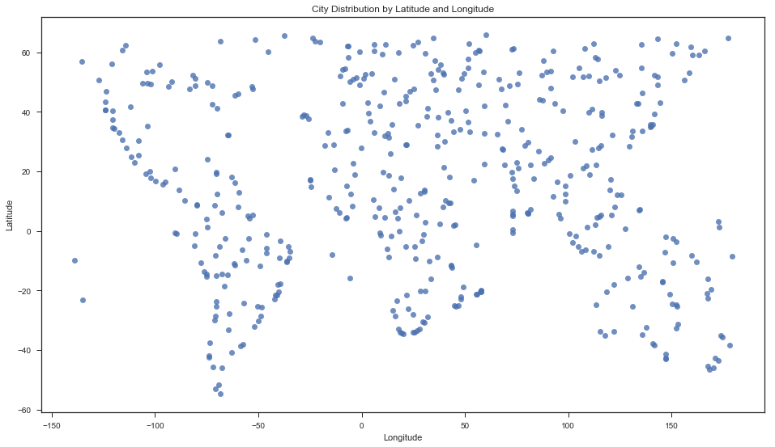
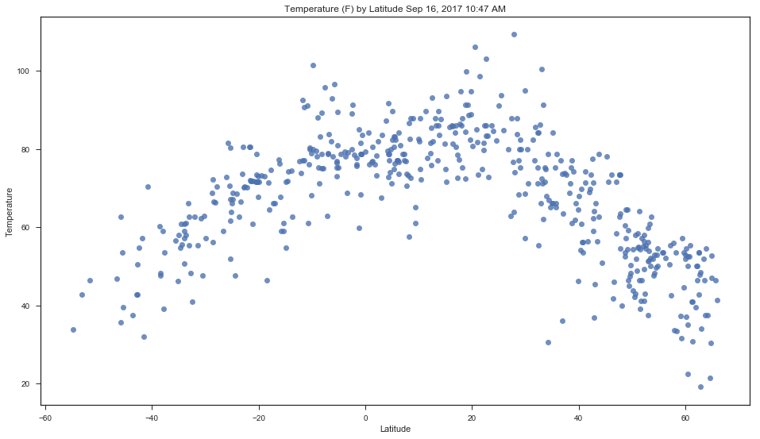
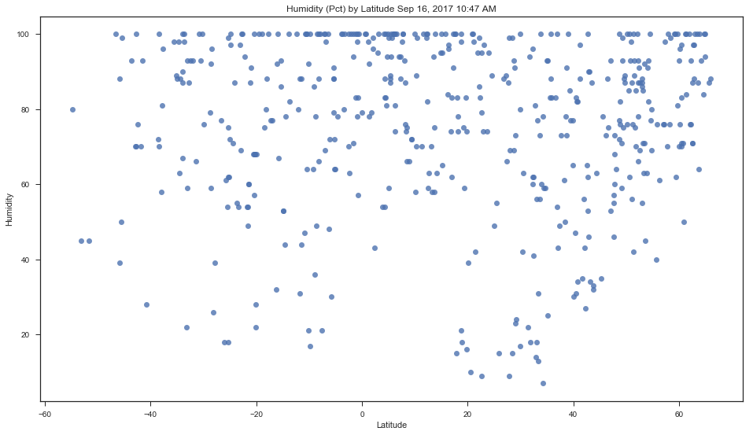

# Weather Analysis by Latitude

## Overview

This notebook visualizes the current weather in 500 unique cities across the world in random locations. [Citipy](https://pypi.python.org/pypi/citipy) a simple city-finding python package will be used to find randomly located cities, and the [OpenWeatherMap API](https://openweathermap.org/api), will return current weather statistics for those cities.

A series of scatter plots will be used to showcase the following relationships:

* Temperature (F) vs. Latitude.
* Humidity (%) vs. Latitude.
* Cloudiness (%) vs. Latitude.
* Wind Speed (mph) vs. Latitude.

Specifically, this script will:

* Randomly select **at least** 500 unique (non-repeat) cities based on latitude and longitude.
* Perform a weather check on each of the cities using a series of successive API calls. 
* Include a print log of each city as it's being processed with the city number, city name, and requested URL.
* Save both a CSV of all data retrieved and png images for each scatter plot.


```python
# Import dependencies.
from citipy import citipy
import numpy as np
import pandas as pd
import random
import datetime as date
import requests as req
import json
import seaborn as sns
import matplotlib.pyplot as plt

# Import Open Weather Map API keys.
from openWeatherMapApiKeys import apiKey

```

## Sampling Cities

Finding a city by searching random latitude and longitude values with Citipy can be problematic. Randomly selected remote locations, such as points in the middle of the Pacific Ocean or in Antarctica, may yield a city thousands of miles away in any direction. This is a problem for extremely northern or southern latitudes, or longitudes in the Pacific Ocean: random points in these areas inflate the number of cities selected in extreme northern or southern areas, or around the Pacific Rim.

To solve this, the range of latitudes is restricted to between 55th parallel south (running through Patagonia, Argentina) and 65th parallel north (running through southern Greenland and northern Canada). Longitudes are restricted to between 140th meridian west (which removes most of Alaska from the sample) and 160 meridian east (which leaves points west of Australia out). This yields a more uniform distribution of points that resolve to a city in Citipy, particularly by latitude.


```python
# Declare variables describing the scope of lat/lng search for cities.
latDim = {'min': -55, 'max': 65}
lngDim = {'min': -140, 'max': 180}

# Create arrays containing increments of lat and long.
latVals = np.arange(latDim['min'], latDim['max'], 0.1)
lngVals = np.arange(lngDim['min'], lngDim['max'], 0.1)
```


```python
# Create an empty data frame that will contain details of our randomly selected cities.
colNames = ('cityName', 'countryCode', 'randLat', 'randLng', 'uniqueName', 'Latitude', 'Longitude','Temperature',
            'Humidity','Cloudiness','WindSpeed')
cities = pd.DataFrame(columns = colNames)
```


```python
# Query Citipy for random lat long values until we collect our sample, and append weather
# data via API call.

# Set the sample size (this will return exactly as many records as the sample size).
sampleSize = 500

baseUrl = 'http://api.openweathermap.org/data/2.5/weather?q='
units = 'imperial'

# Set the current date and time the data was retrieved, for labeling.
analysistime = date.datetime.now()
analysistimename = analysistime.strftime("%b %d, %Y %I:%M %p")

while len(cities) <= sampleSize:
    # Choose a random point within our lat-lng domain.
    randLat = random.choice(latVals)
    randLng = random.choice(lngVals)
    # Call citipy's nearest_city() method to get a city object.
    city = citipy.nearest_city(randLat, randLng)
    cityName = city.city_name.replace(' ', '%20')
    countryCode = city.country_code
    # Check if the combination of city name and country code from citipy is already present in our data frame
    # This is the best that can be done with the nearest_city() method.
    if cityName + countryCode in cities.uniqueName.tolist():
        pass
    else:
        url = baseUrl + cityName + ',' + countryCode + '&units=' + units + '&APPID=' + apiKey
        weather_response = req.get(url)
        weather_json = weather_response.json()
        print('Status code: %s DF Length is now: %s' % (str(weather_json["cod"]), str(len(cities))))
        if weather_json["cod"] == 200:
            print('City %s: %s loaded with status %s: %s' % (weather_json['id'], weather_json['name'], weather_json["cod"], url))
            Latitude = weather_json["coord"]["lat"]
            Longitude = weather_json["coord"]["lon"]
            Temperature = weather_json["main"]["temp"]
            Humidity = weather_json["main"]["humidity"]
            Cloudiness = weather_json["clouds"]["all"]
            WindSpeed = weather_json["wind"]["speed"]
            cities.loc[len(cities)+1] = [weather_json['name'], countryCode, randLat, randLng, cityName+countryCode, Latitude, Longitude, Temperature, Humidity, Cloudiness, WindSpeed]
#             cities = concat(cities, DataFrame([{'cityName': cityName, 'countryCode' : countryCode, 'randLat' : randLat,'randLng' : randLng, 'uniqueName' : cityName, 'Latitude' : Latitude, 'Longitude' : Longitude,'Temperature' : Temperature, 'Humidity' : Humidity,'Cloudiness' : Cloudiness,'WindSpeed' : WindSpeed}])
        else:
            pass

```

    Status code: 200 DF Length is now: 0
    City 3994469: Ojinaga loaded with status 200: http://api.openweathermap.org/data/2.5/weather?q=ojinaga,mx&units=imperial&APPID=244a987a274dfd51f4820c3f46a53b02
    Status code: 200 DF Length is now: 1
    City 921786: Mitsamiouli loaded with status 200: http://api.openweathermap.org/data/2.5/weather?q=mitsamiouli,km&units=imperial&APPID=244a987a274dfd51f4820c3f46a53b02
    Status code: 200 DF Length is now: 2
    City 3448903: Sao Joao da Barra loaded with status 200: http://api.openweathermap.org/data/2.5/weather?q=sao%20joao%20da%20barra,br&units=imperial&APPID=244a987a274dfd51f4820c3f46a53b02
    Status code: 200 DF Length is now: 3
    City 3652764: Puerto Ayora loaded with status 200: http://api.openweathermap.org/data/2.5/weather?q=puerto%20ayora,ec&units=imperial&APPID=244a987a274dfd51f4820c3f46a53b02
    Status code: 200 DF Length is now: 4
    City 964420: Port Elizabeth loaded with status 200: http://api.openweathermap.org/data/2.5/weather?q=port%20elizabeth,za&units=imperial&APPID=244a987a274dfd51f4820c3f46a53b02
    Status code: 200 DF Length is now: 5
    City 3867427: Capitan Pablo Lagerenza loaded with status 200: http://api.openweathermap.org/data/2.5/weather?q=mayor%20pablo%20lagerenza,py&units=imperial&APPID=244a987a274dfd51f4820c3f46a53b02
    Status code: 200 DF Length is now: 6
    City 210379: Lusambo loaded with status 200: http://api.openweathermap.org/data/2.5/weather?q=lusambo,cd&units=imperial&APPID=244a987a274dfd51f4820c3f46a53b02
    Status code: 200 DF Length is now: 7
    City 3662489: Santa Isabel do Rio Negro loaded with status 200: http://api.openweathermap.org/data/2.5/weather?q=santa%20isabel%20do%20rio%20negro,br&units=imperial&APPID=244a987a274dfd51f4820c3f46a53b02
    Status code: 200 DF Length is now: 8
    City 6145890: Shelburne loaded with status 200: http://api.openweathermap.org/data/2.5/weather?q=shelburne,ca&units=imperial&APPID=244a987a274dfd51f4820c3f46a53b02
    Status code: 200 DF Length is now: 9
    City 4916311: Wheeling loaded with status 200: http://api.openweathermap.org/data/2.5/weather?q=wheeling,us&units=imperial&APPID=244a987a274dfd51f4820c3f46a53b02
    Status code: 200 DF Length is now: 10
    City 2136697: Lakatoro loaded with status 200: http://api.openweathermap.org/data/2.5/weather?q=lakatoro,vu&units=imperial&APPID=244a987a274dfd51f4820c3f46a53b02
    Status code: 200 DF Length is now: 11
    City 2013216: Vysokogornyy loaded with status 200: http://api.openweathermap.org/data/2.5/weather?q=vysokogornyy,ru&units=imperial&APPID=244a987a274dfd51f4820c3f46a53b02
    Status code: 200 DF Length is now: 12
    City 2206939: Bluff loaded with status 200: http://api.openweathermap.org/data/2.5/weather?q=bluff,nz&units=imperial&APPID=244a987a274dfd51f4820c3f46a53b02
    Status code: 200 DF Length is now: 13
    City 1860750: Kajiki loaded with status 200: http://api.openweathermap.org/data/2.5/weather?q=airai,pw&units=imperial&APPID=244a987a274dfd51f4820c3f46a53b02
    Status code: 200 DF Length is now: 14
    City 3894426: Coihaique loaded with status 200: http://api.openweathermap.org/data/2.5/weather?q=coihaique,cl&units=imperial&APPID=244a987a274dfd51f4820c3f46a53b02
    Status code: 200 DF Length is now: 15
    City 935215: Saint-Philippe loaded with status 200: http://api.openweathermap.org/data/2.5/weather?q=saint-philippe,re&units=imperial&APPID=244a987a274dfd51f4820c3f46a53b02
    Status code: 200 DF Length is now: 16
    City 1540711: Muravlenko loaded with status 200: http://api.openweathermap.org/data/2.5/weather?q=muravlenko,ru&units=imperial&APPID=244a987a274dfd51f4820c3f46a53b02
    Status code: 200 DF Length is now: 17
    City 2138555: Poum loaded with status 200: http://api.openweathermap.org/data/2.5/weather?q=poum,nc&units=imperial&APPID=244a987a274dfd51f4820c3f46a53b02
    Status code: 200 DF Length is now: 18
    City 1526038: Atbasar loaded with status 200: http://api.openweathermap.org/data/2.5/weather?q=atbasar,kz&units=imperial&APPID=244a987a274dfd51f4820c3f46a53b02
    Status code: 200 DF Length is now: 19
    City 6255012: Flinders loaded with status 200: http://api.openweathermap.org/data/2.5/weather?q=flinders,au&units=imperial&APPID=244a987a274dfd51f4820c3f46a53b02
    Status code: 200 DF Length is now: 20
    City 3421765: Nanortalik loaded with status 200: http://api.openweathermap.org/data/2.5/weather?q=nanortalik,gl&units=imperial&APPID=244a987a274dfd51f4820c3f46a53b02
    Status code: 200 DF Length is now: 21
    City 1106677: Bambous Virieux loaded with status 200: http://api.openweathermap.org/data/2.5/weather?q=bambous%20virieux,mu&units=imperial&APPID=244a987a274dfd51f4820c3f46a53b02
    Status code: 200 DF Length is now: 22
    City 2137773: Vao loaded with status 200: http://api.openweathermap.org/data/2.5/weather?q=vao,nc&units=imperial&APPID=244a987a274dfd51f4820c3f46a53b02
    Status code: 200 DF Length is now: 23
    City 2411397: Georgetown loaded with status 200: http://api.openweathermap.org/data/2.5/weather?q=georgetown,sh&units=imperial&APPID=244a987a274dfd51f4820c3f46a53b02
    Status code: 200 DF Length is now: 24
    City 2093967: Kimbe loaded with status 200: http://api.openweathermap.org/data/2.5/weather?q=kimbe,pg&units=imperial&APPID=244a987a274dfd51f4820c3f46a53b02
    Status code: 200 DF Length is now: 25
    City 2185763: Okato loaded with status 200: http://api.openweathermap.org/data/2.5/weather?q=okato,nz&units=imperial&APPID=244a987a274dfd51f4820c3f46a53b02
    Status code: 200 DF Length is now: 26
    City 4030556: Rikitea loaded with status 200: http://api.openweathermap.org/data/2.5/weather?q=rikitea,pf&units=imperial&APPID=244a987a274dfd51f4820c3f46a53b02
    Status code: 200 DF Length is now: 27
    City 1054500: Tsiombe loaded with status 200: http://api.openweathermap.org/data/2.5/weather?q=tsihombe,mg&units=imperial&APPID=244a987a274dfd51f4820c3f46a53b02
    Status code: 200 DF Length is now: 28
    City 2446796: Bilma loaded with status 200: http://api.openweathermap.org/data/2.5/weather?q=bilma,ne&units=imperial&APPID=244a987a274dfd51f4820c3f46a53b02
    Status code: 200 DF Length is now: 29
    City 3896218: Castro loaded with status 200: http://api.openweathermap.org/data/2.5/weather?q=castro,cl&units=imperial&APPID=244a987a274dfd51f4820c3f46a53b02
    Status code: 200 DF Length is now: 30
    City 3369157: Cape Town loaded with status 200: http://api.openweathermap.org/data/2.5/weather?q=cape%20town,za&units=imperial&APPID=244a987a274dfd51f4820c3f46a53b02
    Status code: 200 DF Length is now: 31
    City 3664980: Boa Vista loaded with status 200: http://api.openweathermap.org/data/2.5/weather?q=boa%20vista,br&units=imperial&APPID=244a987a274dfd51f4820c3f46a53b02
    Status code: 200 DF Length is now: 32
    City 3929389: San Miguel de Cauri loaded with status 200: http://api.openweathermap.org/data/2.5/weather?q=san%20miguel%20de%20cauri,pe&units=imperial&APPID=244a987a274dfd51f4820c3f46a53b02
    Status code: 200 DF Length is now: 33
    City 934812: Albion loaded with status 200: http://api.openweathermap.org/data/2.5/weather?q=albion,mu&units=imperial&APPID=244a987a274dfd51f4820c3f46a53b02
    Status code: 200 DF Length is now: 34
    City 2162683: Innisfail loaded with status 200: http://api.openweathermap.org/data/2.5/weather?q=innisfail,au&units=imperial&APPID=244a987a274dfd51f4820c3f46a53b02
    Status code: 200 DF Length is now: 35
    City 2126493: Boshnyakovo loaded with status 200: http://api.openweathermap.org/data/2.5/weather?q=boshnyakovo,ru&units=imperial&APPID=244a987a274dfd51f4820c3f46a53b02
    Status code: 200 DF Length is now: 36
    City 3354540: Omaruru loaded with status 200: http://api.openweathermap.org/data/2.5/weather?q=omaruru,na&units=imperial&APPID=244a987a274dfd51f4820c3f46a53b02
    Status code: 200 DF Length is now: 37
    City 2129513: Kizukuri loaded with status 200: http://api.openweathermap.org/data/2.5/weather?q=kizukuri,jp&units=imperial&APPID=244a987a274dfd51f4820c3f46a53b02
    Status code: 200 DF Length is now: 38
    City 1646443: Cimaja loaded with status 200: http://api.openweathermap.org/data/2.5/weather?q=palabuhanratu,id&units=imperial&APPID=244a987a274dfd51f4820c3f46a53b02
    Status code: 200 DF Length is now: 39
    City 3069465: Nove Mesto na Morave loaded with status 200: http://api.openweathermap.org/data/2.5/weather?q=nove%20mesto%20na%20morave,cz&units=imperial&APPID=244a987a274dfd51f4820c3f46a53b02
    Status code: 200 DF Length is now: 40
    City 3838859: Rio Gallegos loaded with status 200: http://api.openweathermap.org/data/2.5/weather?q=rio%20gallegos,ar&units=imperial&APPID=244a987a274dfd51f4820c3f46a53b02
    Status code: 200 DF Length is now: 41
    City 3374346: Ponta do Sol loaded with status 200: http://api.openweathermap.org/data/2.5/weather?q=ponta%20do%20sol,cv&units=imperial&APPID=244a987a274dfd51f4820c3f46a53b02
    Status code: 200 DF Length is now: 42
    City 988356: Kokstad loaded with status 200: http://api.openweathermap.org/data/2.5/weather?q=umzimvubu,za&units=imperial&APPID=244a987a274dfd51f4820c3f46a53b02
    Status code: 200 DF Length is now: 43
    City 5563839: Fortuna loaded with status 200: http://api.openweathermap.org/data/2.5/weather?q=fortuna,us&units=imperial&APPID=244a987a274dfd51f4820c3f46a53b02
    Status code: 200 DF Length is now: 44
    City 3985710: Cabo San Lucas loaded with status 200: http://api.openweathermap.org/data/2.5/weather?q=cabo%20san%20lucas,mx&units=imperial&APPID=244a987a274dfd51f4820c3f46a53b02
    Status code: 200 DF Length is now: 45
    City 3575479: Charlestown loaded with status 200: http://api.openweathermap.org/data/2.5/weather?q=charlestown,kn&units=imperial&APPID=244a987a274dfd51f4820c3f46a53b02
    Status code: 200 DF Length is now: 46
    City 934649: Cap Malheureux loaded with status 200: http://api.openweathermap.org/data/2.5/weather?q=cap%20malheureux,mu&units=imperial&APPID=244a987a274dfd51f4820c3f46a53b02
    Status code: 200 DF Length is now: 47
    City 2186280: Nelson loaded with status 200: http://api.openweathermap.org/data/2.5/weather?q=nelson,nz&units=imperial&APPID=244a987a274dfd51f4820c3f46a53b02
    Status code: 200 DF Length is now: 48
    City 2077963: Albany loaded with status 200: http://api.openweathermap.org/data/2.5/weather?q=albany,au&units=imperial&APPID=244a987a274dfd51f4820c3f46a53b02
    Status code: 200 DF Length is now: 49
    City 2303611: Axim loaded with status 200: http://api.openweathermap.org/data/2.5/weather?q=axim,gh&units=imperial&APPID=244a987a274dfd51f4820c3f46a53b02
    Status code: 200 DF Length is now: 50
    City 3381538: Grand-Santi loaded with status 200: http://api.openweathermap.org/data/2.5/weather?q=grand-santi,gf&units=imperial&APPID=244a987a274dfd51f4820c3f46a53b02
    Status code: 200 DF Length is now: 51
    City 6111862: Port Hardy loaded with status 200: http://api.openweathermap.org/data/2.5/weather?q=port%20hardy,ca&units=imperial&APPID=244a987a274dfd51f4820c3f46a53b02
    Status code: 200 DF Length is now: 52
    City 1067565: Beloha loaded with status 200: http://api.openweathermap.org/data/2.5/weather?q=beloha,mg&units=imperial&APPID=244a987a274dfd51f4820c3f46a53b02
    Status code: 200 DF Length is now: 53
    City 3399518: Floresta loaded with status 200: http://api.openweathermap.org/data/2.5/weather?q=floresta,br&units=imperial&APPID=244a987a274dfd51f4820c3f46a53b02
    Status code: 200 DF Length is now: 54
    City 1337610: Thinadhoo loaded with status 200: http://api.openweathermap.org/data/2.5/weather?q=viligili,mv&units=imperial&APPID=244a987a274dfd51f4820c3f46a53b02
    Status code: 200 DF Length is now: 55
    City 333750: Jinka loaded with status 200: http://api.openweathermap.org/data/2.5/weather?q=jinka,et&units=imperial&APPID=244a987a274dfd51f4820c3f46a53b02
    Status code: 200 DF Length is now: 56
    City 3333198: South Gloucestershire loaded with status 200: http://api.openweathermap.org/data/2.5/weather?q=codrington,ag&units=imperial&APPID=244a987a274dfd51f4820c3f46a53b02
    Status code: 200 DF Length is now: 57
    City 3386213: Touros loaded with status 200: http://api.openweathermap.org/data/2.5/weather?q=touros,br&units=imperial&APPID=244a987a274dfd51f4820c3f46a53b02
    Status code: 200 DF Length is now: 58
    City 6169587: Truro loaded with status 200: http://api.openweathermap.org/data/2.5/weather?q=truro,ca&units=imperial&APPID=244a987a274dfd51f4820c3f46a53b02
    Status code: 200 DF Length is now: 59
    City 2194098: Ahipara loaded with status 200: http://api.openweathermap.org/data/2.5/weather?q=ahipara,nz&units=imperial&APPID=244a987a274dfd51f4820c3f46a53b02
    Status code: 200 DF Length is now: 60
    City 1078317: Amparihy loaded with status 200: http://api.openweathermap.org/data/2.5/weather?q=taolanaro,mg&units=imperial&APPID=244a987a274dfd51f4820c3f46a53b02
    Status code: 200 DF Length is now: 61
    City 1861084: Izumo loaded with status 200: http://api.openweathermap.org/data/2.5/weather?q=izumo,jp&units=imperial&APPID=244a987a274dfd51f4820c3f46a53b02
    Status code: 200 DF Length is now: 62
    City 364216: Wad az Zaki loaded with status 200: http://api.openweathermap.org/data/2.5/weather?q=umm%20durman,sd&units=imperial&APPID=244a987a274dfd51f4820c3f46a53b02
    Status code: 200 DF Length is now: 63
    City 5403676: Truckee loaded with status 200: http://api.openweathermap.org/data/2.5/weather?q=truckee,us&units=imperial&APPID=244a987a274dfd51f4820c3f46a53b02
    Status code: 200 DF Length is now: 64
    City 678831: Dridu loaded with status 200: http://api.openweathermap.org/data/2.5/weather?q=dridu,ro&units=imperial&APPID=244a987a274dfd51f4820c3f46a53b02
    Status code: 200 DF Length is now: 65
    City 3573061: Saint George loaded with status 200: http://api.openweathermap.org/data/2.5/weather?q=saint%20george,bm&units=imperial&APPID=244a987a274dfd51f4820c3f46a53b02
    Status code: 200 DF Length is now: 66
    City 2354675: Tenkodogo loaded with status 200: http://api.openweathermap.org/data/2.5/weather?q=tenkodogo,bf&units=imperial&APPID=244a987a274dfd51f4820c3f46a53b02
    Status code: 200 DF Length is now: 67
    City 3868707: Valdivia loaded with status 200: http://api.openweathermap.org/data/2.5/weather?q=valdivia,cl&units=imperial&APPID=244a987a274dfd51f4820c3f46a53b02
    Status code: 200 DF Length is now: 68
    City 359796: Suez loaded with status 200: http://api.openweathermap.org/data/2.5/weather?q=suez,eg&units=imperial&APPID=244a987a274dfd51f4820c3f46a53b02
    Status code: 200 DF Length is now: 69
    City 2688250: Norrtalje loaded with status 200: http://api.openweathermap.org/data/2.5/weather?q=norrtalje,se&units=imperial&APPID=244a987a274dfd51f4820c3f46a53b02
    Status code: 200 DF Length is now: 70
    City 1580541: Hoi An loaded with status 200: http://api.openweathermap.org/data/2.5/weather?q=hoi%20an,vn&units=imperial&APPID=244a987a274dfd51f4820c3f46a53b02
    Status code: 200 DF Length is now: 71
    City 2110227: Butaritari loaded with status 200: http://api.openweathermap.org/data/2.5/weather?q=butaritari,ki&units=imperial&APPID=244a987a274dfd51f4820c3f46a53b02
    Status code: 200 DF Length is now: 72
    City 1264099: Malhargarh loaded with status 200: http://api.openweathermap.org/data/2.5/weather?q=malhargarh,in&units=imperial&APPID=244a987a274dfd51f4820c3f46a53b02
    Status code: 200 DF Length is now: 73
    City 3370903: Jamestown loaded with status 200: http://api.openweathermap.org/data/2.5/weather?q=jamestown,sh&units=imperial&APPID=244a987a274dfd51f4820c3f46a53b02
    Status code: 200 DF Length is now: 74
    City 155285: Mahanje loaded with status 200: http://api.openweathermap.org/data/2.5/weather?q=mahanje,tz&units=imperial&APPID=244a987a274dfd51f4820c3f46a53b02
    Status code: 200 DF Length is now: 75
    City 3372760: Praia da Vitoria loaded with status 200: http://api.openweathermap.org/data/2.5/weather?q=praia%20da%20vitoria,pt&units=imperial&APPID=244a987a274dfd51f4820c3f46a53b02
    Status code: 200 DF Length is now: 76
    City 3430863: Mar del Plata loaded with status 200: http://api.openweathermap.org/data/2.5/weather?q=mar%20del%20plata,ar&units=imperial&APPID=244a987a274dfd51f4820c3f46a53b02
    Status code: 200 DF Length is now: 77
    City 2185081: Paihia loaded with status 200: http://api.openweathermap.org/data/2.5/weather?q=russell,nz&units=imperial&APPID=244a987a274dfd51f4820c3f46a53b02
    Status code: 200 DF Length is now: 78
    City 3450554: Salvador loaded with status 200: http://api.openweathermap.org/data/2.5/weather?q=salvador,br&units=imperial&APPID=244a987a274dfd51f4820c3f46a53b02
    Status code: 200 DF Length is now: 79
    City 3601402: Savannah Bight loaded with status 200: http://api.openweathermap.org/data/2.5/weather?q=savannah%20bight,hn&units=imperial&APPID=244a987a274dfd51f4820c3f46a53b02
    Status code: 200 DF Length is now: 80
    City 4020109: Atuona loaded with status 200: http://api.openweathermap.org/data/2.5/weather?q=atuona,pf&units=imperial&APPID=244a987a274dfd51f4820c3f46a53b02
    Status code: 200 DF Length is now: 81
    City 3347019: Namibe loaded with status 200: http://api.openweathermap.org/data/2.5/weather?q=namibe,ao&units=imperial&APPID=244a987a274dfd51f4820c3f46a53b02
    Status code: 200 DF Length is now: 82
    City 1510689: Baykit loaded with status 200: http://api.openweathermap.org/data/2.5/weather?q=baykit,ru&units=imperial&APPID=244a987a274dfd51f4820c3f46a53b02
    Status code: 200 DF Length is now: 83
    City 2013727: Vanavara loaded with status 200: http://api.openweathermap.org/data/2.5/weather?q=vanavara,ru&units=imperial&APPID=244a987a274dfd51f4820c3f46a53b02
    Status code: 200 DF Length is now: 84
    City 1070940: Antananarivo loaded with status 200: http://api.openweathermap.org/data/2.5/weather?q=antananarivo,mg&units=imperial&APPID=244a987a274dfd51f4820c3f46a53b02
    Status code: 200 DF Length is now: 85
    City 4173593: South Venice loaded with status 200: http://api.openweathermap.org/data/2.5/weather?q=south%20venice,us&units=imperial&APPID=244a987a274dfd51f4820c3f46a53b02
    Status code: 200 DF Length is now: 86
    City 934475: Grande Riviere Sud Est loaded with status 200: http://api.openweathermap.org/data/2.5/weather?q=grand%20river%20south%20east,mu&units=imperial&APPID=244a987a274dfd51f4820c3f46a53b02
    Status code: 200 DF Length is now: 87
    City 6068416: Mayo loaded with status 200: http://api.openweathermap.org/data/2.5/weather?q=mayo,ca&units=imperial&APPID=244a987a274dfd51f4820c3f46a53b02
    Status code: 200 DF Length is now: 88
    City 2021017: Kysyl-Syr loaded with status 200: http://api.openweathermap.org/data/2.5/weather?q=kysyl-syr,ru&units=imperial&APPID=244a987a274dfd51f4820c3f46a53b02
    Status code: 200 DF Length is now: 89
    City 1591474: Thanh pho Bac Lieu loaded with status 200: http://api.openweathermap.org/data/2.5/weather?q=bac%20lieu,vn&units=imperial&APPID=244a987a274dfd51f4820c3f46a53b02
    Status code: 200 DF Length is now: 90
    City 3471451: Arraial do Cabo loaded with status 200: http://api.openweathermap.org/data/2.5/weather?q=arraial%20do%20cabo,br&units=imperial&APPID=244a987a274dfd51f4820c3f46a53b02
    Status code: 200 DF Length is now: 91
    City 6148373: Sioux Lookout loaded with status 200: http://api.openweathermap.org/data/2.5/weather?q=sioux%20lookout,ca&units=imperial&APPID=244a987a274dfd51f4820c3f46a53b02
    Status code: 200 DF Length is now: 92
    City 3542759: Rancho Pekita loaded with status 200: http://api.openweathermap.org/data/2.5/weather?q=santa%20fe,cu&units=imperial&APPID=244a987a274dfd51f4820c3f46a53b02
    Status code: 200 DF Length is now: 93
    City 2155415: New Norfolk loaded with status 200: http://api.openweathermap.org/data/2.5/weather?q=new%20norfolk,au&units=imperial&APPID=244a987a274dfd51f4820c3f46a53b02
    Status code: 200 DF Length is now: 94
    City 3451432: Riacho do Ouro loaded with status 200: http://api.openweathermap.org/data/2.5/weather?q=dianopolis,br&units=imperial&APPID=244a987a274dfd51f4820c3f46a53b02
    Status code: 200 DF Length is now: 95
    City 529368: Marfino loaded with status 200: http://api.openweathermap.org/data/2.5/weather?q=marfino,ru&units=imperial&APPID=244a987a274dfd51f4820c3f46a53b02
    Status code: 200 DF Length is now: 96
    City 5367788: Lompoc loaded with status 200: http://api.openweathermap.org/data/2.5/weather?q=lompoc,us&units=imperial&APPID=244a987a274dfd51f4820c3f46a53b02
    Status code: 200 DF Length is now: 97
    City 464343: Zasechnoye loaded with status 200: http://api.openweathermap.org/data/2.5/weather?q=zasechnoye,ru&units=imperial&APPID=244a987a274dfd51f4820c3f46a53b02
    Status code: 200 DF Length is now: 98
    City 2070998: Geraldton loaded with status 200: http://api.openweathermap.org/data/2.5/weather?q=geraldton,au&units=imperial&APPID=244a987a274dfd51f4820c3f46a53b02
    Status code: 200 DF Length is now: 99
    City 6166142: Thunder Bay loaded with status 200: http://api.openweathermap.org/data/2.5/weather?q=thunder%20bay,ca&units=imperial&APPID=244a987a274dfd51f4820c3f46a53b02
    Status code: 200 DF Length is now: 100
    City 4866445: Mason City loaded with status 200: http://api.openweathermap.org/data/2.5/weather?q=mason%20city,us&units=imperial&APPID=244a987a274dfd51f4820c3f46a53b02
    Status code: 200 DF Length is now: 101
    City 1633419: Padang loaded with status 200: http://api.openweathermap.org/data/2.5/weather?q=padang,id&units=imperial&APPID=244a987a274dfd51f4820c3f46a53b02
    Status code: 200 DF Length is now: 102
    City 819411: Аксиньино loaded with status 200: http://api.openweathermap.org/data/2.5/weather?q=chagda,ru&units=imperial&APPID=244a987a274dfd51f4820c3f46a53b02
    Status code: 200 DF Length is now: 103
    City 1651531: Ambon loaded with status 200: http://api.openweathermap.org/data/2.5/weather?q=ambon,id&units=imperial&APPID=244a987a274dfd51f4820c3f46a53b02
    Status code: 200 DF Length is now: 104
    City 5983720: Iqaluit loaded with status 200: http://api.openweathermap.org/data/2.5/weather?q=iqaluit,ca&units=imperial&APPID=244a987a274dfd51f4820c3f46a53b02
    Status code: 200 DF Length is now: 105
    City 1812381: Dongli loaded with status 200: http://api.openweathermap.org/data/2.5/weather?q=dongli,cn&units=imperial&APPID=244a987a274dfd51f4820c3f46a53b02
    Status code: 200 DF Length is now: 106
    City 1244926: Hambantota loaded with status 200: http://api.openweathermap.org/data/2.5/weather?q=hambantota,lk&units=imperial&APPID=244a987a274dfd51f4820c3f46a53b02
    Status code: 200 DF Length is now: 107
    City 1282256: Hithadhoo loaded with status 200: http://api.openweathermap.org/data/2.5/weather?q=hithadhoo,mv&units=imperial&APPID=244a987a274dfd51f4820c3f46a53b02
    Status code: 200 DF Length is now: 108
    City 1798473: Puqi loaded with status 200: http://api.openweathermap.org/data/2.5/weather?q=puqi,cn&units=imperial&APPID=244a987a274dfd51f4820c3f46a53b02
    Status code: 200 DF Length is now: 109
    City 6355222: Yulara loaded with status 200: http://api.openweathermap.org/data/2.5/weather?q=yulara,au&units=imperial&APPID=244a987a274dfd51f4820c3f46a53b02
    Status code: 200 DF Length is now: 110
    City 2270385: Camacha loaded with status 200: http://api.openweathermap.org/data/2.5/weather?q=camacha,pt&units=imperial&APPID=244a987a274dfd51f4820c3f46a53b02
    Status code: 200 DF Length is now: 111
    City 3662927: Pauini loaded with status 200: http://api.openweathermap.org/data/2.5/weather?q=pauini,br&units=imperial&APPID=244a987a274dfd51f4820c3f46a53b02
    Status code: 200 DF Length is now: 112
    City 2219235: Awbari loaded with status 200: http://api.openweathermap.org/data/2.5/weather?q=awbari,ly&units=imperial&APPID=244a987a274dfd51f4820c3f46a53b02
    Status code: 200 DF Length is now: 113
    City 2175403: Blackwater loaded with status 200: http://api.openweathermap.org/data/2.5/weather?q=blackwater,au&units=imperial&APPID=244a987a274dfd51f4820c3f46a53b02
    Status code: 200 DF Length is now: 114
    City 3395981: Maceio loaded with status 200: http://api.openweathermap.org/data/2.5/weather?q=maceio,br&units=imperial&APPID=244a987a274dfd51f4820c3f46a53b02
    Status code: 200 DF Length is now: 115
    City 3382160: Cayenne loaded with status 200: http://api.openweathermap.org/data/2.5/weather?q=cayenne,gf&units=imperial&APPID=244a987a274dfd51f4820c3f46a53b02
    Status code: 200 DF Length is now: 116
    City 3361934: Saldanha loaded with status 200: http://api.openweathermap.org/data/2.5/weather?q=saldanha,za&units=imperial&APPID=244a987a274dfd51f4820c3f46a53b02
    Status code: 200 DF Length is now: 117
    City 3366880: Hermanus loaded with status 200: http://api.openweathermap.org/data/2.5/weather?q=hermanus,za&units=imperial&APPID=244a987a274dfd51f4820c3f46a53b02
    Status code: 200 DF Length is now: 118
    City 4021858: Guerrero Negro loaded with status 200: http://api.openweathermap.org/data/2.5/weather?q=guerrero%20negro,mx&units=imperial&APPID=244a987a274dfd51f4820c3f46a53b02
    Status code: 200 DF Length is now: 119
    City 2964782: Dingle loaded with status 200: http://api.openweathermap.org/data/2.5/weather?q=dingle,ie&units=imperial&APPID=244a987a274dfd51f4820c3f46a53b02
    Status code: 200 DF Length is now: 120
    City 3026285: Chateaudun loaded with status 200: http://api.openweathermap.org/data/2.5/weather?q=chateaudun,fr&units=imperial&APPID=244a987a274dfd51f4820c3f46a53b02
    Status code: 200 DF Length is now: 121
    City 241131: Victoria loaded with status 200: http://api.openweathermap.org/data/2.5/weather?q=victoria,sc&units=imperial&APPID=244a987a274dfd51f4820c3f46a53b02
    Status code: 200 DF Length is now: 122
    City 214614: Kamina loaded with status 200: http://api.openweathermap.org/data/2.5/weather?q=kamina,cd&units=imperial&APPID=244a987a274dfd51f4820c3f46a53b02
    Status code: 200 DF Length is now: 123
    City 933995: Souillac loaded with status 200: http://api.openweathermap.org/data/2.5/weather?q=souillac,mu&units=imperial&APPID=244a987a274dfd51f4820c3f46a53b02
    Status code: 200 DF Length is now: 124
    City 2121385: Severo-Kurilsk loaded with status 200: http://api.openweathermap.org/data/2.5/weather?q=severo-kurilsk,ru&units=imperial&APPID=244a987a274dfd51f4820c3f46a53b02
    Status code: 200 DF Length is now: 125
    City 2408770: Freetown loaded with status 200: http://api.openweathermap.org/data/2.5/weather?q=goderich,sl&units=imperial&APPID=244a987a274dfd51f4820c3f46a53b02
    Status code: 200 DF Length is now: 126
    City 3883457: Lebu loaded with status 200: http://api.openweathermap.org/data/2.5/weather?q=lebu,cl&units=imperial&APPID=244a987a274dfd51f4820c3f46a53b02
    Status code: 200 DF Length is now: 127
    City 3372783: Ponta Delgada loaded with status 200: http://api.openweathermap.org/data/2.5/weather?q=ponta%20delgada,pt&units=imperial&APPID=244a987a274dfd51f4820c3f46a53b02
    Status code: 200 DF Length is now: 128
    City 1649150: Bengkulu loaded with status 200: http://api.openweathermap.org/data/2.5/weather?q=bengkulu,id&units=imperial&APPID=244a987a274dfd51f4820c3f46a53b02
    Status code: 200 DF Length is now: 129
    City 1259385: Port Blair loaded with status 200: http://api.openweathermap.org/data/2.5/weather?q=port%20blair,in&units=imperial&APPID=244a987a274dfd51f4820c3f46a53b02
    Status code: 200 DF Length is now: 130
    City 1337610: Thinadhoo loaded with status 200: http://api.openweathermap.org/data/2.5/weather?q=thinadhoo,mv&units=imperial&APPID=244a987a274dfd51f4820c3f46a53b02
    Status code: 200 DF Length is now: 131
    City 3618908: Juigalpa loaded with status 200: http://api.openweathermap.org/data/2.5/weather?q=juigalpa,ni&units=imperial&APPID=244a987a274dfd51f4820c3f46a53b02
    Status code: 200 DF Length is now: 132
    City 541826: Krasnyy Bor loaded with status 200: http://api.openweathermap.org/data/2.5/weather?q=nikolskoye,ru&units=imperial&APPID=244a987a274dfd51f4820c3f46a53b02
    Status code: 200 DF Length is now: 133
    City 934479: Grand Gaube loaded with status 200: http://api.openweathermap.org/data/2.5/weather?q=grand%20gaube,mu&units=imperial&APPID=244a987a274dfd51f4820c3f46a53b02
    Status code: 200 DF Length is now: 134
    City 2112309: Katsuura loaded with status 200: http://api.openweathermap.org/data/2.5/weather?q=katsuura,jp&units=imperial&APPID=244a987a274dfd51f4820c3f46a53b02
    Status code: 200 DF Length is now: 135
    City 2037335: Fuyu loaded with status 200: http://api.openweathermap.org/data/2.5/weather?q=fuyu,cn&units=imperial&APPID=244a987a274dfd51f4820c3f46a53b02
    Status code: 200 DF Length is now: 136
    City 6167817: Torbay loaded with status 200: http://api.openweathermap.org/data/2.5/weather?q=torbay,ca&units=imperial&APPID=244a987a274dfd51f4820c3f46a53b02
    Status code: 200 DF Length is now: 137
    City 3424934: Saint-Pierre loaded with status 200: http://api.openweathermap.org/data/2.5/weather?q=saint-pierre,pm&units=imperial&APPID=244a987a274dfd51f4820c3f46a53b02
    Status code: 200 DF Length is now: 138
    City 2023584: Imeni Poliny Osipenko loaded with status 200: http://api.openweathermap.org/data/2.5/weather?q=imeni%20poliny%20osipenko,ru&units=imperial&APPID=244a987a274dfd51f4820c3f46a53b02
    Status code: 200 DF Length is now: 139
    City 2075265: Busselton loaded with status 200: http://api.openweathermap.org/data/2.5/weather?q=busselton,au&units=imperial&APPID=244a987a274dfd51f4820c3f46a53b02
    Status code: 200 DF Length is now: 140
    City 64814: Bandarbeyla loaded with status 200: http://api.openweathermap.org/data/2.5/weather?q=bandarbeyla,so&units=imperial&APPID=244a987a274dfd51f4820c3f46a53b02
    Status code: 200 DF Length is now: 141
    City 95788: Hit loaded with status 200: http://api.openweathermap.org/data/2.5/weather?q=hit,iq&units=imperial&APPID=244a987a274dfd51f4820c3f46a53b02
    Status code: 200 DF Length is now: 142
    City 4337291: Pineville loaded with status 200: http://api.openweathermap.org/data/2.5/weather?q=pineville,us&units=imperial&APPID=244a987a274dfd51f4820c3f46a53b02
    Status code: 200 DF Length is now: 143
    City 2657915: Zofingen loaded with status 200: http://api.openweathermap.org/data/2.5/weather?q=zofingen,ch&units=imperial&APPID=244a987a274dfd51f4820c3f46a53b02
    Status code: 200 DF Length is now: 144
    City 1134074: Mama Khel loaded with status 200: http://api.openweathermap.org/data/2.5/weather?q=azrow,af&units=imperial&APPID=244a987a274dfd51f4820c3f46a53b02
    Status code: 200 DF Length is now: 145
    City 5836068: Rawlins loaded with status 200: http://api.openweathermap.org/data/2.5/weather?q=rawlins,us&units=imperial&APPID=244a987a274dfd51f4820c3f46a53b02
    Status code: 200 DF Length is now: 146
    City 3929520: San Juan loaded with status 200: http://api.openweathermap.org/data/2.5/weather?q=marcona,pe&units=imperial&APPID=244a987a274dfd51f4820c3f46a53b02
    Status code: 200 DF Length is now: 147
    City 3472473: Alto Araguaia loaded with status 200: http://api.openweathermap.org/data/2.5/weather?q=alto%20araguaia,br&units=imperial&APPID=244a987a274dfd51f4820c3f46a53b02
    Status code: 200 DF Length is now: 148
    City 3440777: Rocha loaded with status 200: http://api.openweathermap.org/data/2.5/weather?q=rocha,uy&units=imperial&APPID=244a987a274dfd51f4820c3f46a53b02
    Status code: 200 DF Length is now: 149
    City 3466165: Cidreira loaded with status 200: http://api.openweathermap.org/data/2.5/weather?q=cidreira,br&units=imperial&APPID=244a987a274dfd51f4820c3f46a53b02
    Status code: 200 DF Length is now: 150
    City 3985168: San Patricio loaded with status 200: http://api.openweathermap.org/data/2.5/weather?q=san%20patricio,mx&units=imperial&APPID=244a987a274dfd51f4820c3f46a53b02
    Status code: 200 DF Length is now: 151
    City 2255564: Ouesso loaded with status 200: http://api.openweathermap.org/data/2.5/weather?q=ouesso,cg&units=imperial&APPID=244a987a274dfd51f4820c3f46a53b02
    Status code: 200 DF Length is now: 152
    City 1052944: Antonio Enes loaded with status 200: http://api.openweathermap.org/data/2.5/weather?q=angoche,mz&units=imperial&APPID=244a987a274dfd51f4820c3f46a53b02
    Status code: 200 DF Length is now: 153
    City 1106643: Quatre Cocos loaded with status 200: http://api.openweathermap.org/data/2.5/weather?q=quatre%20cocos,mu&units=imperial&APPID=244a987a274dfd51f4820c3f46a53b02
    Status code: 200 DF Length is now: 154
    City 535639: Letka loaded with status 200: http://api.openweathermap.org/data/2.5/weather?q=letka,ru&units=imperial&APPID=244a987a274dfd51f4820c3f46a53b02
    Status code: 200 DF Length is now: 155
    City 3470137: Belmonte loaded with status 200: http://api.openweathermap.org/data/2.5/weather?q=belmonte,br&units=imperial&APPID=244a987a274dfd51f4820c3f46a53b02
    Status code: 200 DF Length is now: 156
    City 2051523: Bratsk loaded with status 200: http://api.openweathermap.org/data/2.5/weather?q=bratsk,ru&units=imperial&APPID=244a987a274dfd51f4820c3f46a53b02
    Status code: 200 DF Length is now: 157
    City 1337617: Muli loaded with status 200: http://api.openweathermap.org/data/2.5/weather?q=muli,mv&units=imperial&APPID=244a987a274dfd51f4820c3f46a53b02
    Status code: 200 DF Length is now: 158
    City 80509: Bardiyah loaded with status 200: http://api.openweathermap.org/data/2.5/weather?q=bardiyah,ly&units=imperial&APPID=244a987a274dfd51f4820c3f46a53b02
    Status code: 200 DF Length is now: 159
    City 2122574: Ola loaded with status 200: http://api.openweathermap.org/data/2.5/weather?q=ola,ru&units=imperial&APPID=244a987a274dfd51f4820c3f46a53b02
    Status code: 200 DF Length is now: 160
    City 2377457: Nouadhibou loaded with status 200: http://api.openweathermap.org/data/2.5/weather?q=nouadhibou,mr&units=imperial&APPID=244a987a274dfd51f4820c3f46a53b02
    Status code: 200 DF Length is now: 161
    City 6979864: Jinshaba loaded with status 200: http://api.openweathermap.org/data/2.5/weather?q=yaan,cn&units=imperial&APPID=244a987a274dfd51f4820c3f46a53b02
    Status code: 200 DF Length is now: 162
    City 1861280: Itoman loaded with status 200: http://api.openweathermap.org/data/2.5/weather?q=itoman,jp&units=imperial&APPID=244a987a274dfd51f4820c3f46a53b02
    Status code: 200 DF Length is now: 163
    City 2126710: Beringovskiy loaded with status 200: http://api.openweathermap.org/data/2.5/weather?q=beringovskiy,ru&units=imperial&APPID=244a987a274dfd51f4820c3f46a53b02
    Status code: 200 DF Length is now: 164
    City 286987: Nizwa loaded with status 200: http://api.openweathermap.org/data/2.5/weather?q=nizwa,om&units=imperial&APPID=244a987a274dfd51f4820c3f46a53b02
    Status code: 200 DF Length is now: 165
    City 3893629: Coquimbo loaded with status 200: http://api.openweathermap.org/data/2.5/weather?q=coquimbo,cl&units=imperial&APPID=244a987a274dfd51f4820c3f46a53b02
    Status code: 200 DF Length is now: 166
    City 2381334: Atar loaded with status 200: http://api.openweathermap.org/data/2.5/weather?q=atar,mr&units=imperial&APPID=244a987a274dfd51f4820c3f46a53b02
    Status code: 200 DF Length is now: 167
    City 3402648: Carutapera loaded with status 200: http://api.openweathermap.org/data/2.5/weather?q=carutapera,br&units=imperial&APPID=244a987a274dfd51f4820c3f46a53b02
    Status code: 200 DF Length is now: 168
    City 5984019: Irricana loaded with status 200: http://api.openweathermap.org/data/2.5/weather?q=irricana,ca&units=imperial&APPID=244a987a274dfd51f4820c3f46a53b02
    Status code: 200 DF Length is now: 169
    City 934322: Mahebourg loaded with status 200: http://api.openweathermap.org/data/2.5/weather?q=mahebourg,mu&units=imperial&APPID=244a987a274dfd51f4820c3f46a53b02
    Status code: 200 DF Length is now: 170
    City 876177: Luau loaded with status 200: http://api.openweathermap.org/data/2.5/weather?q=luau,ao&units=imperial&APPID=244a987a274dfd51f4820c3f46a53b02
    Status code: 200 DF Length is now: 171
    City 6696686: Pyt-Yakh loaded with status 200: http://api.openweathermap.org/data/2.5/weather?q=sentyabrskiy,ru&units=imperial&APPID=244a987a274dfd51f4820c3f46a53b02
    Status code: 200 DF Length is now: 172
    City 57000: Hobyo loaded with status 200: http://api.openweathermap.org/data/2.5/weather?q=hobyo,so&units=imperial&APPID=244a987a274dfd51f4820c3f46a53b02
    Status code: 200 DF Length is now: 173
    City 3833883: Trelew loaded with status 200: http://api.openweathermap.org/data/2.5/weather?q=trelew,ar&units=imperial&APPID=244a987a274dfd51f4820c3f46a53b02
    Status code: 200 DF Length is now: 174
    City 2541479: Nador loaded with status 200: http://api.openweathermap.org/data/2.5/weather?q=nador,ma&units=imperial&APPID=244a987a274dfd51f4820c3f46a53b02
    Status code: 200 DF Length is now: 175
    City 3589770: San Mateo Ixtatan loaded with status 200: http://api.openweathermap.org/data/2.5/weather?q=san%20mateo%20ixtatan,gt&units=imperial&APPID=244a987a274dfd51f4820c3f46a53b02
    Status code: 200 DF Length is now: 176
    City 6078359: Moosomin loaded with status 200: http://api.openweathermap.org/data/2.5/weather?q=moosomin,ca&units=imperial&APPID=244a987a274dfd51f4820c3f46a53b02
    Status code: 200 DF Length is now: 177
    City 6171633: Ucluelet loaded with status 200: http://api.openweathermap.org/data/2.5/weather?q=ucluelet,ca&units=imperial&APPID=244a987a274dfd51f4820c3f46a53b02
    Status code: 200 DF Length is now: 178
    City 1039536: Maxixe loaded with status 200: http://api.openweathermap.org/data/2.5/weather?q=maxixe,mz&units=imperial&APPID=244a987a274dfd51f4820c3f46a53b02
    Status code: 200 DF Length is now: 179
    City 2027316: Ayan loaded with status 200: http://api.openweathermap.org/data/2.5/weather?q=ayan,ru&units=imperial&APPID=244a987a274dfd51f4820c3f46a53b02
    Status code: 200 DF Length is now: 180
    City 2184707: Wanaka loaded with status 200: http://api.openweathermap.org/data/2.5/weather?q=wanaka,nz&units=imperial&APPID=244a987a274dfd51f4820c3f46a53b02
    Status code: 200 DF Length is now: 181
    City 1852357: Shimoda loaded with status 200: http://api.openweathermap.org/data/2.5/weather?q=shimoda,jp&units=imperial&APPID=244a987a274dfd51f4820c3f46a53b02
    Status code: 200 DF Length is now: 182
    City 1485528: Zalesovo loaded with status 200: http://api.openweathermap.org/data/2.5/weather?q=zalesovo,ru&units=imperial&APPID=244a987a274dfd51f4820c3f46a53b02
    Status code: 200 DF Length is now: 183
    City 2508737: Aflou loaded with status 200: http://api.openweathermap.org/data/2.5/weather?q=aflu,dz&units=imperial&APPID=244a987a274dfd51f4820c3f46a53b02
    Status code: 200 DF Length is now: 184
    City 4013723: Ciudad Constitucion loaded with status 200: http://api.openweathermap.org/data/2.5/weather?q=constitucion,mx&units=imperial&APPID=244a987a274dfd51f4820c3f46a53b02
    Status code: 200 DF Length is now: 185
    City 2167426: Emerald loaded with status 200: http://api.openweathermap.org/data/2.5/weather?q=emerald,au&units=imperial&APPID=244a987a274dfd51f4820c3f46a53b02
    Status code: 200 DF Length is now: 186
    City 2074865: Carnarvon loaded with status 200: http://api.openweathermap.org/data/2.5/weather?q=carnarvon,au&units=imperial&APPID=244a987a274dfd51f4820c3f46a53b02
    Status code: 200 DF Length is now: 187
    City 54460: Mahaddayweyne loaded with status 200: http://api.openweathermap.org/data/2.5/weather?q=mahadday%20weyne,so&units=imperial&APPID=244a987a274dfd51f4820c3f46a53b02
    Status code: 200 DF Length is now: 188
    City 550574: Kharitonovo loaded with status 200: http://api.openweathermap.org/data/2.5/weather?q=kharitonovo,ru&units=imperial&APPID=244a987a274dfd51f4820c3f46a53b02
    Status code: 200 DF Length is now: 189
    City 140463: Birjand loaded with status 200: http://api.openweathermap.org/data/2.5/weather?q=birjand,ir&units=imperial&APPID=244a987a274dfd51f4820c3f46a53b02
    Status code: 200 DF Length is now: 190
    City 155016: Malinyi loaded with status 200: http://api.openweathermap.org/data/2.5/weather?q=malinyi,tz&units=imperial&APPID=244a987a274dfd51f4820c3f46a53b02
    Status code: 200 DF Length is now: 191
    City 2163355: Hobart loaded with status 200: http://api.openweathermap.org/data/2.5/weather?q=hobart,au&units=imperial&APPID=244a987a274dfd51f4820c3f46a53b02
    Status code: 200 DF Length is now: 192
    City 3372707: Ribeira Grande loaded with status 200: http://api.openweathermap.org/data/2.5/weather?q=ribeira%20grande,pt&units=imperial&APPID=244a987a274dfd51f4820c3f46a53b02
    Status code: 200 DF Length is now: 193
    City 3380290: Sinnamary loaded with status 200: http://api.openweathermap.org/data/2.5/weather?q=sinnamary,gf&units=imperial&APPID=244a987a274dfd51f4820c3f46a53b02
    Status code: 200 DF Length is now: 194
    City 4989133: Clinton loaded with status 200: http://api.openweathermap.org/data/2.5/weather?q=clinton,us&units=imperial&APPID=244a987a274dfd51f4820c3f46a53b02
    Status code: 200 DF Length is now: 195
    City 364027: Wagar loaded with status 200: http://api.openweathermap.org/data/2.5/weather?q=wagar,sd&units=imperial&APPID=244a987a274dfd51f4820c3f46a53b02
    Status code: 200 DF Length is now: 196
    City 2294877: Tamale loaded with status 200: http://api.openweathermap.org/data/2.5/weather?q=tamale,gh&units=imperial&APPID=244a987a274dfd51f4820c3f46a53b02
    Status code: 200 DF Length is now: 197
    City 5742974: North Bend loaded with status 200: http://api.openweathermap.org/data/2.5/weather?q=north%20bend,us&units=imperial&APPID=244a987a274dfd51f4820c3f46a53b02
    Status code: 200 DF Length is now: 198
    City 3355672: Luderitz loaded with status 200: http://api.openweathermap.org/data/2.5/weather?q=luderitz,na&units=imperial&APPID=244a987a274dfd51f4820c3f46a53b02
    Status code: 200 DF Length is now: 199
    City 2110248: Betio Village loaded with status 200: http://api.openweathermap.org/data/2.5/weather?q=tabiauea,ki&units=imperial&APPID=244a987a274dfd51f4820c3f46a53b02
    Status code: 200 DF Length is now: 200
    City 599808: Dotnuva loaded with status 200: http://api.openweathermap.org/data/2.5/weather?q=dotnuva,lt&units=imperial&APPID=244a987a274dfd51f4820c3f46a53b02
    Status code: 200 DF Length is now: 201
    City 1762882: Kampong Tengah loaded with status 200: http://api.openweathermap.org/data/2.5/weather?q=sri%20aman,my&units=imperial&APPID=244a987a274dfd51f4820c3f46a53b02
    Status code: 200 DF Length is now: 202
    City 610091: Chingirlau loaded with status 200: http://api.openweathermap.org/data/2.5/weather?q=chingirlau,kz&units=imperial&APPID=244a987a274dfd51f4820c3f46a53b02
    Status code: 200 DF Length is now: 203
    City 2110384: Funafuti loaded with status 200: http://api.openweathermap.org/data/2.5/weather?q=asau,tv&units=imperial&APPID=244a987a274dfd51f4820c3f46a53b02
    Status code: 200 DF Length is now: 204
    City 3376190: Saint Cuthberts Mission loaded with status 200: http://api.openweathermap.org/data/2.5/weather?q=mahaicony,gy&units=imperial&APPID=244a987a274dfd51f4820c3f46a53b02
    Status code: 200 DF Length is now: 205
    City 2177541: Atherton loaded with status 200: http://api.openweathermap.org/data/2.5/weather?q=atherton,au&units=imperial&APPID=244a987a274dfd51f4820c3f46a53b02
    Status code: 200 DF Length is now: 206
    City 3541446: Sagua de Tanamo loaded with status 200: http://api.openweathermap.org/data/2.5/weather?q=sagua%20de%20tanamo,cu&units=imperial&APPID=244a987a274dfd51f4820c3f46a53b02
    Status code: 200 DF Length is now: 207
    City 5989520: Kashechewan loaded with status 200: http://api.openweathermap.org/data/2.5/weather?q=attawapiskat,ca&units=imperial&APPID=244a987a274dfd51f4820c3f46a53b02
    Status code: 200 DF Length is now: 208
    City 2122605: Okhotsk loaded with status 200: http://api.openweathermap.org/data/2.5/weather?q=okhotsk,ru&units=imperial&APPID=244a987a274dfd51f4820c3f46a53b02
    Status code: 200 DF Length is now: 209
    City 3374210: Sao Filipe loaded with status 200: http://api.openweathermap.org/data/2.5/weather?q=sao%20filipe,cv&units=imperial&APPID=244a987a274dfd51f4820c3f46a53b02
    Status code: 200 DF Length is now: 210
    City 3353871: Otjimbingwe loaded with status 200: http://api.openweathermap.org/data/2.5/weather?q=otjimbingwe,na&units=imperial&APPID=244a987a274dfd51f4820c3f46a53b02
    Status code: 200 DF Length is now: 211
    City 3420846: Qaqortoq loaded with status 200: http://api.openweathermap.org/data/2.5/weather?q=qaqortoq,gl&units=imperial&APPID=244a987a274dfd51f4820c3f46a53b02
    Status code: 200 DF Length is now: 212
    City 2409914: Bonthe loaded with status 200: http://api.openweathermap.org/data/2.5/weather?q=bonthe,sl&units=imperial&APPID=244a987a274dfd51f4820c3f46a53b02
    Status code: 200 DF Length is now: 213
    City 1235846: Matara loaded with status 200: http://api.openweathermap.org/data/2.5/weather?q=matara,lk&units=imperial&APPID=244a987a274dfd51f4820c3f46a53b02
    Status code: 200 DF Length is now: 214
    City 1280037: Shache loaded with status 200: http://api.openweathermap.org/data/2.5/weather?q=shache,cn&units=imperial&APPID=244a987a274dfd51f4820c3f46a53b02
    Status code: 200 DF Length is now: 215
    City 3449195: Sao Fidelis loaded with status 200: http://api.openweathermap.org/data/2.5/weather?q=lolua,tv&units=imperial&APPID=244a987a274dfd51f4820c3f46a53b02
    Status code: 200 DF Length is now: 216
    City 2181625: Te Anau loaded with status 200: http://api.openweathermap.org/data/2.5/weather?q=te%20anau,nz&units=imperial&APPID=244a987a274dfd51f4820c3f46a53b02
    Status code: 200 DF Length is now: 217
    City 1729580: Bacolod loaded with status 200: http://api.openweathermap.org/data/2.5/weather?q=bacolod,ph&units=imperial&APPID=244a987a274dfd51f4820c3f46a53b02
    Status code: 200 DF Length is now: 218
    City 53654: Mogadishu loaded with status 200: http://api.openweathermap.org/data/2.5/weather?q=mogadishu,so&units=imperial&APPID=244a987a274dfd51f4820c3f46a53b02
    Status code: 200 DF Length is now: 219
    City 6165406: Thompson loaded with status 200: http://api.openweathermap.org/data/2.5/weather?q=thompson,ca&units=imperial&APPID=244a987a274dfd51f4820c3f46a53b02
    Status code: 200 DF Length is now: 220
    City 3374218: Santa Maria loaded with status 200: http://api.openweathermap.org/data/2.5/weather?q=santa%20maria,cv&units=imperial&APPID=244a987a274dfd51f4820c3f46a53b02
    Status code: 200 DF Length is now: 221
    City 1214488: Meulaboh loaded with status 200: http://api.openweathermap.org/data/2.5/weather?q=meulaboh,id&units=imperial&APPID=244a987a274dfd51f4820c3f46a53b02
    Status code: 200 DF Length is now: 222
    City 6050610: Laval loaded with status 200: http://api.openweathermap.org/data/2.5/weather?q=hauterive,ca&units=imperial&APPID=244a987a274dfd51f4820c3f46a53b02
    Status code: 200 DF Length is now: 223
    City 1162634: Wana loaded with status 200: http://api.openweathermap.org/data/2.5/weather?q=wana,pk&units=imperial&APPID=244a987a274dfd51f4820c3f46a53b02
    Status code: 200 DF Length is now: 224
    City 1684245: Tagusao loaded with status 200: http://api.openweathermap.org/data/2.5/weather?q=tagusao,ph&units=imperial&APPID=244a987a274dfd51f4820c3f46a53b02
    Status code: 200 DF Length is now: 225
    City 3388456: Sao Jose da Coroa Grande loaded with status 200: http://api.openweathermap.org/data/2.5/weather?q=sao%20jose%20da%20coroa%20grande,br&units=imperial&APPID=244a987a274dfd51f4820c3f46a53b02
    Status code: 200 DF Length is now: 226
    City 6113406: Prince Rupert loaded with status 200: http://api.openweathermap.org/data/2.5/weather?q=prince%20rupert,ca&units=imperial&APPID=244a987a274dfd51f4820c3f46a53b02
    Status code: 200 DF Length is now: 227
    City 3887127: Iquique loaded with status 200: http://api.openweathermap.org/data/2.5/weather?q=iquique,cl&units=imperial&APPID=244a987a274dfd51f4820c3f46a53b02
    Status code: 200 DF Length is now: 228
    City 2449893: Tessalit loaded with status 200: http://api.openweathermap.org/data/2.5/weather?q=tessalit,ml&units=imperial&APPID=244a987a274dfd51f4820c3f46a53b02
    Status code: 200 DF Length is now: 229
    City 1337605: Mahibadhoo loaded with status 200: http://api.openweathermap.org/data/2.5/weather?q=mahibadhoo,mv&units=imperial&APPID=244a987a274dfd51f4820c3f46a53b02
    Status code: 200 DF Length is now: 230
    City 4004293: Ixtapa loaded with status 200: http://api.openweathermap.org/data/2.5/weather?q=ixtapa,mx&units=imperial&APPID=244a987a274dfd51f4820c3f46a53b02
    Status code: 200 DF Length is now: 231
    City 3401148: Cururupu loaded with status 200: http://api.openweathermap.org/data/2.5/weather?q=cururupu,br&units=imperial&APPID=244a987a274dfd51f4820c3f46a53b02
    Status code: 200 DF Length is now: 232
    City 2014833: Tura loaded with status 200: http://api.openweathermap.org/data/2.5/weather?q=tura,ru&units=imperial&APPID=244a987a274dfd51f4820c3f46a53b02
    Status code: 200 DF Length is now: 233
    City 3948613: Acari loaded with status 200: http://api.openweathermap.org/data/2.5/weather?q=acari,pe&units=imperial&APPID=244a987a274dfd51f4820c3f46a53b02
    Status code: 200 DF Length is now: 234
    City 3388847: Sao Felix do Xingu loaded with status 200: http://api.openweathermap.org/data/2.5/weather?q=sao%20felix%20do%20xingu,br&units=imperial&APPID=244a987a274dfd51f4820c3f46a53b02
    Status code: 200 DF Length is now: 235
    City 5017822: Bemidji loaded with status 200: http://api.openweathermap.org/data/2.5/weather?q=bemidji,us&units=imperial&APPID=244a987a274dfd51f4820c3f46a53b02
    Status code: 200 DF Length is now: 236
    City 187231: Maua loaded with status 200: http://api.openweathermap.org/data/2.5/weather?q=maua,ke&units=imperial&APPID=244a987a274dfd51f4820c3f46a53b02
    Status code: 200 DF Length is now: 237
    City 1082243: Ambilobe loaded with status 200: http://api.openweathermap.org/data/2.5/weather?q=ambilobe,mg&units=imperial&APPID=244a987a274dfd51f4820c3f46a53b02
    Status code: 200 DF Length is now: 238
    City 520798: Nizhniy Baskunchak loaded with status 200: http://api.openweathermap.org/data/2.5/weather?q=nizhniy%20baskunchak,ru&units=imperial&APPID=244a987a274dfd51f4820c3f46a53b02
    Status code: 200 DF Length is now: 239
    City 4004885: Heroica Zitacuaro loaded with status 200: http://api.openweathermap.org/data/2.5/weather?q=zitacuaro,mx&units=imperial&APPID=244a987a274dfd51f4820c3f46a53b02
    Status code: 200 DF Length is now: 240
    City 3517970: San Pedro Pochutla loaded with status 200: http://api.openweathermap.org/data/2.5/weather?q=pochutla,mx&units=imperial&APPID=244a987a274dfd51f4820c3f46a53b02
    Status code: 200 DF Length is now: 241
    City 7910033: Buller District loaded with status 200: http://api.openweathermap.org/data/2.5/weather?q=karamea,nz&units=imperial&APPID=244a987a274dfd51f4820c3f46a53b02
    Status code: 200 DF Length is now: 242
    City 3468031: Camacari loaded with status 200: http://api.openweathermap.org/data/2.5/weather?q=camacari,br&units=imperial&APPID=244a987a274dfd51f4820c3f46a53b02
    Status code: 200 DF Length is now: 243
    City 2725123: Arvika loaded with status 200: http://api.openweathermap.org/data/2.5/weather?q=arvika,se&units=imperial&APPID=244a987a274dfd51f4820c3f46a53b02
    Status code: 200 DF Length is now: 244
    City 3464728: Diamantina loaded with status 200: http://api.openweathermap.org/data/2.5/weather?q=diamantina,br&units=imperial&APPID=244a987a274dfd51f4820c3f46a53b02
    Status code: 200 DF Length is now: 245
    City 3665361: Estado do Amazonas loaded with status 200: http://api.openweathermap.org/data/2.5/weather?q=tapaua,br&units=imperial&APPID=244a987a274dfd51f4820c3f46a53b02
    Status code: 200 DF Length is now: 246
    City 1696188: Palauig loaded with status 200: http://api.openweathermap.org/data/2.5/weather?q=palauig,ph&units=imperial&APPID=244a987a274dfd51f4820c3f46a53b02
    Status code: 200 DF Length is now: 247
    City 5919850: Chapais loaded with status 200: http://api.openweathermap.org/data/2.5/weather?q=chapais,ca&units=imperial&APPID=244a987a274dfd51f4820c3f46a53b02
    Status code: 200 DF Length is now: 248
    City 4972220: Millinocket loaded with status 200: http://api.openweathermap.org/data/2.5/weather?q=millinocket,us&units=imperial&APPID=244a987a274dfd51f4820c3f46a53b02
    Status code: 200 DF Length is now: 249
    City 5296802: Green Valley loaded with status 200: http://api.openweathermap.org/data/2.5/weather?q=green%20valley,us&units=imperial&APPID=244a987a274dfd51f4820c3f46a53b02
    Status code: 200 DF Length is now: 250
    City 1805935: Jiazi loaded with status 200: http://api.openweathermap.org/data/2.5/weather?q=jiazi,cn&units=imperial&APPID=244a987a274dfd51f4820c3f46a53b02
    Status code: 200 DF Length is now: 251
    City 2786420: Soignies loaded with status 200: http://api.openweathermap.org/data/2.5/weather?q=soignies,be&units=imperial&APPID=244a987a274dfd51f4820c3f46a53b02
    Status code: 200 DF Length is now: 252
    City 1634614: Nabire loaded with status 200: http://api.openweathermap.org/data/2.5/weather?q=nabire,id&units=imperial&APPID=244a987a274dfd51f4820c3f46a53b02
    Status code: 200 DF Length is now: 253
    City 2112802: Hasaki loaded with status 200: http://api.openweathermap.org/data/2.5/weather?q=hasaki,jp&units=imperial&APPID=244a987a274dfd51f4820c3f46a53b02
    Status code: 200 DF Length is now: 254
    City 286621: Salalah loaded with status 200: http://api.openweathermap.org/data/2.5/weather?q=salalah,om&units=imperial&APPID=244a987a274dfd51f4820c3f46a53b02
    Status code: 200 DF Length is now: 255
    City 6185377: Yellowknife loaded with status 200: http://api.openweathermap.org/data/2.5/weather?q=yellowknife,ca&units=imperial&APPID=244a987a274dfd51f4820c3f46a53b02
    Status code: 200 DF Length is now: 256
    City 1528998: Yumen loaded with status 200: http://api.openweathermap.org/data/2.5/weather?q=yumen,cn&units=imperial&APPID=244a987a274dfd51f4820c3f46a53b02
    Status code: 200 DF Length is now: 257
    City 2156643: Mount Gambier loaded with status 200: http://api.openweathermap.org/data/2.5/weather?q=mount%20gambier,au&units=imperial&APPID=244a987a274dfd51f4820c3f46a53b02
    Status code: 200 DF Length is now: 258
    City 3416888: Grindavik loaded with status 200: http://api.openweathermap.org/data/2.5/weather?q=grindavik,is&units=imperial&APPID=244a987a274dfd51f4820c3f46a53b02
    Status code: 200 DF Length is now: 259
    City 1816269: Baicheng loaded with status 200: http://api.openweathermap.org/data/2.5/weather?q=bose,cn&units=imperial&APPID=244a987a274dfd51f4820c3f46a53b02
    Status code: 200 DF Length is now: 260
    City 1006984: East London loaded with status 200: http://api.openweathermap.org/data/2.5/weather?q=east%20london,za&units=imperial&APPID=244a987a274dfd51f4820c3f46a53b02
    Status code: 200 DF Length is now: 261
    City 2032614: Baruun-Urt loaded with status 200: http://api.openweathermap.org/data/2.5/weather?q=baruun-urt,mn&units=imperial&APPID=244a987a274dfd51f4820c3f46a53b02
    Status code: 200 DF Length is now: 262
    City 1170367: Miram Shah loaded with status 200: http://api.openweathermap.org/data/2.5/weather?q=miram%20shah,pk&units=imperial&APPID=244a987a274dfd51f4820c3f46a53b02
    Status code: 200 DF Length is now: 263
    City 5711149: Altamont loaded with status 200: http://api.openweathermap.org/data/2.5/weather?q=altamont,us&units=imperial&APPID=244a987a274dfd51f4820c3f46a53b02
    Status code: 200 DF Length is now: 264
    City 3835994: Santa Rosa loaded with status 200: http://api.openweathermap.org/data/2.5/weather?q=santa%20rosa,ar&units=imperial&APPID=244a987a274dfd51f4820c3f46a53b02
    Status code: 200 DF Length is now: 265
    City 3421193: Paamiut loaded with status 200: http://api.openweathermap.org/data/2.5/weather?q=paamiut,gl&units=imperial&APPID=244a987a274dfd51f4820c3f46a53b02
    Status code: 200 DF Length is now: 266
    City 128747: Karaj loaded with status 200: http://api.openweathermap.org/data/2.5/weather?q=karaj,ir&units=imperial&APPID=244a987a274dfd51f4820c3f46a53b02
    Status code: 200 DF Length is now: 267
    City 1015776: Bredasdorp loaded with status 200: http://api.openweathermap.org/data/2.5/weather?q=bredasdorp,za&units=imperial&APPID=244a987a274dfd51f4820c3f46a53b02
    Status code: 200 DF Length is now: 268
    City 3931656: Pucara loaded with status 200: http://api.openweathermap.org/data/2.5/weather?q=pucara,pe&units=imperial&APPID=244a987a274dfd51f4820c3f46a53b02
    Status code: 200 DF Length is now: 269
    City 1502750: Kommunisticheskiy loaded with status 200: http://api.openweathermap.org/data/2.5/weather?q=kommunisticheskiy,ru&units=imperial&APPID=244a987a274dfd51f4820c3f46a53b02
    Status code: 200 DF Length is now: 270
    City 3443061: Chuy loaded with status 200: http://api.openweathermap.org/data/2.5/weather?q=chuy,uy&units=imperial&APPID=244a987a274dfd51f4820c3f46a53b02
    Status code: 200 DF Length is now: 271
    City 475777: Vereshchagino loaded with status 200: http://api.openweathermap.org/data/2.5/weather?q=vereshchagino,ru&units=imperial&APPID=244a987a274dfd51f4820c3f46a53b02
    Status code: 200 DF Length is now: 272
    City 2092164: Lorengau loaded with status 200: http://api.openweathermap.org/data/2.5/weather?q=lorengau,pg&units=imperial&APPID=244a987a274dfd51f4820c3f46a53b02
    Status code: 200 DF Length is now: 273
    City 986717: Kruisfontein loaded with status 200: http://api.openweathermap.org/data/2.5/weather?q=kruisfontein,za&units=imperial&APPID=244a987a274dfd51f4820c3f46a53b02
    Status code: 200 DF Length is now: 274
    City 1516589: Zhezqazghan loaded with status 200: http://api.openweathermap.org/data/2.5/weather?q=zhezkazgan,kz&units=imperial&APPID=244a987a274dfd51f4820c3f46a53b02
    Status code: 200 DF Length is now: 275
    City 1337612: Dhidhdhoo loaded with status 200: http://api.openweathermap.org/data/2.5/weather?q=dhidhdhoo,mv&units=imperial&APPID=244a987a274dfd51f4820c3f46a53b02
    Status code: 200 DF Length is now: 276
    City 2164422: Griffith loaded with status 200: http://api.openweathermap.org/data/2.5/weather?q=griffith,au&units=imperial&APPID=244a987a274dfd51f4820c3f46a53b02
    Status code: 200 DF Length is now: 277
    City 5071348: Kearney loaded with status 200: http://api.openweathermap.org/data/2.5/weather?q=kearney,us&units=imperial&APPID=244a987a274dfd51f4820c3f46a53b02
    Status code: 200 DF Length is now: 278
    City 2035588: Ning’an loaded with status 200: http://api.openweathermap.org/data/2.5/weather?q=ningan,cn&units=imperial&APPID=244a987a274dfd51f4820c3f46a53b02
    Status code: 200 DF Length is now: 279
    City 86049: Gialo loaded with status 200: http://api.openweathermap.org/data/2.5/weather?q=jalu,ly&units=imperial&APPID=244a987a274dfd51f4820c3f46a53b02
    Status code: 200 DF Length is now: 280
    City 3837213: San Juan loaded with status 200: http://api.openweathermap.org/data/2.5/weather?q=san%20juan,ar&units=imperial&APPID=244a987a274dfd51f4820c3f46a53b02
    Status code: 200 DF Length is now: 281
    City 292968: Abu Dhabi loaded with status 200: http://api.openweathermap.org/data/2.5/weather?q=abu%20dhabi,ae&units=imperial&APPID=244a987a274dfd51f4820c3f46a53b02
    Status code: 200 DF Length is now: 282
    City 2654970: Brae loaded with status 200: http://api.openweathermap.org/data/2.5/weather?q=brae,gb&units=imperial&APPID=244a987a274dfd51f4820c3f46a53b02
    Status code: 200 DF Length is now: 283
    City 2151187: Roma loaded with status 200: http://api.openweathermap.org/data/2.5/weather?q=roma,au&units=imperial&APPID=244a987a274dfd51f4820c3f46a53b02
    Status code: 200 DF Length is now: 284
    City 2189343: Kaeo loaded with status 200: http://api.openweathermap.org/data/2.5/weather?q=kaeo,nz&units=imperial&APPID=244a987a274dfd51f4820c3f46a53b02
    Status code: 200 DF Length is now: 285
    City 3372964: Lagoa loaded with status 200: http://api.openweathermap.org/data/2.5/weather?q=lagoa,pt&units=imperial&APPID=244a987a274dfd51f4820c3f46a53b02
    Status code: 200 DF Length is now: 286
    City 7671049: Northern Province loaded with status 200: http://api.openweathermap.org/data/2.5/weather?q=mullaitivu,lk&units=imperial&APPID=244a987a274dfd51f4820c3f46a53b02
    Status code: 200 DF Length is now: 287
    City 4000490: La Reforma loaded with status 200: http://api.openweathermap.org/data/2.5/weather?q=la%20reforma,mx&units=imperial&APPID=244a987a274dfd51f4820c3f46a53b02
    Status code: 200 DF Length is now: 288
    City 3874787: Punta Arenas loaded with status 200: http://api.openweathermap.org/data/2.5/weather?q=punta%20arenas,cl&units=imperial&APPID=244a987a274dfd51f4820c3f46a53b02
    Status code: 200 DF Length is now: 289
    City 2090021: Namatanai loaded with status 200: http://api.openweathermap.org/data/2.5/weather?q=namatanai,pg&units=imperial&APPID=244a987a274dfd51f4820c3f46a53b02
    Status code: 200 DF Length is now: 290
    City 5577158: Fort Morgan loaded with status 200: http://api.openweathermap.org/data/2.5/weather?q=fort%20morgan,us&units=imperial&APPID=244a987a274dfd51f4820c3f46a53b02
    Status code: 200 DF Length is now: 291
    City 1524302: Yereymentau loaded with status 200: http://api.openweathermap.org/data/2.5/weather?q=ereymentau,kz&units=imperial&APPID=244a987a274dfd51f4820c3f46a53b02
    Status code: 200 DF Length is now: 292
    City 379406: Al Hilaliyya loaded with status 200: http://api.openweathermap.org/data/2.5/weather?q=tambul,sd&units=imperial&APPID=244a987a274dfd51f4820c3f46a53b02
    Status code: 200 DF Length is now: 293
    City 2487130: Wilaya de Mostaganem loaded with status 200: http://api.openweathermap.org/data/2.5/weather?q=sidi%20ali,dz&units=imperial&APPID=244a987a274dfd51f4820c3f46a53b02
    Status code: 200 DF Length is now: 294
    City 3357247: Gobabis loaded with status 200: http://api.openweathermap.org/data/2.5/weather?q=gobabis,na&units=imperial&APPID=244a987a274dfd51f4820c3f46a53b02
    Status code: 200 DF Length is now: 295
    City 2965761: Carndonagh loaded with status 200: http://api.openweathermap.org/data/2.5/weather?q=carndonagh,ie&units=imperial&APPID=244a987a274dfd51f4820c3f46a53b02
    Status code: 200 DF Length is now: 296
    City 3522235: Ozuluama loaded with status 200: http://api.openweathermap.org/data/2.5/weather?q=ozuluama,mx&units=imperial&APPID=244a987a274dfd51f4820c3f46a53b02
    Status code: 200 DF Length is now: 297
    City 3382867: Totness loaded with status 200: http://api.openweathermap.org/data/2.5/weather?q=totness,sr&units=imperial&APPID=244a987a274dfd51f4820c3f46a53b02
    Status code: 200 DF Length is now: 298
    City 2094144: Kerema loaded with status 200: http://api.openweathermap.org/data/2.5/weather?q=kerema,pg&units=imperial&APPID=244a987a274dfd51f4820c3f46a53b02
    Status code: 200 DF Length is now: 299
    City 2124286: Korsakov loaded with status 200: http://api.openweathermap.org/data/2.5/weather?q=korsakov,ru&units=imperial&APPID=244a987a274dfd51f4820c3f46a53b02
    Status code: 200 DF Length is now: 300
    City 1723926: Borbon loaded with status 200: http://api.openweathermap.org/data/2.5/weather?q=borbon,ph&units=imperial&APPID=244a987a274dfd51f4820c3f46a53b02
    Status code: 200 DF Length is now: 301
    City 2186363: Muriwai Beach loaded with status 200: http://api.openweathermap.org/data/2.5/weather?q=muriwai%20beach,nz&units=imperial&APPID=244a987a274dfd51f4820c3f46a53b02
    Status code: 200 DF Length is now: 302
    City 4987617: Cadillac loaded with status 200: http://api.openweathermap.org/data/2.5/weather?q=cadillac,us&units=imperial&APPID=244a987a274dfd51f4820c3f46a53b02
    Status code: 200 DF Length is now: 303
    City 1650064: Barabai loaded with status 200: http://api.openweathermap.org/data/2.5/weather?q=barabai,id&units=imperial&APPID=244a987a274dfd51f4820c3f46a53b02
    Status code: 200 DF Length is now: 304
    City 553766: Kamenka loaded with status 200: http://api.openweathermap.org/data/2.5/weather?q=kamenka,ru&units=imperial&APPID=244a987a274dfd51f4820c3f46a53b02
    Status code: 200 DF Length is now: 305
    City 5557293: Sitka loaded with status 200: http://api.openweathermap.org/data/2.5/weather?q=sitka,us&units=imperial&APPID=244a987a274dfd51f4820c3f46a53b02
    Status code: 200 DF Length is now: 306
    City 3569907: Saint-Pierre loaded with status 200: http://api.openweathermap.org/data/2.5/weather?q=saint-pierre,mq&units=imperial&APPID=244a987a274dfd51f4820c3f46a53b02
    Status code: 200 DF Length is now: 307
    City 3618522: Laguna de Perlas loaded with status 200: http://api.openweathermap.org/data/2.5/weather?q=laguna%20de%20perlas,ni&units=imperial&APPID=244a987a274dfd51f4820c3f46a53b02
    Status code: 200 DF Length is now: 308
    City 581186: Ardatov loaded with status 200: http://api.openweathermap.org/data/2.5/weather?q=ardatov,ru&units=imperial&APPID=244a987a274dfd51f4820c3f46a53b02
    Status code: 200 DF Length is now: 309
    City 2155742: Narrabri loaded with status 200: http://api.openweathermap.org/data/2.5/weather?q=narrabri,au&units=imperial&APPID=244a987a274dfd51f4820c3f46a53b02
    Status code: 200 DF Length is now: 310
    City 1672228: Ma-kung loaded with status 200: http://api.openweathermap.org/data/2.5/weather?q=makung,tw&units=imperial&APPID=244a987a274dfd51f4820c3f46a53b02
    Status code: 200 DF Length is now: 311
    City 3383570: Marienburg loaded with status 200: http://api.openweathermap.org/data/2.5/weather?q=marienburg,sr&units=imperial&APPID=244a987a274dfd51f4820c3f46a53b02
    Status code: 200 DF Length is now: 312
    City 5907364: Brampton loaded with status 200: http://api.openweathermap.org/data/2.5/weather?q=grand%20centre,ca&units=imperial&APPID=244a987a274dfd51f4820c3f46a53b02
    Status code: 200 DF Length is now: 313
    City 1788852: Xining loaded with status 200: http://api.openweathermap.org/data/2.5/weather?q=xining,cn&units=imperial&APPID=244a987a274dfd51f4820c3f46a53b02
    Status code: 200 DF Length is now: 314
    City 2630299: Hofn loaded with status 200: http://api.openweathermap.org/data/2.5/weather?q=hofn,is&units=imperial&APPID=244a987a274dfd51f4820c3f46a53b02
    Status code: 200 DF Length is now: 315
    City 1854774: Oda loaded with status 200: http://api.openweathermap.org/data/2.5/weather?q=oda,jp&units=imperial&APPID=244a987a274dfd51f4820c3f46a53b02
    Status code: 200 DF Length is now: 316
    City 3653967: Muisne loaded with status 200: http://api.openweathermap.org/data/2.5/weather?q=muisne,ec&units=imperial&APPID=244a987a274dfd51f4820c3f46a53b02
    Status code: 200 DF Length is now: 317
    City 2030065: Mandalgovi loaded with status 200: http://api.openweathermap.org/data/2.5/weather?q=mandalgovi,mn&units=imperial&APPID=244a987a274dfd51f4820c3f46a53b02
    Status code: 200 DF Length is now: 318
    City 3452237: Promissao loaded with status 200: http://api.openweathermap.org/data/2.5/weather?q=promissao,br&units=imperial&APPID=244a987a274dfd51f4820c3f46a53b02
    Status code: 200 DF Length is now: 319
    City 5735537: La Grande loaded with status 200: http://api.openweathermap.org/data/2.5/weather?q=la%20grande,us&units=imperial&APPID=244a987a274dfd51f4820c3f46a53b02
    Status code: 200 DF Length is now: 320
    City 763291: Olecko loaded with status 200: http://api.openweathermap.org/data/2.5/weather?q=olecko,pl&units=imperial&APPID=244a987a274dfd51f4820c3f46a53b02
    Status code: 200 DF Length is now: 321
    City 2112444: Kamaishi loaded with status 200: http://api.openweathermap.org/data/2.5/weather?q=kamaishi,jp&units=imperial&APPID=244a987a274dfd51f4820c3f46a53b02
    Status code: 200 DF Length is now: 322
    City 2071860: Esperance loaded with status 200: http://api.openweathermap.org/data/2.5/weather?q=esperance,au&units=imperial&APPID=244a987a274dfd51f4820c3f46a53b02
    Status code: 200 DF Length is now: 323
    City 3939168: Huarmey loaded with status 200: http://api.openweathermap.org/data/2.5/weather?q=huarmey,pe&units=imperial&APPID=244a987a274dfd51f4820c3f46a53b02
    Status code: 200 DF Length is now: 324
    City 3397967: Itaituba loaded with status 200: http://api.openweathermap.org/data/2.5/weather?q=itaituba,br&units=imperial&APPID=244a987a274dfd51f4820c3f46a53b02
    Status code: 200 DF Length is now: 325
    City 2180815: Tuatapere loaded with status 200: http://api.openweathermap.org/data/2.5/weather?q=tuatapere,nz&units=imperial&APPID=244a987a274dfd51f4820c3f46a53b02
    Status code: 200 DF Length is now: 326
    City 1517060: Zaysan loaded with status 200: http://api.openweathermap.org/data/2.5/weather?q=zaysan,kz&units=imperial&APPID=244a987a274dfd51f4820c3f46a53b02
    Status code: 200 DF Length is now: 327
    City 3996737: Maneadero loaded with status 200: http://api.openweathermap.org/data/2.5/weather?q=maneadero,mx&units=imperial&APPID=244a987a274dfd51f4820c3f46a53b02
    Status code: 200 DF Length is now: 328
    City 3450873: Rosario do Sul loaded with status 200: http://api.openweathermap.org/data/2.5/weather?q=rosario%20do%20sul,br&units=imperial&APPID=244a987a274dfd51f4820c3f46a53b02
    Status code: 200 DF Length is now: 329
    City 1056899: Sambava loaded with status 200: http://api.openweathermap.org/data/2.5/weather?q=sambava,mg&units=imperial&APPID=244a987a274dfd51f4820c3f46a53b02
    Status code: 200 DF Length is now: 330
    City 2094342: Kavieng loaded with status 200: http://api.openweathermap.org/data/2.5/weather?q=kavieng,pg&units=imperial&APPID=244a987a274dfd51f4820c3f46a53b02
    Status code: 200 DF Length is now: 331
    City 1862505: Hirara loaded with status 200: http://api.openweathermap.org/data/2.5/weather?q=hirara,jp&units=imperial&APPID=244a987a274dfd51f4820c3f46a53b02
    Status code: 200 DF Length is now: 332
    City 1525798: Balqash loaded with status 200: http://api.openweathermap.org/data/2.5/weather?q=balkhash,kz&units=imperial&APPID=244a987a274dfd51f4820c3f46a53b02
    Status code: 200 DF Length is now: 333
    City 187725: Maralal loaded with status 200: http://api.openweathermap.org/data/2.5/weather?q=maralal,ke&units=imperial&APPID=244a987a274dfd51f4820c3f46a53b02
    Status code: 200 DF Length is now: 334
    City 3521074: Pueblo Nuevo loaded with status 200: http://api.openweathermap.org/data/2.5/weather?q=pueblo%20nuevo,mx&units=imperial&APPID=244a987a274dfd51f4820c3f46a53b02
    Status code: 200 DF Length is now: 335
    City 3146487: Maloy loaded with status 200: http://api.openweathermap.org/data/2.5/weather?q=raudeberg,no&units=imperial&APPID=244a987a274dfd51f4820c3f46a53b02
    Status code: 200 DF Length is now: 336
    City 373141: Kadugli loaded with status 200: http://api.openweathermap.org/data/2.5/weather?q=kaduqli,sd&units=imperial&APPID=244a987a274dfd51f4820c3f46a53b02
    Status code: 200 DF Length is now: 337
    City 3424607: Tasiilaq loaded with status 200: http://api.openweathermap.org/data/2.5/weather?q=tasiilaq,gl&units=imperial&APPID=244a987a274dfd51f4820c3f46a53b02
    Status code: 200 DF Length is now: 338
    City 3860443: Comodoro Rivadavia loaded with status 200: http://api.openweathermap.org/data/2.5/weather?q=comodoro%20rivadavia,ar&units=imperial&APPID=244a987a274dfd51f4820c3f46a53b02
    Status code: 200 DF Length is now: 339
    City 7771963: Carioca loaded with status 200: http://api.openweathermap.org/data/2.5/weather?q=japura,br&units=imperial&APPID=244a987a274dfd51f4820c3f46a53b02
    Status code: 200 DF Length is now: 340
    City 5100572: Livingston loaded with status 200: http://api.openweathermap.org/data/2.5/weather?q=livingston,us&units=imperial&APPID=244a987a274dfd51f4820c3f46a53b02
    Status code: 200 DF Length is now: 341
    City 1337613: Kulhudhuffushi loaded with status 200: http://api.openweathermap.org/data/2.5/weather?q=kulhudhuffushi,mv&units=imperial&APPID=244a987a274dfd51f4820c3f46a53b02
    Status code: 200 DF Length is now: 342
    City 5903535: Blairmore loaded with status 200: http://api.openweathermap.org/data/2.5/weather?q=blairmore,ca&units=imperial&APPID=244a987a274dfd51f4820c3f46a53b02
    Status code: 200 DF Length is now: 343
    City 1572151: Nha Trang loaded with status 200: http://api.openweathermap.org/data/2.5/weather?q=nha%20trang,vn&units=imperial&APPID=244a987a274dfd51f4820c3f46a53b02
    Status code: 200 DF Length is now: 344
    City 3459094: Laguna loaded with status 200: http://api.openweathermap.org/data/2.5/weather?q=laguna,br&units=imperial&APPID=244a987a274dfd51f4820c3f46a53b02
    Status code: 200 DF Length is now: 345
    City 2122262: Palana loaded with status 200: http://api.openweathermap.org/data/2.5/weather?q=palana,ru&units=imperial&APPID=244a987a274dfd51f4820c3f46a53b02
    Status code: 200 DF Length is now: 346
    City 699061: Novovasylivka loaded with status 200: http://api.openweathermap.org/data/2.5/weather?q=novovasylivka,ua&units=imperial&APPID=244a987a274dfd51f4820c3f46a53b02
    Status code: 200 DF Length is now: 347
    City 2108502: Honiara loaded with status 200: http://api.openweathermap.org/data/2.5/weather?q=honiara,sb&units=imperial&APPID=244a987a274dfd51f4820c3f46a53b02
    Status code: 200 DF Length is now: 348
    City 746565: Gorele loaded with status 200: http://api.openweathermap.org/data/2.5/weather?q=gorele,tr&units=imperial&APPID=244a987a274dfd51f4820c3f46a53b02
    Status code: 200 DF Length is now: 349
    City 667265: Sibot loaded with status 200: http://api.openweathermap.org/data/2.5/weather?q=sibot,ro&units=imperial&APPID=244a987a274dfd51f4820c3f46a53b02
    Status code: 200 DF Length is now: 350
    City 3919097: Coripata loaded with status 200: http://api.openweathermap.org/data/2.5/weather?q=coripata,bo&units=imperial&APPID=244a987a274dfd51f4820c3f46a53b02
    Status code: 200 DF Length is now: 351
    City 2013279: Vostok loaded with status 200: http://api.openweathermap.org/data/2.5/weather?q=vostok,ru&units=imperial&APPID=244a987a274dfd51f4820c3f46a53b02
    Status code: 200 DF Length is now: 352
    City 3457991: Mangaratiba loaded with status 200: http://api.openweathermap.org/data/2.5/weather?q=mangaratiba,br&units=imperial&APPID=244a987a274dfd51f4820c3f46a53b02
    Status code: 200 DF Length is now: 353
    City 2294915: Takoradi loaded with status 200: http://api.openweathermap.org/data/2.5/weather?q=takoradi,gh&units=imperial&APPID=244a987a274dfd51f4820c3f46a53b02
    Status code: 200 DF Length is now: 354
    City 2332459: Lagos loaded with status 200: http://api.openweathermap.org/data/2.5/weather?q=lagos,ng&units=imperial&APPID=244a987a274dfd51f4820c3f46a53b02
    Status code: 200 DF Length is now: 355
    City 3445026: Vila Velha loaded with status 200: http://api.openweathermap.org/data/2.5/weather?q=vila%20velha,br&units=imperial&APPID=244a987a274dfd51f4820c3f46a53b02
    Status code: 200 DF Length is now: 356
    City 3573197: Hamilton loaded with status 200: http://api.openweathermap.org/data/2.5/weather?q=hamilton,bm&units=imperial&APPID=244a987a274dfd51f4820c3f46a53b02
    Status code: 200 DF Length is now: 357
    City 878141: Madimba loaded with status 200: http://api.openweathermap.org/data/2.5/weather?q=madimba,tz&units=imperial&APPID=244a987a274dfd51f4820c3f46a53b02
    Status code: 200 DF Length is now: 358
    City 4755280: Danville loaded with status 200: http://api.openweathermap.org/data/2.5/weather?q=danville,us&units=imperial&APPID=244a987a274dfd51f4820c3f46a53b02
    Status code: 200 DF Length is now: 359
    City 5783695: Tooele loaded with status 200: http://api.openweathermap.org/data/2.5/weather?q=tooele,us&units=imperial&APPID=244a987a274dfd51f4820c3f46a53b02
    Status code: 200 DF Length is now: 360
    City 587207: Artyom loaded with status 200: http://api.openweathermap.org/data/2.5/weather?q=artyom,az&units=imperial&APPID=244a987a274dfd51f4820c3f46a53b02
    Status code: 200 DF Length is now: 361
    City 594064: Svencionys loaded with status 200: http://api.openweathermap.org/data/2.5/weather?q=svencionys,lt&units=imperial&APPID=244a987a274dfd51f4820c3f46a53b02
    Status code: 200 DF Length is now: 362
    City 2017658: Preobrazheniye loaded with status 200: http://api.openweathermap.org/data/2.5/weather?q=preobrazheniye,ru&units=imperial&APPID=244a987a274dfd51f4820c3f46a53b02
    Status code: 200 DF Length is now: 363
    City 5195561: Johnstown loaded with status 200: http://api.openweathermap.org/data/2.5/weather?q=johnstown,us&units=imperial&APPID=244a987a274dfd51f4820c3f46a53b02
    Status code: 200 DF Length is now: 364
    City 3430443: Necochea loaded with status 200: http://api.openweathermap.org/data/2.5/weather?q=necochea,ar&units=imperial&APPID=244a987a274dfd51f4820c3f46a53b02
    Status code: 200 DF Length is now: 365
    City 609906: Fort-Shevchenko loaded with status 200: http://api.openweathermap.org/data/2.5/weather?q=fort-shevchenko,kz&units=imperial&APPID=244a987a274dfd51f4820c3f46a53b02
    Status code: 200 DF Length is now: 366
    City 3407378: Aracati loaded with status 200: http://api.openweathermap.org/data/2.5/weather?q=aracati,br&units=imperial&APPID=244a987a274dfd51f4820c3f46a53b02
    Status code: 200 DF Length is now: 367
    City 1185272: Kalia loaded with status 200: http://api.openweathermap.org/data/2.5/weather?q=kalia,bd&units=imperial&APPID=244a987a274dfd51f4820c3f46a53b02
    Status code: 200 DF Length is now: 368
    City 3666570: Turbo loaded with status 200: http://api.openweathermap.org/data/2.5/weather?q=turbo,co&units=imperial&APPID=244a987a274dfd51f4820c3f46a53b02
    Status code: 200 DF Length is now: 369
    City 1264007: Malvan loaded with status 200: http://api.openweathermap.org/data/2.5/weather?q=malwan,in&units=imperial&APPID=244a987a274dfd51f4820c3f46a53b02
    Status code: 200 DF Length is now: 370
    City 1799384: Ninghai loaded with status 200: http://api.openweathermap.org/data/2.5/weather?q=ninghai,cn&units=imperial&APPID=244a987a274dfd51f4820c3f46a53b02
    Status code: 200 DF Length is now: 371
    City 3833859: Tres Arroyos loaded with status 200: http://api.openweathermap.org/data/2.5/weather?q=tres%20arroyos,ar&units=imperial&APPID=244a987a274dfd51f4820c3f46a53b02
    Status code: 200 DF Length is now: 372
    City 6111867: Port Hawkesbury loaded with status 200: http://api.openweathermap.org/data/2.5/weather?q=port%20hawkesbury,ca&units=imperial&APPID=244a987a274dfd51f4820c3f46a53b02
    Status code: 200 DF Length is now: 373
    City 643522: Otaniemi loaded with status 200: http://api.openweathermap.org/data/2.5/weather?q=warqla,dz&units=imperial&APPID=244a987a274dfd51f4820c3f46a53b02
    Status code: 200 DF Length is now: 374
    City 5321473: Winslow loaded with status 200: http://api.openweathermap.org/data/2.5/weather?q=winslow,us&units=imperial&APPID=244a987a274dfd51f4820c3f46a53b02
    Status code: 200 DF Length is now: 375
    City 7647230: Koukkuniemi loaded with status 200: http://api.openweathermap.org/data/2.5/weather?q=gat,ly&units=imperial&APPID=244a987a274dfd51f4820c3f46a53b02
    Status code: 200 DF Length is now: 376
    City 2100633: Arawa loaded with status 200: http://api.openweathermap.org/data/2.5/weather?q=arawa,pg&units=imperial&APPID=244a987a274dfd51f4820c3f46a53b02
    Status code: 200 DF Length is now: 377
    City 2134814: Sola loaded with status 200: http://api.openweathermap.org/data/2.5/weather?q=sola,vu&units=imperial&APPID=244a987a274dfd51f4820c3f46a53b02
    Status code: 200 DF Length is now: 378
    City 2027244: Bagdarin loaded with status 200: http://api.openweathermap.org/data/2.5/weather?q=bagdarin,ru&units=imperial&APPID=244a987a274dfd51f4820c3f46a53b02
    Status code: 200 DF Length is now: 379
    City 108410: Riyadh loaded with status 200: http://api.openweathermap.org/data/2.5/weather?q=riyadh,sa&units=imperial&APPID=244a987a274dfd51f4820c3f46a53b02
    Status code: 200 DF Length is now: 380
    City 1028434: Quelimane loaded with status 200: http://api.openweathermap.org/data/2.5/weather?q=quelimane,mz&units=imperial&APPID=244a987a274dfd51f4820c3f46a53b02
    Status code: 200 DF Length is now: 381
    City 525025: Moshenskoye loaded with status 200: http://api.openweathermap.org/data/2.5/weather?q=moshenskoye,ru&units=imperial&APPID=244a987a274dfd51f4820c3f46a53b02
    Status code: 200 DF Length is now: 382
    City 2136825: Isangel loaded with status 200: http://api.openweathermap.org/data/2.5/weather?q=isangel,vu&units=imperial&APPID=244a987a274dfd51f4820c3f46a53b02
    Status code: 200 DF Length is now: 383
    City 3530103: San Miguel de Cozumel loaded with status 200: http://api.openweathermap.org/data/2.5/weather?q=cozumel,mx&units=imperial&APPID=244a987a274dfd51f4820c3f46a53b02
    Status code: 200 DF Length is now: 384
    City 3899695: Ancud loaded with status 200: http://api.openweathermap.org/data/2.5/weather?q=ancud,cl&units=imperial&APPID=244a987a274dfd51f4820c3f46a53b02
    Status code: 200 DF Length is now: 385
    City 2125711: Esso loaded with status 200: http://api.openweathermap.org/data/2.5/weather?q=esso,ru&units=imperial&APPID=244a987a274dfd51f4820c3f46a53b02
    Status code: 200 DF Length is now: 386
    City 1586350: Cam Ranh loaded with status 200: http://api.openweathermap.org/data/2.5/weather?q=cam%20ranh,vn&units=imperial&APPID=244a987a274dfd51f4820c3f46a53b02
    Status code: 200 DF Length is now: 387
    City 2253354: Dakar loaded with status 200: http://api.openweathermap.org/data/2.5/weather?q=dakar,sn&units=imperial&APPID=244a987a274dfd51f4820c3f46a53b02
    Status code: 200 DF Length is now: 388
    City 1081790: Amboasary loaded with status 200: http://api.openweathermap.org/data/2.5/weather?q=amboasary,mg&units=imperial&APPID=244a987a274dfd51f4820c3f46a53b02
    Status code: 200 DF Length is now: 389
    City 363619: Yei loaded with status 200: http://api.openweathermap.org/data/2.5/weather?q=tambura,sd&units=imperial&APPID=244a987a274dfd51f4820c3f46a53b02
    Status code: 200 DF Length is now: 390
    City 6620339: Karratha loaded with status 200: http://api.openweathermap.org/data/2.5/weather?q=karratha,au&units=imperial&APPID=244a987a274dfd51f4820c3f46a53b02
    Status code: 200 DF Length is now: 391
    City 797213: Pervomayskoye loaded with status 200: http://api.openweathermap.org/data/2.5/weather?q=pervomayskoye,ru&units=imperial&APPID=244a987a274dfd51f4820c3f46a53b02
    Status code: 200 DF Length is now: 392
    City 63795: Burco loaded with status 200: http://api.openweathermap.org/data/2.5/weather?q=bur%20gabo,so&units=imperial&APPID=244a987a274dfd51f4820c3f46a53b02
    Status code: 200 DF Length is now: 393
    City 2036653: Hunchun loaded with status 200: http://api.openweathermap.org/data/2.5/weather?q=hunchun,cn&units=imperial&APPID=244a987a274dfd51f4820c3f46a53b02
    Status code: 200 DF Length is now: 394
    City 3084237: Sulecin loaded with status 200: http://api.openweathermap.org/data/2.5/weather?q=sulecin,pl&units=imperial&APPID=244a987a274dfd51f4820c3f46a53b02
    Status code: 200 DF Length is now: 395
    City 4013593: Cocorit loaded with status 200: http://api.openweathermap.org/data/2.5/weather?q=cocorit,mx&units=imperial&APPID=244a987a274dfd51f4820c3f46a53b02
    Status code: 200 DF Length is now: 396
    City 88533: Awjilah loaded with status 200: http://api.openweathermap.org/data/2.5/weather?q=awjilah,ly&units=imperial&APPID=244a987a274dfd51f4820c3f46a53b02
    Status code: 200 DF Length is now: 397
    City 2033403: Yilan loaded with status 200: http://api.openweathermap.org/data/2.5/weather?q=yilan,cn&units=imperial&APPID=244a987a274dfd51f4820c3f46a53b02
    Status code: 200 DF Length is now: 398
    City 3397893: Itacoatiara loaded with status 200: http://api.openweathermap.org/data/2.5/weather?q=itacoatiara,br&units=imperial&APPID=244a987a274dfd51f4820c3f46a53b02
    Status code: 200 DF Length is now: 399
    City 513898: Otradnoye loaded with status 200: http://api.openweathermap.org/data/2.5/weather?q=otradnoye,ru&units=imperial&APPID=244a987a274dfd51f4820c3f46a53b02
    Status code: 200 DF Length is now: 400
    City 3351014: Camacupa loaded with status 200: http://api.openweathermap.org/data/2.5/weather?q=camacupa,ao&units=imperial&APPID=244a987a274dfd51f4820c3f46a53b02
    Status code: 200 DF Length is now: 401
    City 5836898: Rock Springs loaded with status 200: http://api.openweathermap.org/data/2.5/weather?q=rock%20springs,us&units=imperial&APPID=244a987a274dfd51f4820c3f46a53b02
    Status code: 200 DF Length is now: 402
    City 2090495: Morehead loaded with status 200: http://api.openweathermap.org/data/2.5/weather?q=morehead,pg&units=imperial&APPID=244a987a274dfd51f4820c3f46a53b02
    Status code: 200 DF Length is now: 403
    City 4179667: Americus loaded with status 200: http://api.openweathermap.org/data/2.5/weather?q=americus,us&units=imperial&APPID=244a987a274dfd51f4820c3f46a53b02
    Status code: 200 DF Length is now: 404
    City 3669128: San Pedro loaded with status 200: http://api.openweathermap.org/data/2.5/weather?q=san%20pedro,co&units=imperial&APPID=244a987a274dfd51f4820c3f46a53b02
    Status code: 200 DF Length is now: 405
    City 3393692: Olho d’Agua loaded with status 200: http://api.openweathermap.org/data/2.5/weather?q=itarema,br&units=imperial&APPID=244a987a274dfd51f4820c3f46a53b02
    Status code: 200 DF Length is now: 406
    City 3984629: Santa Barbara loaded with status 200: http://api.openweathermap.org/data/2.5/weather?q=santa%20barbara,mx&units=imperial&APPID=244a987a274dfd51f4820c3f46a53b02
    Status code: 200 DF Length is now: 407
    City 6137462: Saint-Augustin loaded with status 200: http://api.openweathermap.org/data/2.5/weather?q=saint-augustin,ca&units=imperial&APPID=244a987a274dfd51f4820c3f46a53b02
    Status code: 200 DF Length is now: 408
    City 3408368: Acarau loaded with status 200: http://api.openweathermap.org/data/2.5/weather?q=acarau,br&units=imperial&APPID=244a987a274dfd51f4820c3f46a53b02
    Status code: 200 DF Length is now: 409
    City 2960970: Westport loaded with status 200: http://api.openweathermap.org/data/2.5/weather?q=westport,ie&units=imperial&APPID=244a987a274dfd51f4820c3f46a53b02
    Status code: 200 DF Length is now: 410
    City 88319: Benghazi loaded with status 200: http://api.openweathermap.org/data/2.5/weather?q=benghazi,ly&units=imperial&APPID=244a987a274dfd51f4820c3f46a53b02
    Status code: 200 DF Length is now: 411
    City 1653316: Savannakhet loaded with status 200: http://api.openweathermap.org/data/2.5/weather?q=savannakhet,la&units=imperial&APPID=244a987a274dfd51f4820c3f46a53b02
    Status code: 200 DF Length is now: 412
    City 2132606: Samarai loaded with status 200: http://api.openweathermap.org/data/2.5/weather?q=samarai,pg&units=imperial&APPID=244a987a274dfd51f4820c3f46a53b02
    Status code: 200 DF Length is now: 413
    City 962367: Richards Bay loaded with status 200: http://api.openweathermap.org/data/2.5/weather?q=richards%20bay,za&units=imperial&APPID=244a987a274dfd51f4820c3f46a53b02
    Status code: 200 DF Length is now: 414
    City 1507565: Dalmatovo loaded with status 200: http://api.openweathermap.org/data/2.5/weather?q=dalmatovo,ru&units=imperial&APPID=244a987a274dfd51f4820c3f46a53b02
    Status code: 200 DF Length is now: 415
    City 2101169: Aitape loaded with status 200: http://api.openweathermap.org/data/2.5/weather?q=aitape,pg&units=imperial&APPID=244a987a274dfd51f4820c3f46a53b02
    Status code: 200 DF Length is now: 416
    City 2961459: Skibbereen loaded with status 200: http://api.openweathermap.org/data/2.5/weather?q=skibbereen,ie&units=imperial&APPID=244a987a274dfd51f4820c3f46a53b02
    Status code: 200 DF Length is now: 417
    City 504341: Pskov loaded with status 200: http://api.openweathermap.org/data/2.5/weather?q=pskov,ru&units=imperial&APPID=244a987a274dfd51f4820c3f46a53b02
    Status code: 200 DF Length is now: 418
    City 5970873: Hare Bay loaded with status 200: http://api.openweathermap.org/data/2.5/weather?q=hare%20bay,ca&units=imperial&APPID=244a987a274dfd51f4820c3f46a53b02
    Status code: 200 DF Length is now: 419
    City 3380402: Saint-Georges-de-lOyapock loaded with status 200: http://api.openweathermap.org/data/2.5/weather?q=saint-georges,gf&units=imperial&APPID=244a987a274dfd51f4820c3f46a53b02
    Status code: 200 DF Length is now: 420
    City 1899102: Nagato loaded with status 200: http://api.openweathermap.org/data/2.5/weather?q=nagato,jp&units=imperial&APPID=244a987a274dfd51f4820c3f46a53b02
    Status code: 200 DF Length is now: 421
    City 3443631: Bella Union loaded with status 200: http://api.openweathermap.org/data/2.5/weather?q=bella%20union,uy&units=imperial&APPID=244a987a274dfd51f4820c3f46a53b02
    Status code: 200 DF Length is now: 422
    City 1151464: Phangnga loaded with status 200: http://api.openweathermap.org/data/2.5/weather?q=phangnga,th&units=imperial&APPID=244a987a274dfd51f4820c3f46a53b02
    Status code: 200 DF Length is now: 423
    City 1586357: Cam Pha Mines loaded with status 200: http://api.openweathermap.org/data/2.5/weather?q=cam%20pha,vn&units=imperial&APPID=244a987a274dfd51f4820c3f46a53b02
    Status code: 200 DF Length is now: 424
    City 2098329: Daru loaded with status 200: http://api.openweathermap.org/data/2.5/weather?q=daru,pg&units=imperial&APPID=244a987a274dfd51f4820c3f46a53b02
    Status code: 200 DF Length is now: 425
    City 2508813: Adrar loaded with status 200: http://api.openweathermap.org/data/2.5/weather?q=adrar,dz&units=imperial&APPID=244a987a274dfd51f4820c3f46a53b02
    Status code: 200 DF Length is now: 426
    City 2088659: Panguna loaded with status 200: http://api.openweathermap.org/data/2.5/weather?q=panguna,pg&units=imperial&APPID=244a987a274dfd51f4820c3f46a53b02
    Status code: 200 DF Length is now: 427
    City 1623197: Tual loaded with status 200: http://api.openweathermap.org/data/2.5/weather?q=tual,id&units=imperial&APPID=244a987a274dfd51f4820c3f46a53b02
    Status code: 200 DF Length is now: 428
    City 3573374: The Valley loaded with status 200: http://api.openweathermap.org/data/2.5/weather?q=the%20valley,ai&units=imperial&APPID=244a987a274dfd51f4820c3f46a53b02
    Status code: 200 DF Length is now: 429
    City 3134327: Tonstad loaded with status 200: http://api.openweathermap.org/data/2.5/weather?q=tonstad,no&units=imperial&APPID=244a987a274dfd51f4820c3f46a53b02
    Status code: 200 DF Length is now: 430
    City 2252606: Diawara loaded with status 200: http://api.openweathermap.org/data/2.5/weather?q=bakel,sn&units=imperial&APPID=244a987a274dfd51f4820c3f46a53b02
    Status code: 200 DF Length is now: 431
    City 2152667: Portland loaded with status 200: http://api.openweathermap.org/data/2.5/weather?q=portland,au&units=imperial&APPID=244a987a274dfd51f4820c3f46a53b02
    Status code: 200 DF Length is now: 432
    City 505269: Primorsk loaded with status 200: http://api.openweathermap.org/data/2.5/weather?q=primorsk,ru&units=imperial&APPID=244a987a274dfd51f4820c3f46a53b02
    Status code: 200 DF Length is now: 433
    City 510911: Pervomayskiy loaded with status 200: http://api.openweathermap.org/data/2.5/weather?q=pervomayskiy,ru&units=imperial&APPID=244a987a274dfd51f4820c3f46a53b02
    Status code: 200 DF Length is now: 434
    City 8079926: Labuhan loaded with status 200: http://api.openweathermap.org/data/2.5/weather?q=labuhan,id&units=imperial&APPID=244a987a274dfd51f4820c3f46a53b02
    Status code: 200 DF Length is now: 435
    City 2122104: Petropavlovsk-Kamchatskiy loaded with status 200: http://api.openweathermap.org/data/2.5/weather?q=petropavlovsk-kamchatskiy,ru&units=imperial&APPID=244a987a274dfd51f4820c3f46a53b02
    Status code: 200 DF Length is now: 436
    City 4791259: Virginia Beach loaded with status 200: http://api.openweathermap.org/data/2.5/weather?q=virginia%20beach,us&units=imperial&APPID=244a987a274dfd51f4820c3f46a53b02
    Status code: 200 DF Length is now: 437
    City 3372472: Vila Franca do Campo loaded with status 200: http://api.openweathermap.org/data/2.5/weather?q=vila%20franca%20do%20campo,pt&units=imperial&APPID=244a987a274dfd51f4820c3f46a53b02
    Status code: 200 DF Length is now: 438
    City 3353540: Rehoboth loaded with status 200: http://api.openweathermap.org/data/2.5/weather?q=rehoboth,na&units=imperial&APPID=244a987a274dfd51f4820c3f46a53b02
    Status code: 200 DF Length is now: 439
    City 3069980: Nechanice loaded with status 200: http://api.openweathermap.org/data/2.5/weather?q=nechanice,cz&units=imperial&APPID=244a987a274dfd51f4820c3f46a53b02
    Status code: 200 DF Length is now: 440
    City 5830007: Lander loaded with status 200: http://api.openweathermap.org/data/2.5/weather?q=lander,us&units=imperial&APPID=244a987a274dfd51f4820c3f46a53b02
    Status code: 200 DF Length is now: 441
    City 4013679: Coahuayana loaded with status 200: http://api.openweathermap.org/data/2.5/weather?q=coahuayana,mx&units=imperial&APPID=244a987a274dfd51f4820c3f46a53b02
    Status code: 200 DF Length is now: 442
    City 5221703: Cumberland loaded with status 200: http://api.openweathermap.org/data/2.5/weather?q=cumberland,us&units=imperial&APPID=244a987a274dfd51f4820c3f46a53b02
    Status code: 200 DF Length is now: 443
    City 376332: Doka loaded with status 200: http://api.openweathermap.org/data/2.5/weather?q=doka,sd&units=imperial&APPID=244a987a274dfd51f4820c3f46a53b02
    Status code: 200 DF Length is now: 444
    City 3115824: Muros loaded with status 200: http://api.openweathermap.org/data/2.5/weather?q=muros,es&units=imperial&APPID=244a987a274dfd51f4820c3f46a53b02
    Status code: 200 DF Length is now: 445
    City 3932145: Pisco loaded with status 200: http://api.openweathermap.org/data/2.5/weather?q=pisco,pe&units=imperial&APPID=244a987a274dfd51f4820c3f46a53b02
    Status code: 200 DF Length is now: 446
    City 2125693: Evensk loaded with status 200: http://api.openweathermap.org/data/2.5/weather?q=evensk,ru&units=imperial&APPID=244a987a274dfd51f4820c3f46a53b02
    Status code: 200 DF Length is now: 447
    City 6095416: Outlook loaded with status 200: http://api.openweathermap.org/data/2.5/weather?q=outlook,ca&units=imperial&APPID=244a987a274dfd51f4820c3f46a53b02
    Status code: 200 DF Length is now: 448
    City 244878: Biltine loaded with status 200: http://api.openweathermap.org/data/2.5/weather?q=biltine,td&units=imperial&APPID=244a987a274dfd51f4820c3f46a53b02
    Status code: 200 DF Length is now: 449
    City 378699: An Nuhud loaded with status 200: http://api.openweathermap.org/data/2.5/weather?q=juba,sd&units=imperial&APPID=244a987a274dfd51f4820c3f46a53b02
    Status code: 200 DF Length is now: 450
    City 1275812: Bhuj loaded with status 200: http://api.openweathermap.org/data/2.5/weather?q=bhuj,in&units=imperial&APPID=244a987a274dfd51f4820c3f46a53b02
    Status code: 200 DF Length is now: 451
    City 2264923: Peniche loaded with status 200: http://api.openweathermap.org/data/2.5/weather?q=peniche,pt&units=imperial&APPID=244a987a274dfd51f4820c3f46a53b02
    Status code: 200 DF Length is now: 452
    City 2065665: Mount Barker loaded with status 200: http://api.openweathermap.org/data/2.5/weather?q=mount%20barker,au&units=imperial&APPID=244a987a274dfd51f4820c3f46a53b02
    Status code: 200 DF Length is now: 453
    City 1632694: Pangkalanbuun loaded with status 200: http://api.openweathermap.org/data/2.5/weather?q=pangkalanbuun,id&units=imperial&APPID=244a987a274dfd51f4820c3f46a53b02
    Status code: 200 DF Length is now: 454
    City 2164206: Gunnedah loaded with status 200: http://api.openweathermap.org/data/2.5/weather?q=gunnedah,au&units=imperial&APPID=244a987a274dfd51f4820c3f46a53b02
    Status code: 200 DF Length is now: 455
    City 176758: Kaputa loaded with status 200: http://api.openweathermap.org/data/2.5/weather?q=kaputa,zm&units=imperial&APPID=244a987a274dfd51f4820c3f46a53b02
    Status code: 200 DF Length is now: 456
    City 4987990: Canton loaded with status 200: http://api.openweathermap.org/data/2.5/weather?q=canton,us&units=imperial&APPID=244a987a274dfd51f4820c3f46a53b02
    Status code: 200 DF Length is now: 457
    City 2097418: Finschhafen loaded with status 200: http://api.openweathermap.org/data/2.5/weather?q=finschhafen,pg&units=imperial&APPID=244a987a274dfd51f4820c3f46a53b02
    Status code: 200 DF Length is now: 458
    City 1855540: Naze loaded with status 200: http://api.openweathermap.org/data/2.5/weather?q=naze,jp&units=imperial&APPID=244a987a274dfd51f4820c3f46a53b02
    Status code: 200 DF Length is now: 459
    City 2374583: Bubaque loaded with status 200: http://api.openweathermap.org/data/2.5/weather?q=bubaque,gw&units=imperial&APPID=244a987a274dfd51f4820c3f46a53b02
    Status code: 200 DF Length is now: 460
    City 3430708: Mercedes loaded with status 200: http://api.openweathermap.org/data/2.5/weather?q=mercedes,ar&units=imperial&APPID=244a987a274dfd51f4820c3f46a53b02
    Status code: 200 DF Length is now: 461
    City 4132625: Stuttgart loaded with status 200: http://api.openweathermap.org/data/2.5/weather?q=stuttgart,us&units=imperial&APPID=244a987a274dfd51f4820c3f46a53b02
    Status code: 200 DF Length is now: 462
    City 6113335: Prince Albert loaded with status 200: http://api.openweathermap.org/data/2.5/weather?q=prince%20albert,ca&units=imperial&APPID=244a987a274dfd51f4820c3f46a53b02
    Status code: 200 DF Length is now: 463
    City 1267390: Kavaratti loaded with status 200: http://api.openweathermap.org/data/2.5/weather?q=kavaratti,in&units=imperial&APPID=244a987a274dfd51f4820c3f46a53b02
    Status code: 200 DF Length is now: 464
    City 5887798: Assiniboia loaded with status 200: http://api.openweathermap.org/data/2.5/weather?q=assiniboia,ca&units=imperial&APPID=244a987a274dfd51f4820c3f46a53b02
    Status code: 200 DF Length is now: 465
    City 506232: Porosozero loaded with status 200: http://api.openweathermap.org/data/2.5/weather?q=porosozero,ru&units=imperial&APPID=244a987a274dfd51f4820c3f46a53b02
    Status code: 200 DF Length is now: 466
    City 2257990: Madingou loaded with status 200: http://api.openweathermap.org/data/2.5/weather?q=madingou,cg&units=imperial&APPID=244a987a274dfd51f4820c3f46a53b02
    Status code: 200 DF Length is now: 467
    City 1794971: Shitanjing loaded with status 200: http://api.openweathermap.org/data/2.5/weather?q=shitanjing,cn&units=imperial&APPID=244a987a274dfd51f4820c3f46a53b02
    Status code: 200 DF Length is now: 468
    City 703464: Kuznetsovsk loaded with status 200: http://api.openweathermap.org/data/2.5/weather?q=lyubeshiv,ua&units=imperial&APPID=244a987a274dfd51f4820c3f46a53b02
    Status code: 200 DF Length is now: 469
    City 1805757: Jimo loaded with status 200: http://api.openweathermap.org/data/2.5/weather?q=jimo,cn&units=imperial&APPID=244a987a274dfd51f4820c3f46a53b02
    Status code: 200 DF Length is now: 470
    City 2171722: Charters Towers loaded with status 200: http://api.openweathermap.org/data/2.5/weather?q=charters%20towers,au&units=imperial&APPID=244a987a274dfd51f4820c3f46a53b02
    Status code: 200 DF Length is now: 471
    City 2961666: Rosturk loaded with status 200: http://api.openweathermap.org/data/2.5/weather?q=westpunt,an&units=imperial&APPID=244a987a274dfd51f4820c3f46a53b02
    Status code: 200 DF Length is now: 472
    City 2063042: Port Hedland loaded with status 200: http://api.openweathermap.org/data/2.5/weather?q=port%20hedland,au&units=imperial&APPID=244a987a274dfd51f4820c3f46a53b02
    Status code: 200 DF Length is now: 473
    City 2192362: Christchurch loaded with status 200: http://api.openweathermap.org/data/2.5/weather?q=christchurch,nz&units=imperial&APPID=244a987a274dfd51f4820c3f46a53b02
    Status code: 200 DF Length is now: 474
    City 1529651: Altay loaded with status 200: http://api.openweathermap.org/data/2.5/weather?q=altay,cn&units=imperial&APPID=244a987a274dfd51f4820c3f46a53b02
    Status code: 200 DF Length is now: 475
    City 3533462: Acapulco de Juarez loaded with status 200: http://api.openweathermap.org/data/2.5/weather?q=acapulco,mx&units=imperial&APPID=244a987a274dfd51f4820c3f46a53b02
    Status code: 200 DF Length is now: 476
    City 2063036: Port Lincoln loaded with status 200: http://api.openweathermap.org/data/2.5/weather?q=port%20lincoln,au&units=imperial&APPID=244a987a274dfd51f4820c3f46a53b02
    Status code: 200 DF Length is now: 477
    City 5338166: Coachella loaded with status 200: http://api.openweathermap.org/data/2.5/weather?q=coachella,us&units=imperial&APPID=244a987a274dfd51f4820c3f46a53b02
    Status code: 200 DF Length is now: 478
    City 2064735: Nhulunbuy loaded with status 200: http://api.openweathermap.org/data/2.5/weather?q=nhulunbuy,au&units=imperial&APPID=244a987a274dfd51f4820c3f46a53b02
    Status code: 200 DF Length is now: 479
    City 1795874: Shaoguan loaded with status 200: http://api.openweathermap.org/data/2.5/weather?q=shaoguan,cn&units=imperial&APPID=244a987a274dfd51f4820c3f46a53b02
    Status code: 200 DF Length is now: 480
    City 1000501: Grahamstown loaded with status 200: http://api.openweathermap.org/data/2.5/weather?q=grahamstown,za&units=imperial&APPID=244a987a274dfd51f4820c3f46a53b02
    Status code: 200 DF Length is now: 481
    City 2088163: Popondetta loaded with status 200: http://api.openweathermap.org/data/2.5/weather?q=popondetta,pg&units=imperial&APPID=244a987a274dfd51f4820c3f46a53b02
    Status code: 200 DF Length is now: 482
    City 1261107: Nyamati loaded with status 200: http://api.openweathermap.org/data/2.5/weather?q=nyamati,in&units=imperial&APPID=244a987a274dfd51f4820c3f46a53b02
    Status code: 200 DF Length is now: 483
    City 2019935: Mnogovershinnyy loaded with status 200: http://api.openweathermap.org/data/2.5/weather?q=mnogovershinnyy,ru&units=imperial&APPID=244a987a274dfd51f4820c3f46a53b02
    Status code: 200 DF Length is now: 484
    City 4193699: Evans loaded with status 200: http://api.openweathermap.org/data/2.5/weather?q=evans,us&units=imperial&APPID=244a987a274dfd51f4820c3f46a53b02
    Status code: 200 DF Length is now: 485
    City 1863997: Fukue loaded with status 200: http://api.openweathermap.org/data/2.5/weather?q=fukue,jp&units=imperial&APPID=244a987a274dfd51f4820c3f46a53b02
    Status code: 200 DF Length is now: 486
    City 1140026: Herat loaded with status 200: http://api.openweathermap.org/data/2.5/weather?q=herat,af&units=imperial&APPID=244a987a274dfd51f4820c3f46a53b02
    Status code: 200 DF Length is now: 487
    City 3466980: Caravelas loaded with status 200: http://api.openweathermap.org/data/2.5/weather?q=caravelas,br&units=imperial&APPID=244a987a274dfd51f4820c3f46a53b02
    Status code: 200 DF Length is now: 488
    City 2527087: Tiznit loaded with status 200: http://api.openweathermap.org/data/2.5/weather?q=tiznit,ma&units=imperial&APPID=244a987a274dfd51f4820c3f46a53b02
    Status code: 200 DF Length is now: 489
    City 5955902: Fort Nelson loaded with status 200: http://api.openweathermap.org/data/2.5/weather?q=fort%20nelson,ca&units=imperial&APPID=244a987a274dfd51f4820c3f46a53b02
    Status code: 200 DF Length is now: 490
    City 350550: Qina loaded with status 200: http://api.openweathermap.org/data/2.5/weather?q=qena,eg&units=imperial&APPID=244a987a274dfd51f4820c3f46a53b02
    Status code: 200 DF Length is now: 491
    City 3414079: Ólafsvík loaded with status 200: http://api.openweathermap.org/data/2.5/weather?q=olafsvik,is&units=imperial&APPID=244a987a274dfd51f4820c3f46a53b02
    Status code: 200 DF Length is now: 492
    City 2180991: Tolaga Bay loaded with status 200: http://api.openweathermap.org/data/2.5/weather?q=ruatoria,nz&units=imperial&APPID=244a987a274dfd51f4820c3f46a53b02
    Status code: 200 DF Length is now: 493
    City 2017705: Poyarkovo loaded with status 200: http://api.openweathermap.org/data/2.5/weather?q=poyarkovo,ru&units=imperial&APPID=244a987a274dfd51f4820c3f46a53b02
    Status code: 200 DF Length is now: 494
    City 2428394: Mao loaded with status 200: http://api.openweathermap.org/data/2.5/weather?q=mao,td&units=imperial&APPID=244a987a274dfd51f4820c3f46a53b02
    Status code: 200 DF Length is now: 495
    City 5855927: Hilo loaded with status 200: http://api.openweathermap.org/data/2.5/weather?q=hilo,us&units=imperial&APPID=244a987a274dfd51f4820c3f46a53b02
    Status code: 200 DF Length is now: 496
    City 285663: Bayan loaded with status 200: http://api.openweathermap.org/data/2.5/weather?q=bayan,kw&units=imperial&APPID=244a987a274dfd51f4820c3f46a53b02
    Status code: 200 DF Length is now: 497
    City 1252783: Yarada loaded with status 200: http://api.openweathermap.org/data/2.5/weather?q=yarada,in&units=imperial&APPID=244a987a274dfd51f4820c3f46a53b02
    Status code: 200 DF Length is now: 498
    City 1625929: Sungaipenuh loaded with status 200: http://api.openweathermap.org/data/2.5/weather?q=sungaipenuh,id&units=imperial&APPID=244a987a274dfd51f4820c3f46a53b02
    Status code: 200 DF Length is now: 499
    City 5720727: Corvallis loaded with status 200: http://api.openweathermap.org/data/2.5/weather?q=corvallis,us&units=imperial&APPID=244a987a274dfd51f4820c3f46a53b02
    Status code: 200 DF Length is now: 500
    City 2654332: Buncrana loaded with status 200: http://api.openweathermap.org/data/2.5/weather?q=buncrana,ie&units=imperial&APPID=244a987a274dfd51f4820c3f46a53b02


```python
print(cities.head())
```

                cityName countryCode  randLat  randLng                 uniqueName  \
    1            Ojinaga          mx     29.9   -103.3                  ojinagamx   
    2        Mitsamiouli          km     -6.4     46.3              mitsamioulikm   
    3  Sao Joao da Barra          br    -31.4    -27.1  sao%20joao%20da%20barrabr   
    4       Puerto Ayora          ec    -25.8   -102.2           puerto%20ayoraec   
    5     Port Elizabeth          za    -45.8     27.2         port%20elizabethza   
    
       Latitude  Longitude  Temperature  Humidity  Cloudiness  WindSpeed  
    1     29.57    -104.42        78.66      24.0         0.0      10.42  
    2    -11.38      43.28        71.60      88.0        20.0       5.82  
    3    -21.64     -41.05        72.54      96.0        44.0      19.82  
    4     -0.74     -90.35        67.77     100.0         0.0      14.45  
    5    -33.92      25.57        60.80     100.0        75.0       5.82  


```python
# The total sample size.
len(cities)
```


    501


```python
# Save weather data to csv, will save a new file for each analysis.
filetimename = analysistime.strftime("%m%d%Y_%I%M%p")
cities.to_csv("Open_Weather_Map_Data_%s.csv" % filetimename)
```


```python
# This is a simple plot of latitude and longitude: it confirms that the sample is sufficiently random across
# the "map" of the world that it shows.
sns.set_style('ticks')
fig, ax = plt.subplots()
fig.set_size_inches(16, 9)
p = sns.regplot(x="Longitude", y="Latitude", data=cities, fit_reg=False).set_title('City Distribution by Latitude and Longitude')
# plt.savefig('city_map.png')
plt.show()
```





```python
# Similarly, this jointplot confirms decent distribution of points across populated latitudes and longitudes.

sns.set_style('ticks')
p = sns.jointplot(x="Longitude", y="Latitude", data=cities)
plt.title('Distribution of Randomly Chosen Lat-Long Values', loc = 'left')
plt.xlabel('Longitude')
plt.ylabel('Latitude')
# plt.savefig('city_distribution.png')
plt.show()
```


```python
sns.set_style('ticks')
fig, ax = plt.subplots()
fig.set_size_inches(16, 9)
p = sns.regplot(x="Latitude", y="Temperature", data=cities, fit_reg=False).set_title('Temperature (F) by Latitude %s' % analysistimename)
# plt.savefig('temp_by_lat.png')
plt.show()
```





```python
sns.set_style('ticks')
fig, ax = plt.subplots()
fig.set_size_inches(16, 9)
p = sns.regplot(x="Latitude", y="Humidity", data=cities, fit_reg=False).set_title("Humidity (Pct) by Latitude %s" % analysistimename)
# plt.savefig('humidity_by_lat.png')
plt.show()
```





```python
sns.set_style('ticks')
fig, ax = plt.subplots()
fig.set_size_inches(16, 9)
p = sns.regplot(x="Latitude", y="Cloudiness", data=cities, fit_reg=False).set_title("Cloud Cover (Pct) by Latitude %s" % analysistimename)
# plt.savefig('cloud_cover_by_lat.png')
plt.show()
```


## Conclusions

1. Temperature varies with latitude: this one is obvious but temperature increases as we move from the poles to the equator. High temperatures also skew northwards because at this moment, the northern hemisphere is currently in summer. Also, the hottest temperatures are found around the tropics (+-23 deg latitude).
2. Humidity increases as we move towards the equator: the distribution of humidity shows only high humidity (>60 degrees Fahrenheit) between about -10 and 15 degrees latitude. Nonetheless, most points have humidity over 60%.
3. Cloud cover is fairly evenly distributed by latitude. While areas with zero cloud cover are concentrated in northern latitudes (probably due to the summer conditions there), cloud cover % seems to vary little between north and south.


```python

```
